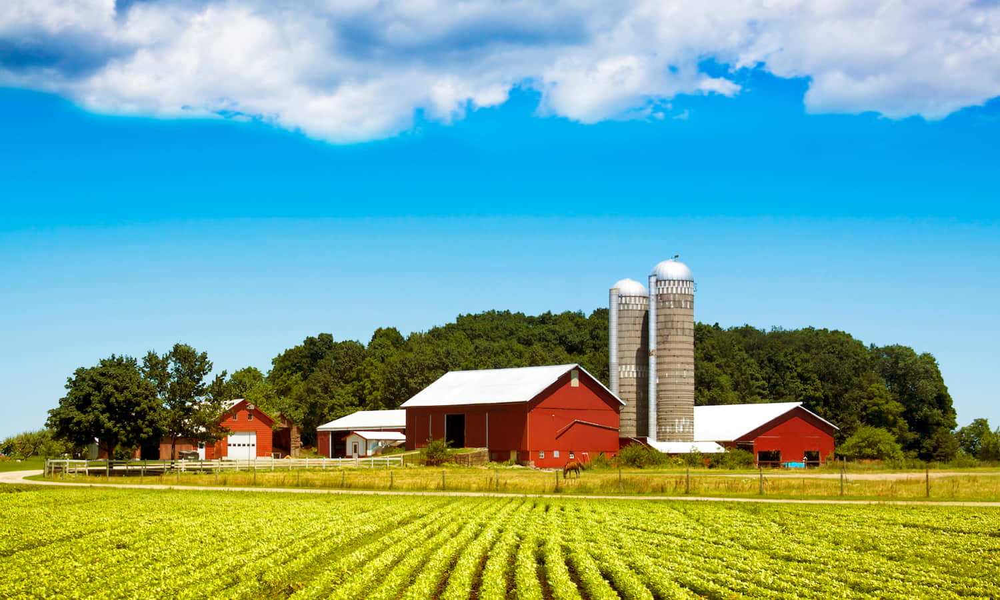

# Yo soy Nicole Rodríguez

---
# Soy de NJ

---

# Mis padres son de Galicia, España

.left[]

.center[]

.right[]

---

# Soy estudiante de doctorado en Rutgers 
### (¡¡¡me graduo en octubre!!!)

---

# Estudio la fonología. 

---

# Soy aficionada de Celta de Vigo y de los Mets

.pull-left[

]

.pull-right[

]

---

# Soy tía

.pull-left[

]

.pull-right[

]
---
# ¡A presentarnos!

- Nombre - Mote/Apodo - Pronombres (cambia en Zoom: Nicole Rodríguez (she/her/ella))
	
- ¿De dónde vienes?
	
- Estudias/trabajas
  - ¿en qué?
	
- Algo interesante de ti

---
# A conocernos un poco más

- ¿Qué te gusta hacer en tu tiempo libre?
  
  - Me gusta **tejer y correr**.

- ¿Qué película te hace llorar?

  - **Avengers: End Game** me hace llorar.

- Describe tu lugar favorito. 
  
  - Mi lugar favorite es **la casa de mis abuelos**. **Son mis mejores amigos y me gusta** 
  **estar con ellos.**  
  

**Tienes que contarnos una cosa de tu compañer@**

---
# El sitio web de Canvas

¡Y el libro!

---
# ¿Qué queremos aprender?

https://www.menti.com/g1rcsmy2f2 

---
# Hoy hablaremos de las presentaciones y descripciones de personas

#### A leer

Me **llamo** Paloma Roldán. 
**Estudio** Administración y Dirección de Empresas en la Universidad 
Autónoma de Madrid. 
Mis clases **son** por la mañana.
**Llego** a la universidad a las nueve. 
Este semestre mis cursos **son** matemáticas, economía, ciencias políticas, 
estadística y análisis financiero. 
Mi clase favorita **es** economía. 
La clase de estadística **es** difícil, pero el profesor **es** muy bueno. 
La clase de ciencias políticas **es** fácil y muy interesante. 
**Hablo** español, francés e inglés.

--

Este chico **es** mi primo. 
Se **llama** Daniel y **estudia** Humanidades en la Universidad Pompeu Fabra 
de Barcelona. 
**Habla** castellano (español) y catalán. 
Sus clases este año **son** literatura, historia y geografía. 
Daniel **es** muy responsable y estudioso. 
Generalmente **llega** a la universidad a las ocho. 
Por la tarde, **escribe** sus tareas en el ordenador, **estudia** y **escucha** 
música o **mira** películas (movies) en la televisión. 
Daniel **practica** fútbol todas las semanas con sus compañeros de clase 
y sus amigos de la universidad.

---
# Recordamos 

¿Qué sabes de los estudiantes? 
Esta información se refiere a Paloma (P) or to Daniel (D).

- _________ Llega a las nueve a la universidad.

- _________ Practica fútbol todas las semanas.

- _________ Estudia geografía.

- _________ Escucha música por la tarde.

- _________ Su clase favorita es economía.

- _________ Habla catalán.

---
class: inverse, middle, center
# Descanso

---
# Trabajamos en grupos. 

Os voy a dar 4 parrafos, tienes que **pensar**, **mirar**, y **adivinar** quien es la
persona de ese parrafo. 

[google drive](https://docs.google.com/document/d/1xEcn5C1CtyO3OPYMo_aJ8sZNK7XJER062et8Ay7_kqA/edit?usp=sharing)

---

# Miramos los verbs en **negrita**

--

## ¿Podemos crear un patrón?

--

### Los pronombres personales

|      |         |
|--------|----------|
| Yo     | Nosotros |
| Tú     | Vosotros       |
| él/ella/Usted | Ustedes  |

**Para recordar estos pronombres personales, mirate la mano**

---
class: middle, center

.pull-left[

]

.pull-right[

]

---
class: center
# Los verbos del presente -ar

|    Hablar  |  (to speak)   |
|--------|----------|
| Yo habl**o**  | Nosotros habl**amos** |
| Tú habl**as**    | Vosotros habl**áis**  |
| él/ella/Usted habl**a** | Ustedes habl**an** |

*Ejemplos*: Ana **trabaja** en la oficina. 
Luis **practica** el piano todos los días. 

---
class: center
# Los verbos del presente -er/-ir

|    aprender  |  (to learn)   |
|--------|----------|
| Yo aprend**o**  | Nosotros aprend**emos** |
| Tú aprend**es**    | Vosotros aprend**éis**  |
| él/ella/Usted aprend**e** | Ustedes aprend**en** |

*Ejemplo*: Nosotros **aprendemos** en la clase de español :) 

|    vivir  |  (to live)   |
|--------|----------|
| Yo viv**o**  | Nosotros viv**imos** |
| Tú viv**es**    | Vosotros viv**ís**  |
| él/ella/Usted viv**e** | Ustedes viv**en** |

*Ejemplo*: Yo **vivo** en Middlebury, Vermont ahora.

---
# Escojemos la palabra correcta (yo, tú, nosotros, él/ella/usted, ustedes, vosotros)

1. _______________ compran libros para las clases que toman.

2. _______________ necesitamos computadoras para estudiar en internet.

3. Señor, _______________ necesita comprar bolígrafos para tomar apuntes.

4. Y _______________, ¿qué necesitas para el proyecto de química?

5. _______________ compro cuadernos en la librería de la universidad.

6. _______________ necesita hablar de sus problemas de horario con la administración.

---
# Usamos comer y escribir para rellenar estas frases

1. Los estudiantes _______________ con sus amigos en un restaurante en el campus todos los días.

2. Yo _______________ en casa porque cuesta mucho dinero comer en los restaurantes.

3. Y tú, ¿_______________ tu almuerzo (lunch) en casa o en la cafetería de la universidad?

4. La profesora _______________ los exámenes en su computadora portátil.

5. Mis amigos y yo _______________ la tarea de español en la computadora.

---

# ¿¿Comemos juntos un día?? Desayno, almuerzo o cena.

---
class: inverse, middle, center

# Día 2

---
 
# Repaso en general de la clase

# Algunas sugerencias

- Habla siempre español 

- Haz muchas preguntas. 

- No tengas miedo de hacer errores; lo que importa es la comunicación. 

- Pide ayuda cuando estés confundido/a.

- Ven a clase con la tarea preparada. 

- No asumas nada, pídele al profesor que confirme las expectativas. 

- Participa activamente en clase; procura hablar por lo menos 10 minutos en 
cada clase. 

---

# Más sugerencias

- Lee mucho en español. La lectura es muy buena para desarrollar la producción 
oral. 

- Escucha la radio en español. 

- Escucha música en español. 

- Ve a todas las películas de la escuela española. 

- **Participa en muchas actividades co-curriculares.**

- Habla con otros profesores y con estudiantes de todos los niveles.

- ¡Diviértete!
---

- [Actividades cocurriculares](https://schoolofspanish.middcreate.net)  
	- el teatro
	- el baile
	- **la clínica de pronunciación**

- Madrinos/padrinos  
	- hacer amigos con más nivel
	- hablar con estudiantes del MA

- **NO** tener miedo  
	- de hablar
	- de hacer preguntas
	- de intentar

- Estudiar (pero ¡no demasiado!)

---

# Tutores

#### ¿Quién?

- ¡Hay muchos!
- Estudiantes graduados
- Ex alumnos
- Profesores

#### ¿Cuándo?

- Ver horarios en el boletín o la página de la escuela

#### ¿Qué más?

- Turnos de 20 minutos
- Hay que tener dudas concretas 

---

# Repasito: Los pronombres personales

### El paradigma tradicional

|    |    |  Singular      |    | Plural              |
|:---| :- | :--------------| :- | :------------------ |
| 1a |    |  yo            |    | nosotros/as         |
| 2a |    |  tú            |    | vosotros/as         |
| 3a |    |  él/ella/usted |    | ellos/ellas/ustedes |

--

### Pronombres no binarios novedosos

- elle, elles

---

# El tiempo presente expresa...

### ...una rutina

--

- Estudio en la biblioteca todos los días.

--

### ...una acción continua

--

- Mi amiga vive en una residencia este semestre.

--

### ...una acción en el futuro

--

- Mis compañeros van a una fiesta mañana.

---

# Repaso y más información Los verbos regulares

### Hay tres tipos de infinitivos: -ar, -er, -ir

|                     |    | -ar         |    | -er         |    | -ir           |
| :------------------ | :- | :---------- | :- | :---------- | :- | :------------ |
|                     |    | **tomar**   |    | **comer**   |    | **asistir**   |
| yo                  |    | tom**o**    |    | com**o**    |    | asist**o**    |
| tú                  |    | tom**as**   |    | com**es**   |    | asist**es**   |
| él/ella/usted       |    | tom**a**    |    | com**e**    |    | asist**e**    |
| nosotro(as)         |    | tom**amos** |    | com**emos** |    | asist**imos** |
| vosotros(as)        |    | tom**áis**  |    | com**éis**  |    | asist**ís**   |
| ellos/ellas/ustedes |    | tom**an**   |    | com**en**   |    | asist**en**   |

---

# A practicar

### Usa los verbos en el presente para hablar de...

1. tu rutina  
.grey[Normalmente desayuno a las 8, voy al gimnasio a las 9, trabajo a las 10, etc.]

--

2. una acción continua  
.grey[Veo la televisión todos los días.]

--

3. una acción en el futuro (ir a + inf.)  
.grey[Mañana voy a viajar.]

---

# Algunos verbos regulares

.pull-left[

  **-ar**  
  Adivinar  
  Gastar  
  Amar  
  Apagar  
  Ayudar  
  Invitar  
  Bailar  
  Jugar  
  Besar  
  Lavar  
  Cambiar  
  Levantar  
  Despertar  
  Pasear  

]

.pull-right[

  Dibujar  
  Pensar  
  Disfrutar  
  Pintar  
  Durar  
  Practicar  
  Echar  
  Preguntar  
  Empezar  
  Prestar  

]

---

# Algunos verbos regulares

.pull-left[

  **-er**  
  Agradecer  
  Llover  
  Beber  
  Nacer  
  Caber  
  Ofrecer  
  Caer  
  Perder  
  Comer  
  Prometer  
  Comprender   

]

.pull-right[

  **-ir**  
  Abrir  
  Partir  
  Construir  
  Pedir  
  Corregir  
  Prohibir  
  Decidir  
  Recibir  
  Despedir  
  Seguir  
  Discutir  

]

---

#¿A qué te dedicas? ¿Qué haces?

- Tejer 
  
- Correr
  
- Cocinar
  
- Enseñar

### **Piensa** en estas preguntas: **¿A qué te dedicas? ¿Qué haces?**
¡¡Puede ser trabajo, estudio, o diversión!!

---

# A compartir con los compañer@s

---

#.pull-left[Un día típico para mí en NJ] 

#.pull-right[Un día típico en Middlebury]

.pull-left[
- Corro

- Tejo 

- Cocino 

- Escribo mi tesis
]

.pull-right[
- Corro (?)

- Enseño

- Escribo mi tesis

- Tejo
]

---
# A compartir con los compañer@s

#### Usa "En Middlebury ______ (verbo) pero en (otro lugar) _______ (verbo)."

#### o: "En Middlebury y en (otro lugar) ______ (verbo)."

Ejemplos: En Middlebury enseño pero en New Jersey cocino. Todos los días en Middlebury y en NJ escribo mi tesis.

### Usemos palabras como: *normalmente, a veces, siempre, todos los días*

---
# El verbo ser para describir

### ser + adjetivo

- Soy responsable
- Eres tímido
- Somos divertidos

--
  
  ### Sirve para identificar y describir a las personas
  
  - ¿De dónde eres?
  - ¿Cuál es tu dirección?
  
  (profesor, estudiante, militar, hombre, mujer, padre, madre, simpático)

--

  
  | -- | Singular             |  Plural                      |
  |-- | ------------------- | --------------------------- |
  | 1a | yo **soy**           | nosotros/as **somos**       |
  | 2a | tú **eres**          |  vosotros/as **sois**        |
  | 3a | él/ella/usted **es** |  ellos/ellas/ustedes **son** |

---
class: center, middle

# En practica

Usamos el verbo "ser" para describir a las profesiones de estas personas.

---
# ¿Qué es?

---

# ¿Qué son?

---

# ¿Qué son?

---

# ¿Qué somos? 

---
class: middle, center
# ¿Qué eres?

---
class: middle, center
# Los artículos y los sustantivos

### ¿Qué es un artículo? 

--

### ¿Y un sustantivo?

---

# Los artículos

- Los sustantivos tienen **artículos**.
- Hay dos tipos:
  - Definidos
  - Indefinidos

---

# Los artículos definidos

- **el** libro, **los** libros
- **la** página, **las** páginas
- **la** mochila, **las** mochilas
- **el** cuaderno, **los** cuadernos

---

# Los artículos indefinidos

- **un** mapa, **unos** mapas
- **una** mesa, **unas** mesas
- **un** pupitre, **unos** pupitres
- **un**(a) estudiante **unos**(as) estudiantes

---
# Con un compañero...

1. Hay (un/una) profesora. Es (el/la) señora Martínez.
2. (Los/Las) estudiantes están en (el/la) clase de español.
3. Hay (una/unas) ventana en (el/la) puerta.
4. Hay (un/una) mapa de España en (el/la) sala de clase.
5. (Un/Una) estudiante usa (el/la) teléfono celular.
6. Hay (unos/unas) borradores en (el/la) silla.
7. (Un/Una) estudiante escribe mensajes de texto en (el/la) teléfono celular.
8. Hay (un/una) libro en (el/la) mesa de la profesora.

---

# Con un compañero...

1. Hay **una** profesora. Es **la** señora Martínez.
2. **Los**/**Las** estudiantes están en **la** clase de español.
3. Hay **una** ventana en **la** puerta.
4. Hay **un** mapa de España en **la** sala de clase.
5. **Un** estudiante usa **el** teléfono celular.
6. Hay **unos** borradores en **la** silla.
7. **Un** estudiante escribe mensajes de texto en **el** teléfono celular.
8. Hay **un** libro en **la** mesa de la profesora.

---

# Con un compañero...

Completa la tabla con el singular y plural de las palabras.

|     Singular     |       Plural       |
| :--------------- | :----------------- |
| **la profesora** |                    |
|                  | **los bolígrafos** |
|                  | **los pupitres**   |
| **el papel**     |                    |
|                  | **unas mochilas**  |
| **una ventana**  |                    |
| **un reloj**     |                    |
|                  | **unos carteles**  |

---

# Con un compañero...

Completa la tabla con el singular y plural de las palabras.

|          Singular         |            Plural           |
| :------------------------ | :-------------------------- |
| **la profesora**          | las profesoras |
| el bolígrafo | **los bolígrafos**          |
| el pupitre   | **los pupitres**            |
| **el papel**              | los papeles    |
| una mochila  | **unas mochilas**           |
| **una ventana**           | unas ventanas  |
| **un reloj**              | unos relojes  |
| un cartel    | **unos carteles**           |

---
class: middle, center, inverse

# ¡Descanso!

---

# ¿Qué necesitamos para nuestras actividades de pasatiempo? 

- Buscamos el vocabulario necesario.

---

# Describimos lo que necesitamos con tus compañer@s

Ejemplo: 

- Para tejer **necesito** *las agujas* y *la lana*. 

- Para correr **necesito** *los zapatos deportivos*. 

## Responde a la pregunta: ¿Tu pasatiempo es barato o caro? $$$

---
class: center, middle

# Middlebury College

## ¿Dónde está?

[el mapa](http://www.middlebury.edu/system/files/media/printablenewmap.pdf)

---
class: center 

# El verbo estar

|    estar  |  (to be)   |
|--------|----------|
| Yo estoy  | Nosotros estamos |
| Tú estás    | Vosotros estáis  |
| él/ella/Usted está | Ustedes están |

*Ejemplos*: 

**Estamos** en Middlebury, Vermont. 

Mis amigos **están** en su casa. 

#### Es un verbo irregular

#### Hay que memorizar las conjugaciones

---

# A corregir las oraciones

- Yo (estar) en Proctor. 

- Grace y Ren (estar) en Monterry durante el otoño.

- La profe Alicia (estar) en cama. 

- Paco (estar) en el salón de coro esperandoles a los estudiantes.

- Mi sobrina y my mamá (estar) en la playa.

- El perrito de Ben (estar) en Las Vegas.

- Nosotros (estar) en clase por Zoom.

---

# Con compañer@s completad las oraciones: 

1. Las muchachas (estar) en el jardín.

2. En este momento mis amigas (estar) en la tienda. 

3. El profesor (estar) enojado esta mañana. 

4. ¿Tu (estar) listo para salir ahora? 

5. ¿Sabes algo de los chicos? (estar) en el estadio. 

6. Nosotros siempre (estar) contentos ver a nuestras mascotas.

7. Vosotros (estar) esperando comenzar el curso.

8. Usted (estar) en el parque en las mañanas.

---
class: middle, center

# ¿Dónde están estas personas? 

---

---

---

---

---

---

---

---

---

# Volvemos a la pregunta ¿A qué te dedicas?

## ¿Dónde estás cuando haces tus actividades favoritas? 

- Yo **estoy** en la cama cuando tejo. 

- Yo **estoy** afuera o en el gimnaso cuando corro. 

#### Compartimos con nuestros compañer@s

---
# Lo que hemos visto hasta ahora

- Los pronombres personales

- Los verbos regulares en el presente

- Los artículos definidos/indefinidos

- Los verbos ser/estar

--

# "Tarea" 

- Verificad que tenéis acceso a Canvas

- Relajad

---
class: inverse, center, middle
# Día 3

---

# Repaso: verbo estar

- Pensamos en un lugar del mundo (famoso). 

- Describimos el lugar.

- Adivinamos donde estamos. 

- **Ejemplo**: Este lugar es una ciudad en Europa. Tiene un museo muy famoso. 
También tiene una torre famosa. En el programa de Parks and Rec, Ben y Leslie visitaron 
esta ciudad. 

¿Dónde estoy?

---
class: middle, center
# Estoy en Paris

---
# Con compañer@s completad las oraciones: 

1. Las muchachas (estar) en el jardín.

2. En este momento mis amigas (estar) en la tienda. 

3. El profesor (estar) enojado esta mañana. 

4. ¿Tu (estar) listo para salir ahora? 

5. ¿Sabes algo de los chicos? (estar) en el estadio. 

6. Nosotros siempre (estar) contentos ver a nuestras mascotas.

7. Vosotros (estar) esperando comenzar el curso.

8. Usted (estar) en el parque en las mañanas.

---
# Los sustantivos

- **Los sustantivos** son personas, lugares o cosas.

- En español tienen **género** y **número**

- ¿Puedes pensar en algunos sustantivos?

---
background-image: url(https://raw.githubusercontent.com/jvcasillas/media/master/teaching/img/frustration.png)
background-size: 300px
background-position: 95% 50%

# Género

Normalmente...

- **el** libr**o**
- **la** mes**a**

--

Pero a veces...

- **el/la** estudiant**e**
- **el** pupitr**e**
- **la** clas**e**
- **el** relo**j**

---
background-image: url(https://raw.githubusercontent.com/jvcasillas/media/master/teaching/img/happy.png)
background-size: 300px
background-position: 95% 50%

# Número

- el libro/los libros
- la mesa/las mesas

**¡Es FÁCIL!**

---
background-image: url(https://raw.githubusercontent.com/jvcasillas/media/master/teaching/img/confused.png)
background-size: 300px
background-position: 95% 50%

# Los artículos

- Los sustantivos tienen **artículos**.
- Hay dos tipos:
  - Definidos
  - Indefinidos

---
background-image: url(https://raw.githubusercontent.com/jvcasillas/media/master/teaching/img/happy.png)
background-size: 300px
background-position: 95% 50%

# Los artículos definidos

- **el** libro, **los** libros
- **la** página, **las** páginas
- **la** mochila, **las** mochilas
- **el** cuaderno, **los** cuadernos

---
background-image: url(https://raw.githubusercontent.com/jvcasillas/media/master/teaching/img/happy2.png)
background-size: 300px
background-position: 95% 50%

# Los artículos indefinidos

- **un** mapa, **unos** mapas
- **una** mesa, **unas** mesas
- **un** pupitre, **unos** pupitres
- **un**(a) estudiante **unos**(as) estudiantes

---
# Practicamos

- Voy a comparme un/una par de zapatos.

- Hay unos/unas tomates en el/la jardín.

- A mí me gusta la/las actriz en esta película. 

- Tengo un/una paquete para ti.

- El/los coches están aparcados en la calle.

- Su ropa de verano está en el/la sala

- La población está concentrada en las/los grandes ciudades.

---
class: inverse, center, middle

# Los interrogativos

---

# Las preguntas

- de sí/no
- de información

---

# Preguntas de sí/no

- Inversión del sujeto/verbo

| Verbo   | Sujeto    | Otros elementos      |
|:--------|:----------|:---------------------|
| ¿Vive   | Martín    | en Madrid?           |
| ¿Comes  | (tú)      | fruta todos los días?|
| ¿Tenemos| (nosotros)| tarea?               |

- Sí, Martín vive en Madrid.

--

- No, no como fruta todos los días.

--

- No, no tenemos tarea.

---

# Preguntas de información

- Requieren una expressión interrogativa

| Expression interrogativa | Verbo    |  Sujeto     |
|:-------------------------|:---------|:------------|
| ¿Dónde                   | vive     | Martín?     |
| ¿Qué                     | comes    | (tú)?       |
| ¿Cuándo                  | es       | la reunión? |

---

1. _________ Es Cristina Zapatero.

2. _________ Se llama Cristina Zapatero.

3. _________ En la Residencia Helmántica.

4. _________ 600 euros al mes.

5. _________ Por la mañana y por la tarde.

---
# Con un compañero

- Haced una lista de 4 preguntas (2 sí/no, 2 de información)
- Tened en cuenta la entonación

---
### ¿Quién es?

- Con un compañero escribid una lista 6-8 expresiones para describir a las 
personas
- Podéis hablar la apariencia física (altura, pelo, color de ojos) y la 
personalidad (tímido, divertido, extrovertido)

--

- Escoge una persona de la clase (¡sin decir quién!) y descríbela para que 
los demás adivinen quién es

---
class: middle, center, inverse

# ¿Qué profesiones hacen preguntas? 

---
class: middle, center, 

# l@s reporter@s y periodistas hacen preguntas

## **hacen entrevistas**

---
class: middle, center, inverse
# ¿Qué es una entrevista? 

---

# ¿Como hacemos una entrevista?

- **PREGUNTA**: haz preguntas que te dan información interesante

- **ESCUCHA**: cuando tu compañero te da una respuesta interesante

- **ENFOCA**: enfoca en esa respuesta y pregúntale más detalles sobre ese asunto

- **AUMENTA**: sigue buscando información sobre el tema y otros temas relacionados

- **DESARROLLA**: desarollo tu discurso sobre esta información

---
# A practicar 

Pensad en 5 preguntas que podemos hacer a nuestr@s compañer@s para conocernos más. 

- Pensad en información más en detalle. 

- Información interesante y relevante. 

---
# Padlet

https://padlet.com/rodriguez68/nsyaghu3vntpmyhm 

---

# Estrategias para la comunicación oral  

### ¿Cómo se hace una presentación?

--

- ¡Ensayar! ¡Ensayar! ¡Ensayar!

--

- Hablar lentamente

--

- Vocales puras

--

- Tensión bucal

--

- Practicad palabras largas por sílabas

---

# Cómo elaborar un discurso

En la elaboración de un discurso se distinguen 5 etapas o pasos:

 
- **INVENCIÓN** Búsqueda de documentación, argumentos y pruebas. Identificar el público oyente.

- **DISPOSICIÓN** Estructuración y organización del material recogido.

- **ELOCUCIÓN** Exposición o estilo del discurso mediante la búsqueda de palabras 
adecuadas, figuras estilísticas etc.

- **MEMORIA** Retención en la memoria de todo lo previamente preparado. Los discursos jamás eran
leídos.

- **ACCIÓN** Uso de gestos y tono de voz adecuados, en una palabra, la dramatización más 
conveniente al tipo de discurso que se ha de pronunciar.

---
# El viernes

- Vas a presentar a un compañero de clase.

- Primero vas a entrevistar a tu compañero.

- Luego vas a seleccionar tres cosas importantes que quieres decir sobre to compañero.

- **No** vas a ESCRIBIR **NADA**! Puedes tener una tarjeta con tres palabras importantes, 
pero no puedes escribir ninguna frase completa.

- Vas a hablar 1:00-1:30 minutos sobre tu compañero en la clase el viernes.

- Es muy importante limitarte al límite de tiempo.

- Lo vamos a grabar en Zoom, y guardar solamente el audio.
---
# Padlet

https://padlet.com/rodriguez68/nsyaghu3vntpmyhm 

---

# Tarea Recomendada 

- piensa más en preguntas

- pg. 42, 1-20

- pg. 44

- pg. 51 y 52

---
# Extra 

**FRANCISCO**: ¡Mariana! ¡Qué sorpresa! ¿Dónde estás?

**MARIANA**: Estoy en el aeropuerto de Barajas, en Madrid. ¿Y tú?

**FRANCISCO**: Mi padre y yo estamos en Nueva York. En este momento, mi padre está en una tienda (store) de aparatos electrónicos. ¿Y cómo están todos en tu familia?

**MARIANA**: Todos estamos muy bien. ¡Qué bueno escucharte! Lo siento, Francisco, pero el vuelo (flight) sale (leaves) pronto. Hablamos otro día. Adiós.

---

El verbo estar en estas frases se refiere a un lugar o un estado (de ánimo (como contento, triste, etc.))

1. _________ Mariana está en el aeropuerto de Barajas.

2. _________ Francisco está contento de escuchar a Mariana.

3. _________ Todos (Everyone) en la familia de Mariana están bien.

4. _________ El padre de Francisco está en una tienda probablemente para comprar un aparato electrónico.

5. _________ Francisco y Mariana están en dos ciudades diferentes.

---

- JOSÉ ANTONIO: Hola, Ramón. ¿Qué tal? ¿Cómo _________?

- RAMÓN: _________ muy bien. ¿Y tú?

- JOSÉ ANTONIO: Muy bien. ¿Y cómo _________ tu hermana (sister) Lucía?

- RAMÓN: Bien, gracias. Ella y mamá _________ en España ahora.

- JOSÉ ANTONIO: ¡Qué suerte! Y nosotros _________ en la universidad, ¡y en la semana de exámenes!

---

Adivina dónde y cómo están estas personas. 

1. José Pablo estudia para un examen difícil. ¿Dónde está? ¿Cómo está?

2. Los profesores tienen una reunión (meeting) urgente. ¿Dónde están? ¿Cómo están?

3. Carmen tiene una competencia importante de básquetbol hoy. Necesita practicar mucho. ¿Dónde está? ¿Cómo está?

4. Tú y tu compañero/a de casa desean (want) tomar café. ¿Dónde están ustedes en este momento? ¿Cómo están?

5. El profesor de álgebra no está en clase hoy. ¿Dónde está? ¿Cómo está?

6. Tú necesitas ayuda (help) con tu computadora. ¿Dónde estás? ¿Cómo estás?
