class: inverse, middle, center

# Capítulo 2: Las relaciones interpersonales 

---

# Repaso: Actividad verbos regulares

1. Mi padre y yo _ _ _ _ _ (vivir) en un piso. 

2. Mi abuelo _ _ _ _ _ _ (comer) a horas fijas. 

3. _ _ _ _ _ _ (cantar, ellos) todo el día. 

4. _ _ _ _ _ _ (trabajar, vosotros) muy duro. 

5. _ _ _ _ _ _  (escribir, yo) un libro. 

6. Mis amigos _ _ _ _ _ _ _ (beber) demasiado. 

7. ¿A que hora _ _ _ _ _ _ _ (cenar) vosotros? 

8. Nosotros _ _ _ _ _ _ _ (abrir) las ventanas para crear una corriente de aire. 

---

# La relación sujeto/verbo

**SVO**

--

- **Juan** ***tiene*** tres clases este semestre.

--

- **Juan** *no* ***tiene*** un laboratorio este semestre.

--

- **Yo** *tengo* cuatro clases este semestre, pero **ella** *tiene* cinco.

--

- **Los estudiantes** ***estudian*** durante el fin de semana. 

--

- **Tú y yo** ***buscamos*** las respuestas de la tarea.

---

class: inverse, center, middle

# Los adjetivos

---

# Los adjetivos

- ¿Qué tipo de concordancia tienen? 

- ¿Con qué concuerdan?

- ¿Cuándo?

- Ejemplos...

---

# ¿Cómo son estas personas? 

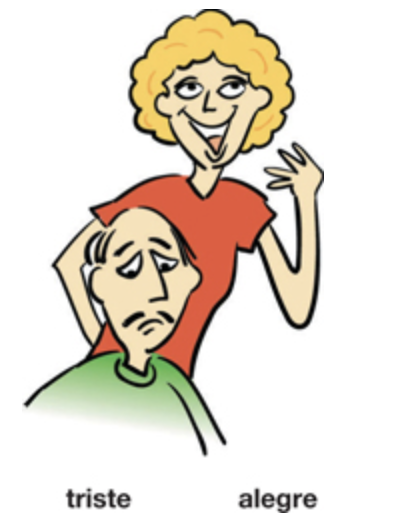

---

# ¿Cómo son estas personas? 

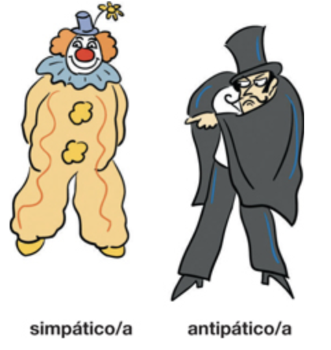

---

# ¿Cómo son estas personas? 

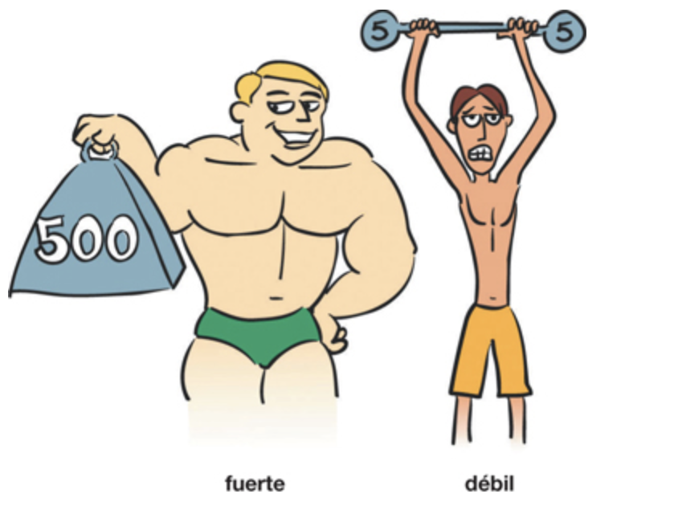

---
background-image: url(./libs/img/listo.png)
background-size: 300px
background-position: 50% 60%

# ¿Cómo son estas personas? 

---

# ¿Cómo son estas personas? 

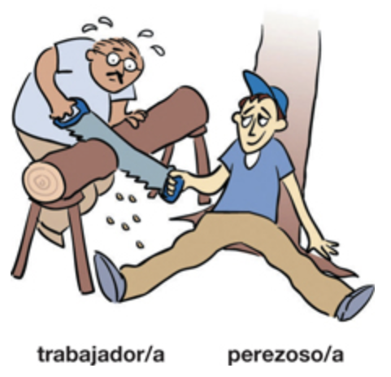

---
# ¿Cómo son estas personas? 

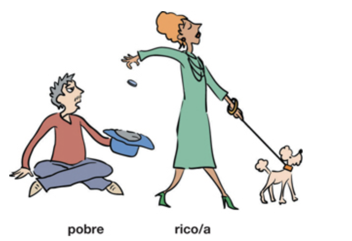

---

# ¿Cómo son estas personas? 

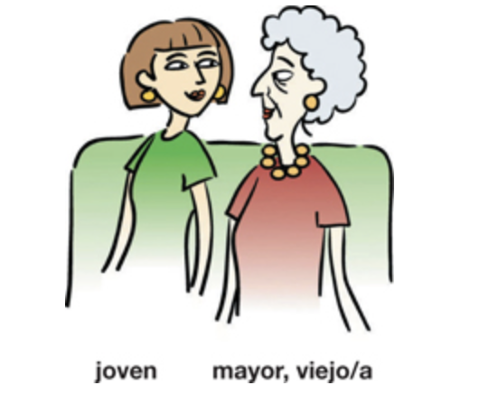

---

# ¿Cómo son estas personas? 

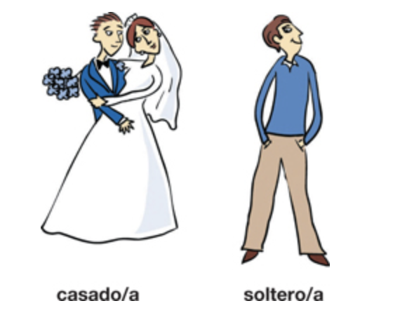

---
# Adivina Quien

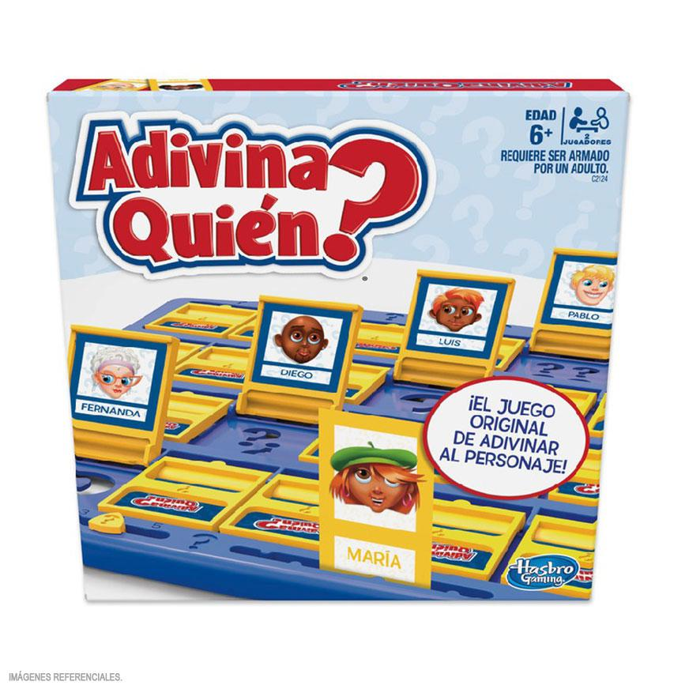

---

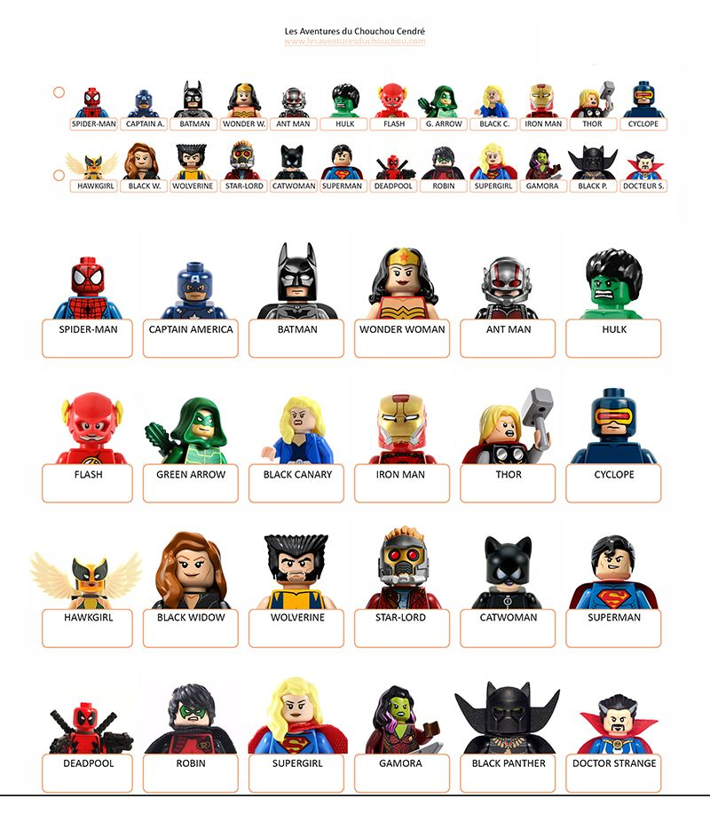

---
# Los adjetivos posesivos

- Se utilizan para indicar **posesión**
- Tienen **número** y **género**

|    |       |                       |
| ---| ----  |  --------------------- |
| 1a | mi(s) | nuestro(s)/nuestra(s)  |
| 2a | tu(s) | vuestro(s)/vuestra(s)  |
| 3a | su(s) | su(s)                  |

- mi familia, mis abuelos

- su hija, sus hijos

- nuestr**a** herman**a**, nuestr**os** herman**os**

---
background-image: url(./libs/img/mapa.jpg)
background-position: 90% 40%

# La posesión con 'de'

.pull-left[

- Para evitar la confusión en la 3a persona, se puede usar la preposión 
'de'

.center[
.RUred[Rosa y Paco viven en Galicia]  

**¿Dónde están sus casas?**
]

- La casa **de** él está en Ourense. 
- La casa **de** ella está en Celanova.  

]

---
background-image: url(./libs/img/mapa.jpg)
background-position: 90% 40%

# La posesión con 'de'

.pull-left[

- Para evitar la confusión en la 3a persona, se puede usar la preposión 'de'

.center[
.RUred[Rosa y Paco tienen amigos que viven en Galicia.]

**¿Dónde viven sus amigos?**
]

- El amigo **de** Rosa vive en Celanova.  
- El amigo **de** Enrique vive en Ourense. 

]

---

# ¡Nunca usamos **'s** para indicar posesión!

.pull-left[
### ~~Mi hermanas casa~~
### ~~Tu amigos coche~~
### ~~Su abuelos teléfono~~
### ~~Nuestro perros correa~~
### ~~Vuestras clases profesor~~ 
### ~~Sus camas sábanas~~
]

--

.pull-right[
### La casa de mi hermana
### El coche de tu amigo
### El teléfono de su abuelo
### La correa de nuestro perro
### El profesor de vuestras clases
### Las sábanas de sus camas
]

---
# Ser y estar

---
background-image: url(./libs/img/chloe.png)
background-size: 250px
background-position: 95% 25%

#El verbo ser: para identificar y clasificar

- Chloe **es** mi sobrina.

--

- Mi hermano **es** estudiante.

--

- Yo **soy** lingüista.

--

- Tú **eres** estudiante.

--

- Jennifer **es** de California.

--

- Nosotros **somos** divertidos.

---
background-image: url(./libs/img/sultan.png), url(./libs/img/lobo.png)
background-size: 200px, 200px
background-position: 80% 50%, 100% 50%

# El verbo ser: 

## Para describir características con los adjetivos

--

- Sultán **es** grande y feroz.

- Sultán y Lobo **son** buenos perros.

---
background-image: url(./libs/img/chloe2.png)
background-size: contain
background-position: 100% 50%

# Chloe es muy...

---
background-image: url(./libs/img/ser1.png)
background-size: 250px
background-position: 95% 50%

# Los usos del verbo ser: 

## Con la preposición "de"

--

- **Posesión**
  - ¿De quién **es** el cuarto? **Es** de Nicole

--

- **Origen**
  - ¿De dónde **es** Jacobo? **Es** de México.

---
background-image: url(./libs/img/fiesta.png)
background-size: 450px
background-position: 95% 50%

# Los usos del verbo ser: 

## Con la HORA y el LUGAR de los eventos

--

 
 
 
 
 

- ¿Cuándo **es** la fiesta?

--

 
 
 
 

- **Es** el sábado a las siete de la noche.

--

 

- La fiesta **es** en la casa del profesor.

---
background-image: url(./libs/img/colorado.png)
background-size: contain
background-position: 140% 50%

# Los usos del verbo estar:

## La ubicación de las cosas

--

- ¿Dónde **está** la profe?

--

- **Está** en Coloardo.

---
background-image: url(https://raw.githubusercontent.com/jvcasillas/media/master/teaching/img/frustration.png)
background-position: 90% 30%

# Los usos del verbo estar: 

## Para describir una condición

--

- ¿Cómo **está** Jackie Chan?

- **Está**...

---
background-image: url(https://raw.githubusercontent.com/jvcasillas/media/master/teaching/img/frustration.png)
background-position: 90% 30%

# Ser y estar: 

## Las características versus las condiciones

--

 
 
 
 
 

.pull-left[

### ¿Cómo **es** Jackie Chan?

- **Es** bajo con pelo negro.
- **Es** simpático.

]

.pull-right[

### ¿Cómo **está** Jackie Chan? 

- **Está** confundido.
- **Está** frustrado.

]

---

background-image: url(./libs/img/esta1.png)
background-size: 600px
background-position: 50% 60%

# ¿Cómo está(n)?

---
background-image: url(./libs/img/esta2.png)
background-size: 600px
background-position: 50% 70%

# ¿Cómo está(n)?

---
background-image: url(./libs/img/esta3.png)
background-size: contain
background-position: 100%

# ¿Cómo está(n)?

---
background-image: url(./libs/img/esta4.png)
background-size: contain
background-position: 100%

# ¿Cómo está(n)?

---
background-image: url(./libs/img/esta5.png)
background-size: contain
background-position: 100%

# ¿Cómo está(n)?

---
background-image: url(./libs/img/esta6.png)
background-size: contain
background-position: 100%

# ¿Cómo está(n)?

---
background-image: url(./libs/img/esta7.png)
background-size: contain
background-position: 100%

# ¿Cómo está(n)?

---
background-image: url(./libs/img/esta8.png)
background-size: contain
background-position: 100%

# ¿Cómo está(n)?

---
class: center, middle, inverse

#[Kahoot](https://create.kahoot.it/share/ser-estar/a7e2e476-6809-4dce-b69e-e985dc42e564)

---

# Presentación de un compañero

- Vais a hacer una presentación oral corta el **LUNES**

--

- Duración de 1.30

--

- El enfoque será en las construcciones que hemos visto en clase

--

- Podéis hablar de lo que queráis, pero sugiero que os centréis en lo que hemos 
visto en clase

---

# Preparación

### Para preparar debéis:

- Escoger un compañero

- Quedar en una hora esta tarde para hablar (si hace falta)

- Utilizar nuestras estrategias para obtener información

- Apuntar toda la información (verificar que es correcta)

- Ensayar

- **NO PODÉIS LEER**

---

# Estrategias para la comunicación oral  

- ¡Ensayar! ¡Ensayar! ¡Ensayar!

--

- Hablar lentamente

--

- Vocales puras

--

- Tensión bucal

--

- Practicad palabras largas por sílabas

---
class: middle, center
# rubrica 

---
class: middle, center, inverse
# Día 2

---

# Repaso: ser vs estar

https://www.spanishdict.com/quizzes/41/ser-vs-estar  

---
class: middle, center

# Los verbos *tener* y *ir*

---

# El verbo tener 

|                |           |                |           |
| -------------- | --------  |  ------------- | --------- |
| yo             | tengo     | nosotr@s       | tenemos   |
| tú             | tienes    | vosotr@s       | tenéis    |
| él/ella/usted  | tiene     | ell@s, ustedes | tienen    | 

--

- Posesión
  - **Tengo** tres gatos
  - **Tienes** una casa bonita
  - Los estudiantes tiene un examen 
  
- Obligación (tener que + inf.)
  - **Tengo que** estudiar
  - Tenemos que hacer mucha tarea para aprobar la clase

- Frases/expresiones especiales 

---

# El verbo *tener*

### Expresiones con el verbo *tener*

.pull-left[
- tener hambre
- tener sed
- tener frío
- tener calor
- tener celos
- tener miedo
- tener razón
]

.pull-right[
- tener suerte
- tener sueño
- tener prisa
- tener X años
- tener ganas de

]

---
class: inverse, middle, center
#[Practica](https://docs.google.com/presentation/d/1-CxGaI6QiFMlHYMBE3ZO5eSImZWlbJmDczHPYeB-mqg/edit#slide=id.SLIDES_API1431452022_9)

---

# El verbo ir

|                |         |                |           |
| -------------- | ------- |  ------------- | --------- |
| yo             | **voy** | nosotr@s       | **vamos** |
| tú             | **vas** | vosotr@s       | **vais**  |
| él/ella/usted  | **va**  | ell@s, ustedes | **van**   | 

--

- Ir a + sustantivo (movimiento, ¿Adónde vas?)
  - **Voy a** la biblioteca
  - **Vamos a** la playa
  
- Ir a + infinitivo (futuro, ¿Qué vas a hacer?)
  - **Voy a** estudiar
  - Los estudiantes **van a** estudiar este fin de semana
  
---
# ¿Dónde van a ir Alicia y Nicole?

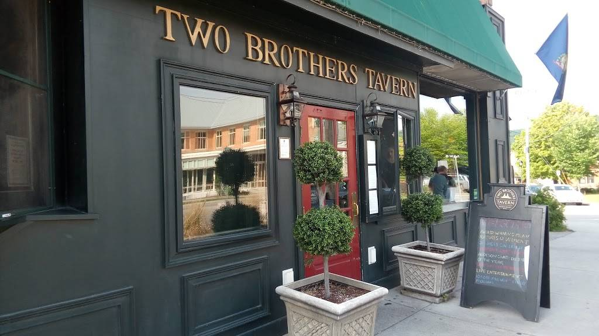

---
# ¿Dónde va a ir Jessica?

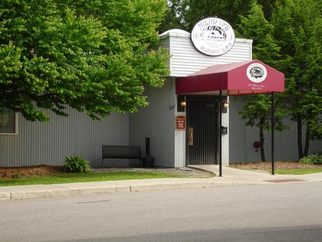

---
# ¿Dónde vas a ir?

---
# ¿Dónde vamos a ir?

---

class: inverse, middle

# Algunos verbos irregulares

---
# Los verbos irregulares con - go: la forma yo

|  Infinitvo |  Yo        |   Otras personas                    |
| ---------- | --------   |  ---------------------------------- |
| hacer      | **hago**   | haces, hace, hacemos, hacéis, hacen |
| poner      | **pongo**  | pones, pone, ponemos, ponéis, ponen |
| salir      | **salgo**  | sales, sale, salimos, salís, salen  | 
| traer      | **traigo** | traes, trae, traemos, traéis, traen | 

---

# Los numeros 100 a 10,000,000

---

# ¿Sabes mucha historia? 

- Haz una lista de 3 acontecimientos históricos importantes

- Cuéntale a tu compañer@ el acontecimiento para que adivine el año

- **Ej.**

  - En este año, Cristóbal Colón hace un viaje al "nuevo mundo" buscando especias. 
  
--

  - **1492** (mil cuatrocientos noventa y dos)
  
---
class: inverse, middle, center

# Más descripción

---

# La familia

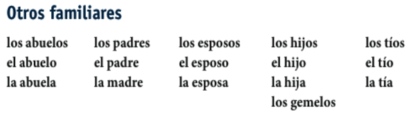

---

# ¿Cómo es tu familia?

- Mi hermano mayor se llama...
- Mi padre tiene ... años.
- Mi tía vive en...

.pull-right[
- Describir tu familia al compañero, él/ella tiene que dibujar el árbol]

---

# Mi árbol genealógico

- En una hoja de papel dibujad una imagen de tu compañero.

- Debajo de la imagen, pon su nombre.

- Tu compañer@ va a describir su familiar para que dibujes su árbol.

- Tienes que describir claramente tu familia y ayudar a tu compañer@

- Tienes que tener paciencia

---

# Mis 3 metas de aprendizaje

[Google doc ejemplo](https://docs.google.com/document/d/1EHGj8RpN645Dh2GNRrrxjGICO3h-zjsR/edit)

---
class: middle, center, inverse
# Practica/Entrevista/Orden de presentaciones

---
