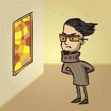
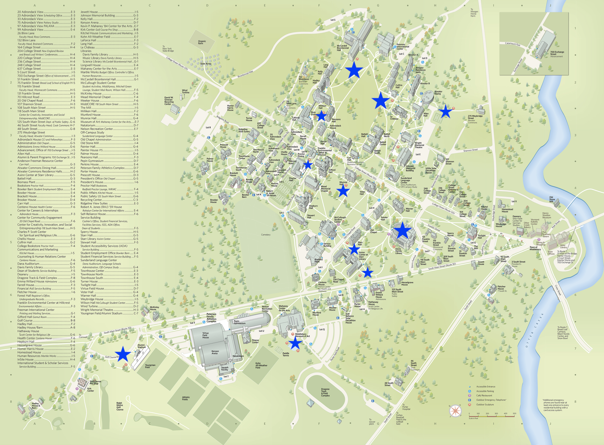
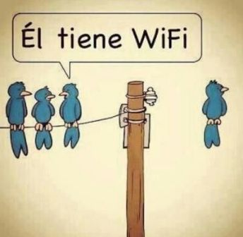
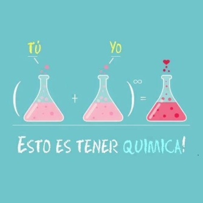
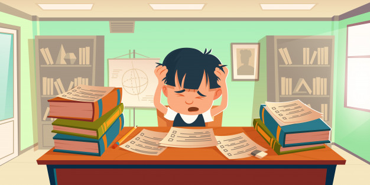

class: middle, inverse, center

# Capítulo 4

#### ¿Qué significa familia para ti?

---

# Repaso por vs para 

https://conjuguemos.com/grammar/213 

---
class: middle, center 

# Regalitos

---
class: center, middle, inverse 

# Verbos irregulares 

---
class: center, middle 

<iframe width="560" height="315" src="https://www.youtube.com/embed/wnJ6LuUFpMo" title="YouTube video player" frameborder="0" allow="accelerometer; autoplay; clipboard-write; encrypted-media; gyroscope; picture-in-picture" allowfullscreen></iframe>

---

# Verbos irregulares

### Verbos con cambio en la raíz

| El infinitivo | la raíz |     |   el cambio    |    Ej.    |
| ------------- | ------- | --- | -------------- | --------- |
|               |         |     |                |           |
| pensar        | pens-   |     | p**ie**ns-     | Yo pienso |
|               | **e**   |  →  | **ie**         |           |
|               |         |     |                |           |
| volver        | volv-   |     | v**ue**lv-     | Yo vuelvo |
|               | **o**   |  →  | **ue**         |           |
|               |         |     |                |           |
| pedir         | ped-    |     | p**i**d-       | Yo pido   |
|               | **e**   |  →  | **i**          |           |

---

# Verbos irregulares

### Los verbos con el cambio **e** → **ie**

|     Pensar    |             |                     |             |
| ------------- | ----------- | ------------------- | ----------- |
| yo            | p**ie**nso  | nosotros            | pensamos    |
| tú            | p**ie**nsas | vosotros            | pensáis     |
| él/ella/usted | p**ie**nsa  | ellos/ellas/ustedes | p**ie**nsan |

--

### Ejemplos

- emp**e**zar
- pref**e**rir
- qu**e**rer
- recom**e**ndar

**OJO**! No hay cambio en las formas de **nosotros**/**vosotros**

---

# Verbos irregulares

### Los verbos con el cambio **o** → **ue**

|     Volver    |             |                     |             |
| ------------- | ----------- | ------------------- | ----------- |
| yo            | v**ue**lvo  | nosotros            | volvemos    |
| tú            | v**ue**lves | vosotros            | volvéis     |
| él/ella/usted | v**ue**lve  | ellos/ellas/ustedes | v**ue**lven |

--

### Ejemplos

- c**o**star
- p**o**der
- d**o**rmir

**OJO**! No hay cambio en las formas de **nosotros**/**vosotros**

---

# Verbos irregulares

### Los verbos con el cambio **e** → **i**

|     Pedir     |           |                     |            |
| ------------- | --------- | ------------------- | ---------- |
| yo            | p**i**do  | nosotros            | pedimos    |
| tú            | p**i**des | vosotros            | pedís      |
| él/ella/usted | p**i**de  | ellos/ellas/ustedes | p**i**den  |

--

### Ejemplos

- p**e**dir
- s**e**guir
- s**e**rvir

**OJO**! No hay cambio en las formas de **nosotros**/**vosotros**

---

# Verbos irregulares

### Jugar: el cambio **u** → **ue**

.large[
|     Jugar     |            |                     |            |
| ------------- | ---------- | ------------------- | ---------- |
| yo            | j**ue**go  | nosotros            | jugamos    |
| tú            | j**ue**gas | vosotros            | jugáis     |
| él/ella/usted | j**ue**ga  | ellos/ellas/ustedes | j**ue**gan |
]

--

### Ejemplo

- J**ue**go al golf todos los días.

**OJO**! No hay cambio en las formas de **nosotros**/**vosotros**

---

# Usamos los verbos que tienen un cambio de raiz para describir estas familias

.pull-left[
**Ejemplo**:

]

.pull-right[

jugar

querer

seguir

servir

pedir

poder

dormir

empezar

costar

preferir

recomendar

]

---

# Actividad: Crowdsourcing un cuento

.pull-left[

- Utilizando la lista de verbos que está a la derecha, escribe una frase 
corta en una hoja de papel. 
  - Puede ser una frase simple (SVO). 
  - Intenta usar vocabulario nuevo. 

- Cuando el profesor diga, mándale el cuento a alguien de tu grupo por mensaje 
**privado**.

- Lee lo que está escrito y añade una frase más. 
  - Tienes que usar uno de los verbos de la lista. 
  - Sólo puedes añadir **una** frase. 

- Repite.

]

--

.pull-right[

### Verbos

- jugar
- querer
- seguir
- servir
- pedir
- poder
- dormir
- empezar
- costar
- preferir
- recomendar

]

---

# Para salir

Conjugad estos verbos y dad el papél a Nicole

1. Yo [recomendar] ir a New Jersey.

2. Nosotros [dormir] después de clase.

3. El viaje [costar] mucho. 

4. Ustedes [poder] hablar español.

5. Tú [jugar] fútbol después de la clase.

6. Vosotros [preferir] no hacer la tarea. 

---
class: middle, center, inverse

# Día 2 

# Capítulo 4

#### ¿Qué significa familia para ti?

---

# Precalentamiento: Pensar, emparejar, compartir

Usad los verbos de la lista para hablar de tu familia

.pull-left[

- jugar
- querer
- seguir
- servir
- pedir
- poder
- dormir
- empezar
- preferir
- recomendar
]

.pull-right[
**Ejemplo**:

- Yo **quiero** mucho a mi familia. 

- Mi mamá **puede** cocinar muy bien. 

- Mi papá **prefiere** fútbol de España.

- Nosotros **jugamos** cartas juntos. 

]

---

# Escapando de la clase tradicional

---
background-image: url(libs/img/spiderman.jpg)
background-size: contain
class: middle

--

# .white[Spiderman (1) ve al Spiderman (2)]

--

# .white[Spiderman (2) ve al Spiderman (1)]

--

# .white[Ellos se ven]

---
background-image: url(libs/img/doghug.png)
background-size: contain
background-position: 200% 50%
class: middle

--

## Kino abraza a Maya

--

## Maya abraza a Kino

--

## Ellos se abrazan

---
background-image: url(libs/img/naruto.png)
background-size: contain
background-color: black

---
background-image: url(libs/img/globos.jpg)
background-size: contain
background-color: black

---

# Para expresar reciprocidad

### Verbos recíprocos

- Verbos que se usan para expresar acciones mútuas

- 2 o más personas participan en una acción que hacen el uno al otro

- Incluye un pronombre recíproco, siempre en plural

--

### Ejemplos

- Marta y yo **nos** .RUred[amamos]

- Ustedes **se** .RUred[conocen]

- Ben and Leslie **se** .RUred[casan]

- Vosotras **os** .RUred[ayudáis] con la tarea 

---

# Para expresar reciprocidad

### Pronombres recíprocos

| Persona   | Pronombre | Ejemplo                                             |
| :-------- | :-------- | :-------------------------------------------------- |
| Primera   | nos       | **Nos** .RUred[vemos] *el uno al otro* en el pasillo. |
|           |           | .white[.]                                             |
| Segunda   | os        | **Os** .RUred[escribís] *mutuamente* durante el verano. |
| \*Segunda | se        | Ustedes **se** .RUred[ayudan] *recíprocamente*.         |
|           |           | .white[.]                                             |
| Tercera   | se        | Los niños **se** .RUred[pelean] *entre sí*.             |

--

.pull-left[
.content-box-blue[
¡.RUred[OJO]! Si se trata de una contrucción de reciprocidad siempre se puede 
incluir una expresión tipo *el uno al otro*, *mutuamente*, *recíprocamente*, 
*entre sí*, *entre ellos*, etc. 
]
]

--

.pull-right[
.content-box-red[
\*En la mayoría de las variedades del español **se** representa 
semánticamente la segunda persona plural (ustedes), aunque su forma es 
gramaticalmente la tercera persona plural.
]
]

---

# Para expresar reciprocidad

### Verbos comunes

- abrazarse
- conocerse
- mirarse
- ayudarse
- despedirse
- pelearse
- besarse
- divorciarse
- reunirse
- casarse
- estrellarse

--

background-image: url(libs/img/crash.dms)
background-size: 450px
background-position: 85% 50%

--

background-image: url(libs/img/hug.gif)
background-size: 450px
background-position: 85% 50%

--

background-image: url(libs/img/despedirse.dms)
background-size: 450px
background-position: 85% 50%

--

background-image: url(libs/img/kisses.gif)
background-size: 450px
background-position: 85% 50%

--

background-image: url(libs/img/pulgas.gif)
background-size: 450px
background-position: 85% 50%

--

background-image: url(libs/img/scratch.gif)
background-size: 450px
background-position: 85% 50%

---
background-image: url(libs/img/rutina.jpg)
background-size: 600px
background-position: 50% 50%

---
class: center, middle

---
class: center, middle

---
class: center, middle

---
class: center, middle

---
class: center, middle

---

# Comparamos nuestras vidas en Middlebury con nuestras vidas en casa

---

# La segunda prueba oral vamos a ser...

--

---
# La segunda prueba oral vamos a ser...

---
class: center, middle

# ¿Qué vocabulario necesitamos? 

---

http://museum.middlebury.edu/collections/public-art/artists-and-exhibits 

---
# Mi escultura favorita 

---

# La segunda presentación oral

Vas a presentar una obra de arte en el museo. 
Primero vas a visitar el campus y vas a elegir una obra de escultura. Luego vamos a practicar la descripción de un objeto en clase. 
El día lunes, 12 de julio (si no llueve) vamos a hacer una gira del campus con nuestra sección de 1.5 y cada estudiante va a presentar su obra favorita. 

No vas a ESCRIBIR NADA! En la presentación vas a hablar 1:30 minuto (EXACTAMENTE) sobre tu escultura preferida. 

http://museum.middlebury.edu/collections/public-art/artists-and-exhibits
 

---
# Verbos recipricos 

https://conjuguemos.com/verb/132 

---

# Tarea

- Visitar las esculturas

- Pensar en lo que quieres decir

- Trabajar en la presentación 

--

**IMPORTANTE** Mañana durante clase vamos a caminar juntos a Axinn 229 para firmar la palabra de honor.

---

# Día 3 

---
class: middle, center

# ¿Qué vamos a hacer este fin de semana?  

---

# Planeamos la ruta por Middlebury

---
class: middle, center

# Practicamos con un@ compañer@ nuestra presentación

---

# El verbo *tener*

|             |                        | .blue[Singular] |                       | .blue[Plural]  |
| ----------- | ---------------------- | --------------- | --------------------- | -------------- |
| .RUred[1a]  | .grey[yo]              | tengo           | nosotros/as           | tenemos        |
| .RUred[2a]  | .grey[tú]              | tienes          | vosotros/as           | tenéis         |
| .RUred[3a]  | .grey[él, ella, usted] | tiene           | ellos, ellas, ustedes | tienen         |

--

- Posesión
  - Tengo tres gatos
  - Tienes una casa bonita
  - Los estudiantes tienen un examen

- Obligación (tener que + inf.)
  - **Tengo que** estudiar.
  - Tenemos que hacer mucha tarea para aprobar la clase

- Frases/expersiones especiales

---

# El verbo *tener*

### Expresiones con el verbo *tener*

.pull-left[

]

.pull-right[

]

---
# El verbo *tener*

### Expresiones con el verbo *tener*

.pull-left[

- tener hambre
- tener sed
- tener frío
- tener calor
- tener celos
- tener miedo
- tener razón

]

.pull-right[

- tener suerte
- tener sueño
- tener prisa
- tener X años
- tener ganas de

]

---

# Con un@ compañer@ habla de lo que tenéis que hacer este fin de semana. 

#### **Ejemplo**

- Este fin de semana tengo que llamarle a mi mamá. 
Alicia y yo tenemos que ir a Hannaford para comprar 
detergente para lavar ropa. 
Desafortunadamente, tengo que correr 4 millas :/. 
No quiero hacerlo, pero tengo que hacerlo. 

---

# El verbo *hacer*

|             |                        | .blue[Singular] |                       | .blue[Plural]  |
| ----------- | ---------------------- | --------------- | --------------------- | -------------- |
| .RUred[1a]  | .grey[yo]              | hago            | nosotros/as           | hacemos        |
| .RUred[2a]  | .grey[tú]              | haces           | vosotros/as           | hacéis         |
| .RUred[3a]  | .grey[él, ella, usted] | hace            | ellos, ellas, ustedes | hacen          |

---
class: center, middle
# ¿Qué hacen ellos?

---
class: center, middle
# ¿Qué hacen?

---
class: center, middle
# ¿Qué hacen después de clase? Explicadle a vuestr@ compañer@ lo que haces después de clase. 

---
class: middle, center 

# **9:00 FIRMA de la PALABRA de HONOR (en Axinn 229)**

---
# Lo que hemos visto hasta ahora

- Verbos de cambio radical

- Verbos reflexivos

- Tener y hacer
