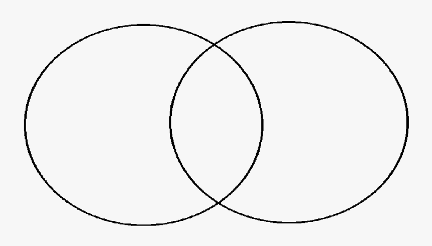
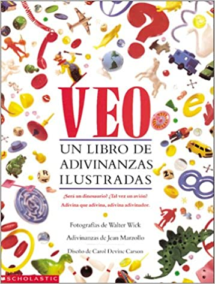

class: center, middle, inverse

# Mi escultura favorita 

---
class: center, middle, inverse

# ¿Qué es una casa? 

---
class: center, middle
# Respondemos: ¿Qué es una casa?

https://pollev.com/nicolerodriguez148 

---
class: center, middle 

<iframe src="https://pollev-embeds.com/free_text_polls/TRHtgzyJvqIZsQ38Uyv6O/respond" width="800px" height="600px"></iframe>

---
class: center, middle
# Mi casa en Middlebury vs mi casa en [X]

---

# Comparamos nuestras vidas con un@ compañer@

#### **Ejemplo**: 
Mi vida en Middlebury es muy [diferente] en comparación con mi vida en Bridgewater.
Prefiero mi cama en Bridgewater. 
En los dos lugares tengo amigos y familia. 
En Middlebury camino más que en Bridgewater. 
Como menos aquí que en Bridgewater, porque mi mamá cocina muy bien. 

---
class: title-slide-section-blue, bottom, center
background-image: url(libs/img/correr.png)
background-size: contain
background-position: 50% 50%

# .white[¿Qué están haciendo?]

--

# .white[Están corr*iendo*]

---
class: title-slide-section-white, left
background-image: url(libs/img/nicole.png)
background-size: contain
background-position: 100% 50%

# .blue[¿Qué está haciendo?]

--

# .blue[Está grit*ando*]

---
class: title-slide-section-white, left
background-image: url(libs/img/photo.png)
background-size: contain
background-position: 100% 50%

# .white[¿Qué están haciendo?]

--

.pull-left[
# .white[Están durm*iendo*]
]

.pull-right[
# .white[Están tom*ando* fotos]
]

---
class: title-slide-section-white, left
background-image: url(libs/img/soccer.png)
background-size: contain
background-position: 100% 50%

# .white[¿Qué están haciendo Carmen y Gillian?]

--

.pull-left[
# .white[Están patin*ando* sobre hielo.]
]

.pull-right[
# .white[Están jug*ando* fútbol.]
]

---
class: title-slide-section-white, bottom
background-image: url(libs/img/grouphike.png)
background-size: contain
background-position: 100% 50%

# .white[¿Qué estamos haciendo?]

--

.pull-left[
# .white[Estamos hac*iendo* senderismo.]
]

.pull-right[
# .white[Estamos llor*ando*.]
]

---

class: title-slide-section-white, left
background-image: url(libs/img/yoga.png)
background-size: contain
background-position: 100% 50%

# .blue[¿Qué está haciendo la profe Alicia?]

--

.pull-left[
# .blue[Está tej*iendo* una bufanda.]
]

.pull-right[
# .blue[Está hac*iendo* yoga.]
]

---
class: title-slide-section-white, left
background-image: url(libs/img/trabajo.png)
background-size: contain
background-position: 100% 50%

# .blue[¿Qué estoy haciendo?]

--

.pull-left[
# .blue[Estoy trabaj*ando* en la tesis.]
]

.pull-right[
# .blue[Estoy mir*ando* el partido de fútbol.]
]

---
class: title-slide-section-white, left
background-image: url(libs/img/gym.png)
background-size: contain
background-position: 100% 50%

# .blue[¿Qué estamos haciendo?]

--

.pull-left[
# .white[Estamos hac*iendo* ejercicio.]
]

.pull-right[
# .white[Estamos llor*ando* mucho.]
]

---
class: center, middle, inverse

# Veo Veo

---
# Para jugar: 

.pull-left[
**Persona A**: 

- una descripción de la persona

- Veo veo a [una persona] con [el pelo azúl]. 

]

.pull-right[
**Persona B**:

- una descripción de la acción

- La persona **está caminando** afuera. 
]

---

class: inverse, middle, center

# El presente progresivo

---

# El presente progresivo

- Sirve para hablar de acciones en progreso

- estar + gerundio
  - -ar = ando
  - -er/-ir = iendo

--

.pull-left[

1. com**er**

2. com

3. com + iendo

4. comiendo

5. Estoy comiendo. 

]

--

.pull-right[

1. habl**ar**

2. habl

3. habl + ando

4. hablando

5. Estoy hablando. 

]

---

# El presente progresivo

### Formas irregulares

.pull-left[

- pedir, servir, vestir, decir, repetir, seguir

- leer, creer, oír

- dormir

]

--

.pull-right[

- e & i ("pidiendo")

- y ("leyendo")

- o & u ("durmiendo")

]

---
class: title-slide-section-blue, bottom
background-image: url(libs/img/hacer8.png)
background-size: contain
background-position: 100% 50%

# .Large[.white[¿Qué está haciendo?]]

---
class: title-slide-section-blue, center, bottom
background-image: url(libs/img/hacer9.png)
background-size: contain
background-position: 50% 50%

# .Large[.white[¿Qué está haciendo?]]

---
class: title-slide-section-blue, bottom
background-image: url(libs/img/hacer10.png)
background-size: contain
background-position: 100% 50%

# .Large[.white[¿Qué están haciendo?]]

---
class: title-slide-section-blue, center, bottom
background-image: url(libs/img/hacer11.png)
background-size: contain
background-position: 50% 50%

# .Large[.white[¿Qué está haciendo?]]

---
class: title-slide-section-blue, center, bottom
background-image: url(libs/img/hacer12.png)
background-size: contain
background-position: 50% 50%

# .Large[.white[¿Qué están haciendo?]]

---
class: title-slide-section-blue, right, bottom
background-image: url(libs/img/hacer13.png)
background-size: contain
background-position: 0% 50%

# .Large[.white[¿Qué están haciendo?]]

---
class: title-slide-section-blue, center, bottom
background-image: url(libs/img/hacer16.png)
background-size: contain
background-position: 50% 50%

# .Large[.white[¿Qué están haciendo?]]

---
class: center, middle, inverse

# Kahoot

https://play.kahoot.it/v2/?quizId=22701978-b525-4317-8a68-ed908e1b64ef 

---

# Tarea

- pg 185 y 186 en el libro

- clínica de pronunciación 4-5pm (MBH 104)

- taller de máscaras 4-5pm (MBH 311)

- cultura popular 4-5pm  (FRE 013)

- la película: "El método" 8:30pm (auditorio Dana)

---
# Resumen

### Cosas que hemos visto...

.pull-left[

- Mucho vocabulario

- El abecedario

- Los números

- Los artículos (definidos, indefinidos)

- El presente

- La concordancia

- Los adjetivos

- Los adjetivos posesivos

- La posesión con "de"

]

.pull-right[

- Ser y estar

- Gustar, tener, ir

- Algunos verbos irregulares

- La familia

- Se recíproco

- El presente progresivo

]

---

# Precalentamiento

### ¿Qué están haciendo?

--

background-image: url(https://raw.githubusercontent.com/jvcasillas/media/master/general/gifs/throw_into_pool.gif)
background-position: 95% 50%
background-size: 600px

--

background-image: url(https://raw.githubusercontent.com/jvcasillas/media/master/teaching/gifs/haha.gif)
background-position: 95% 50%
background-size: 600px

--

background-image: url(https://raw.githubusercontent.com/jvcasillas/media/master/teaching/gifs/partner.gif)
background-position: 95% 50%
background-size: 600px

--

background-image: url(https://raw.githubusercontent.com/jvcasillas/media/master/teaching/gifs/rock_clap.gif)
background-position: 95% 50%
background-size: 600px

---
class: title-slide-section-grey, middle

# Los complementos directos

---

# ¿Qué ves?

&lt;div align="center"&gt;
  &lt;img width="300" src="./assets/img/flan1.png"&gt;
  &lt;img width="300" src="./assets/img/carne.jpg"&gt;
&lt;/div&gt;

---

# ¿Qué comes?

&lt;div align="center"&gt;
  &lt;img width="300" src="./assets/img/camarero1.jpg"&gt;
  &lt;img width="500" src="./assets/img/almuerzo1.png"&gt;
&lt;/div&gt;

---

# Los complementos directos...

### Reciben la acción del verbo

&lt;div style="float: right"&gt;
 &lt;img width="200" src="./assets/img/flan1.png"&gt;  
 &lt;img width="200" src="./assets/img/camarero1.jpg"&gt;
&lt;/div&gt;

--

- Voy a probar **el flan**.
- ¿Qué voy a probar? **El flan**.

&lt;/br&gt;

--

- Veo a **nuestro camarero**.
- ¿A quién veo? A **nuestro camarero**.

---

# Los &lt;blue&gt;PRONOMBRES&lt;/blue&gt; de complementos directos...

### Sirven para evitar la repitición

&lt;div style="float: right"&gt;
 &lt;img width="200" src="./assets/img/flan1.png"&gt;  
 &lt;img width="200" src="./assets/img/camarero1.jpg"&gt;
&lt;/div&gt;

--

- Voy a probar **el flan**.
- **Lo** como con frecuencia.

&lt;/br&gt;

--

- Veo a **nuestro camarero**.
- **Lo** veo enfrente del restaurante.

---

# Los &lt;blue&gt;pronombres&lt;/blue&gt; de complementos directos

Concuerdan en cuanto al número y género. 

| Persona     | &amp;#160; | Singular   | &amp;nbsp; | Plural       |
|:------------|:-------|:-----------|:-------|:-------------|
| 1a          |        | **me**     |        | **nos**      |
| 2a          |        | **te**     |        | **os**       |
| 3a          |        | **lo, la** |        | **los, las** |
| sustantivos |        | **lo, la** |        | **los, las** |

&lt;/br&gt;

--

- ¿Cómo quieres **el café**?
- **Lo** tomo con azúcar.

--

&lt;p&gt;&lt;/p&gt;

- ¿Tienes **las galletas**?
- Sí, **las** tengo.

--

&lt;p&gt;&lt;/p&gt;

- ¿Tú **me** ves?
- Sí, yo **te** veo. 

---

# Los complementos directos

## La posición de los complementos directos pronominales depende de la forma verbal.

--

### Con un verbo conjugado

- ¿Necesitas **el menú**?
- No, no **lo** necesito.

--

### Con un verbo conjugado y un infinitivo 

- ¿Vas a servir **la torta** ahora?
- No, **la** voy a servir un poco más tarde.
- No, voy a servir**la** un poco más tarde.

---

# A practicar

### Forma una pregunta para tu compañer@ usando los ejemplos abajo  

Ej. **ayudar económicamente**  

&lt;grey&gt;Pregunta&lt;/grey&gt;: ¿Quién &lt;blue&gt;te&lt;/blue&gt; **ayuda** económicamente?  

--

&lt;grey&gt;Respuesta&lt;/grey&gt;: Mis padres &lt;blue&gt;me&lt;/blue&gt; **ayudan** económicamente. 

--

1. querer mucho
2. escuchar en todo momento
3. llamar por teléfono con frecuencia
4. ayudar con los problemas
5. aconsejar cuando estás indeciso/a

---

# ¿Qué ves?

&lt;div align="center"&gt;
  &lt;img width="300" src="./assets/img/gryffindor.jpg"&gt;
  &lt;img width="300" src="./assets/img/hufflepuff.jpg"&gt;
  &lt;img width="300" src="./assets/img/slytherin.jpg"&gt;
&lt;/div&gt;

---

# ¿Qué ves?

&lt;div align="center"&gt;
  &lt;img width="300" src="./assets/img/jacobo.jpg"&gt;
  &lt;img width="300" src="./assets/img/moto.jpg"&gt;
  &lt;img width="300" src="./assets/img/maya.jpg"&gt;
&lt;/div&gt;

---

# ¿Qué ves?

&lt;div align="center"&gt;
  &lt;img width="600" src="./assets/img/queves1.jpg"&gt;
&lt;/div&gt;

---

# ¿Qué ves?

&lt;div align="center"&gt;
  &lt;img width="600" src="./assets/img/queves2.jpg"&gt;
&lt;/div&gt;

---

# ¿Qué ves?

&lt;div align="center"&gt;
  &lt;img width="600" src="./assets/img/queves3.jpg"&gt;
&lt;/div&gt;

---

# ¿Qué ves?

&lt;div align="center"&gt;
  &lt;img width="600" src="./assets/img/queves4.jpg"&gt;
&lt;/div&gt;

---

# ¿Qué ves?

&lt;div align="center"&gt;
  &lt;img width="600" src="./assets/img/queves5.jpg"&gt;
&lt;/div&gt;
