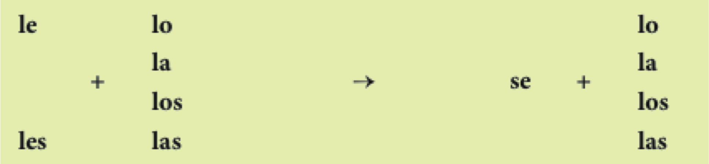
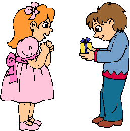
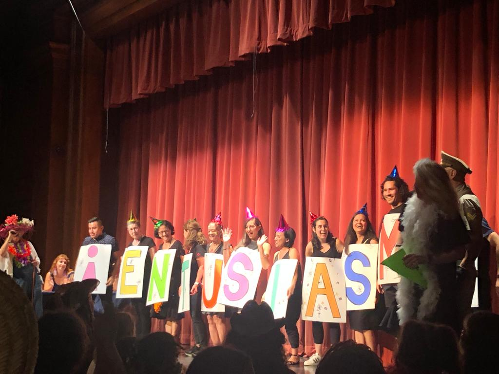
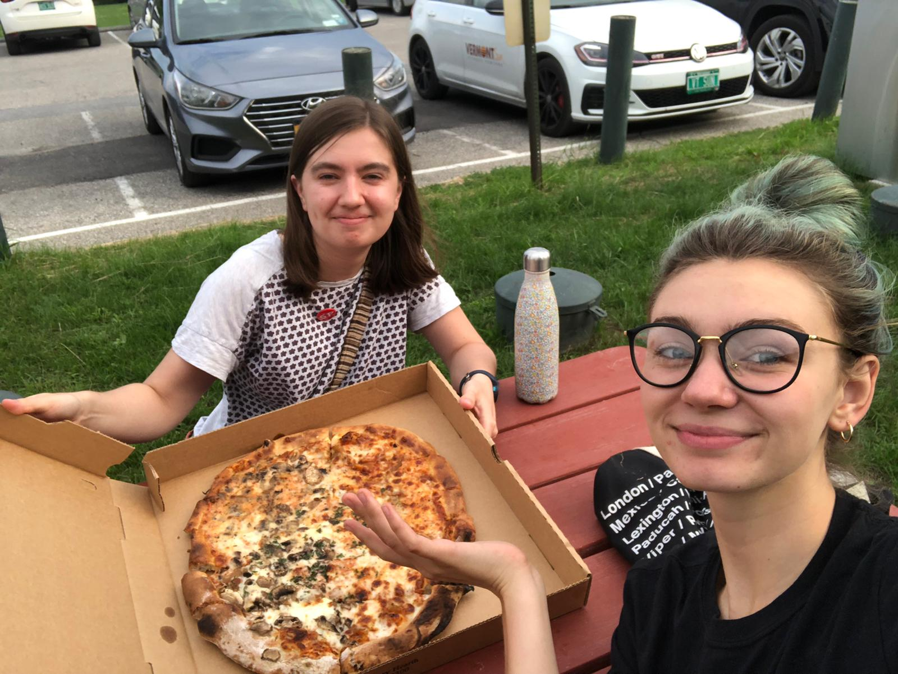
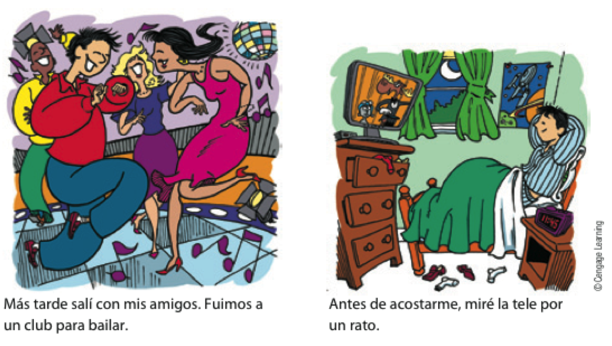
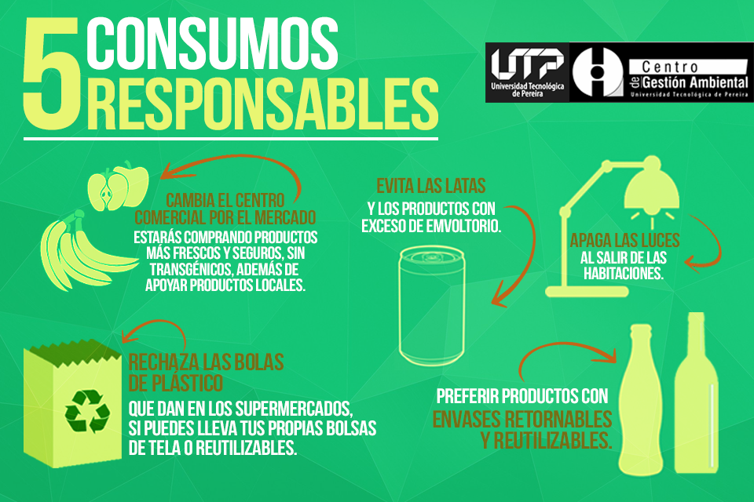
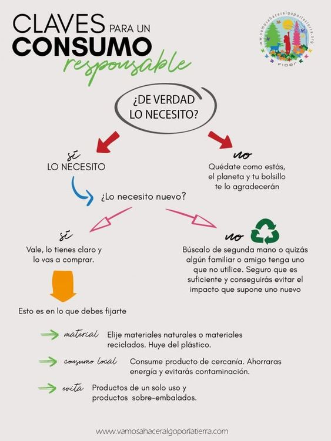
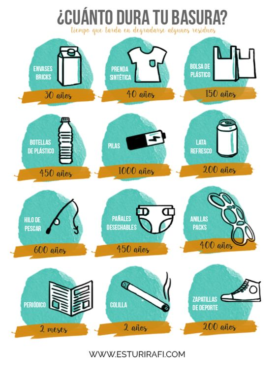

# Repaso: la acentuación

.pull-left[

- reglas de acentuación para: 

- aguda

- llana

- esdrújula

]

--

.pull-right[

Silabificar estas palabras y pon el acento si hace falta

- arbol

- bebe

- azucar

- amigo

- orden

- dificil

- mama

- inlges

]

---
class: middle, center, inverse

# Hacia el consumo responsable

---
class: middle, center, inverse

# ¿Qué es el consumo responsable?

---
# Repaso del complemento directo 

### En relación al conusmo responsable 

- Hacemos una lista de cosas reusables 

- Creamos un diálogo usando complementos directos con nuestr@s compañer@s

---
class: inverse, middle, center 

# ¡Pero hay más! 

### Existe el objecto INdirecto

---
class: inverse, middle, center

# Complemento indirecto

---

# Los complementos indirectos

### Expresan ¿a quién? o ¿para quién?

Siempre **les** sirvo *vino* **a mis invitados**.

--

### ¿Qué sirvo? 

- *El vino*  
(el complemento directo)

--

### ¿A quién sirvo? 

- **A mis invitados**  
(el complemento indirecto)

---
background-image: url("https://www.wpclipart.com/signs_symbol/arrows/BW_arrows/arrow_BW_thin_left.png")
background-position: 47% 38%
background-size: 60px

# Los complementos indirectos

|  Singular         |            |  Plural               |            |
| ----------------- | ---------- | --------------------- | ---------- |
| yo                |  **me**    | nosotros              | **nos**    |
| tú                | **te**     | vosotros              | **os**     |
| usted, él, ella   | .blue[le]  | ustedes, ellos, ellas | .blue[les] |

- ¿**Me** puede traer una cuchara?

- Siempre **les** preparo las galletas.

---

# Los complementos indirectos

### La posición de los complementos indirectos pronominales depende de la forma verbal

--

#### Con un verbo conjugado

- ¿Cuánto **le** debo?

--

#### Con un verbo conjugado y un infinitivo

- ¿**Me** puede traer un tenedor?
- ¿Puede traer**me** un tenedor?

---

# Los complementos indirectos

### Muchas veces el complemento indirecto .blue[y] el pronombre de complemento indirecto aparecen en la misma oración para evitar la confusión

- Siempre **le** sirvo platos vegetarianos **a María**.

- **Les** voy a servir una sopa **a mis invitados**.

---
class: inverse-title-slide-grey, middle

# Dos complementos...

---

# Dos complementos: directo e indirecto

.pull-left[

### .blue[CD]

|        | singular | plural   |
| ------ | -------- | -------- |
| 1a     | me       | nos      |
| 2a     | te       | os       |
| 3a     | lo, la   | los, las |

]

.pull-right[

### **CI**

|        | singular | plural |
| ------ | -------- | ------ |
| 1a     | me       | nos    |
| 2a     | te       | os     |
| 3a     | le       | les    |

]

---

# Dos complementos: directo e indirecto

### Mami, ¿**me** haces .blue[unas galletas]?

--

### Sí, **te** .blue[las] hago esta tarde.

---

# Dos complementos: directo e indirecto

### Mami, ¿**me** haces .blue[unas galletas]?

- ¿Qué haces?  
  - unas galletas (el complemento directo)
- ¿A quién o para quién?  
  - a mí (me) (el complemento indirecto)

--

### Sí, **te** .blue[las] hago esta tarde.

- Te = para ti
- las = las galletas

---

# A veces "le" y "les" cambian a "se"

 <align="center">
  

--

- ¿Me puede traer un menú?
- Ahora **se** lo traigo. 

---

# ¿Qué pasa?

 <align="center">
 

--

.pull-left[

### El perro come *las pelotas de tenis*

]

--

.pull-right[

### *Las* come. 

]

---

# ¿Qué pasa?
 <align="center">
  

--

.pull-left[

### Ari **le** da .RUred[una manzana] **a la maestra**.

]

--

.pull-right[

### **Se** .RUred[la] da.

]

---
class: title-slide-section-white, left
background-image: url(libs/img/chloe.jpeg)
background-size: contain
background-position: 100% 50%

# ¿Qué pasa?

--

.pull-left[

### Chloe **le** da .RUred[gafas] **a Nicole**.

--

### **Se** .RUred[las] da.

]

---

# ¿Qué pasa?

 <align="center">
  

--

.pull-left[

### El niño **le** va a regalar .RUred[una sorpresa] **a la niña**.

]

--

.pull-right[

### **Se** .RUred[la] va a regalar.  
### Va a regalár**se**.RUred[la].

]

---

# ¿Qué pasa?

 <align="center">
  

---

# ¿Qué pasa?

 <align="center">
  

---

class: center, middle

# Cuéntanos de tu último cumpleanos. 

- usa el presente

- intenta usar un OD y OI 2 veces

---

Kahoot

https://play.kahoot.it/v2/?quizId=580ccd99-9cc5-4f17-a4ad-4785ae886619 

---
class: center, middle, inverse

# Examen oral 1 practica 

- citas rápidas 

---
class: middle, inverse, center
# Día 2

---

# Precalentamiento

#### Cambia estas frases para usar C.D. y C.I. 

**Ejemplo**: Mi mamá da las galletas a nosotros.

**Respuesta**: Mi mamá .blue[nos las] da. 

- Rin da las noticias a Gillian. 

- Evelyn compra un regalo a ti. 

- Esther cuenta un secreto a nosotras. 

- Vosotros vendéis un coche a elles. 

- Yo cambio la ropa a su bebé. 

---
class: center, middle, inverse

# Juego de sillas

---

# Las reglas 

- #1 ESTO ES UN JUEGO.

- Vamos a dividirnos en 2 equipos

--

- Una persona va a la vez

--

- No se puede mover sin las sillas

---
class: title-slide-section-white
background-image: url(libs/img/ejemplo.png)
background-size: contain
background-position: 

---
class: title-slide-section-white
background-image: url(libs/img/actual.png)
background-size: contain
background-position: 

---
class: middle, inverse, center

# Nuestro fin de semana pasado

---

# **Fui** a la fiesta de disfraces el viernes. 

---

# Evelyn y Maya **comieron** pizza. 

---

class: title-slide-section-white, left
background-image: url(libs/img/arcadia.jpg)
background-size: contain
background-position: 100% 50%

# Ben, Gillian, y Rin **salieron** a Arcadia

---

# Dani se **emborrachó** un poco. 

(insert img)

---

# Yo **manejé** a Burlington (con resaca)

---

# Gym

---

# Cena de profes

---

class: inverse, middle, center

# El pretérito

---

# ¿Qué hiciste ayer?: el pasado

 <align="center">
  

---

# ¿Qué hiciste ayer?: el pasado

 <align="center">
  

---

# ¿Qué hiciste ayer?: el pasado

 <align="center">
  

---

# El pretérito expresa el pasado con una referencia a un tiempo particular

- Salí con unos compañeros de clase **anoche**.

--

- **Ayer** fuimos a Dos Hermanos.

--

- **La semana pasada** corrimos dos millas.

--

- Me bañé en el mar **el año pasado**. 

---

# El pretérito

|                  |     tomar     | volver         |   salir       |
| ---------------  | ------------- | -------------- | ------------- |
| yo               | tom**é**      | volv**í**      | sal**í**      |
| tú               | tom**aste**   | volv**iste**   | sal**iste**   |
| Ud./él/ella      | tom**ó**      | volv**ió**     | sal**ió**     |
| nosotros(as)     | tom**amos**   | volv**imos**   | sal**imos**   |
| vosotros(as)     | tom**asteis** | volv**isteis** | sal**isteis** |
| Uds./ellos/ellas | tom**aron**   | volv**ieron**  | sal**ieron**  |

--

**¡OJO!**

-  Los verbos reflexivos requieren el pronombre reflexivo.
- **Me desperté** a las ocho ayer.

--

-  El verbo gustar solo usa dos formas en el pretérito.
- **Me gustó** el concierto. No **me gustaron** esas dos películas.

---

# ¿Qué hiciste la semana pasada?

- Piensa en algunas cosas que hiciste la semana pasada

- Forma 3 oraciones usando el préterito y cuéntaselas a tu grupo

- Responde a las oraciones de tus compañeros/as con más preguntas en el pasado

---

### Encuentra a alguien que...

.pull-left[

1. nadó en el lago.

2. cenó en el pueblo. 

3. rompió la palabra de honor.

4. miró juego de tronos.

5. bebió demasiado.

6. estudió todo el fin de semana. 

7. salió de Middlebury.

8. tomó comida de Proctor.

]

--

.small[

|                  | tomar         |   volver       |   salir       |
| :--------------- | ------------- | -------------- | ------------- |
| yo               | tom**é**      | volv**í**      | sal**í**      |
| tú               | tom**aste**   | volv**iste**   | sal**iste**   |
| Ud./él/ella      | tom**ó**      | volv**ió**     | sal**ió**     |
| nosotros(as)     | tom**amos**   | volv**imos**   | sal**imos**   |
| vosotros(as)     | tom**asteis** | volv**isteis** | sal**isteis** |
| Uds./ellos/ellas | tom**aron**   | volv**ieron**  | sal**ieron**  |

]

---

# Más sobre el pretérito 

### Expresa un momento particular en el pasado.

**Palabras importantes: ayer, anoche, la semana pasada**  

- Anoche miramos la televisión.
- Mi abuela me visitó hace dos semanas.

---

# El pretérito 

### Expresa un evento que ocurrió varias veces

**Palabras importantes: una vez, dos veces, varias veces**

- Fuimos a la piscina dos veces la semana pasada.

---

# El pretérito 

### Expresa cuánto tiempo duró un evento.

**Palabras importantes: por veinte minutos, por dos días**

- Arturo habló por teléfono por quince minutos.

---

# El pretérito

### Resume una experiencia (al principio o al final de una historia)

- Ayer fue un día fantástico en la uni. Primero...

---

# Mi experiencia en Midd

Querida mamá,  

Ya \_\_\_\_\_\_\_\_\_\_ (llevar, presente) 5 semanas en el programa de 
Middlebury. 
\_\_\_\_\_\_\_\_\_\_ (ser/estar, presente) muy bien, creo, pero yo siempre 
\_\_\_\_\_\_\_\_\_\_ (ser/estar, presente) cansadx y tengo mucha tarea. 
La semana pasada \_\_\_\_\_\_\_\_\_\_ (escribir) 6 ensayos para mi clase de 
escritura. 
¡No \_\_\_\_\_\_\_\_\_\_ (dormir) nada! 
\_\_\_\_\_\_\_\_\_\_ (estudiar) muchísimo y todos mis amigos 
\_\_\_\_\_\_\_\_\_\_ (salir) al lago para festejar sin mí. 
Ellos lo \_\_\_\_\_\_\_\_\_\_ (pasar) muy bien y yo \_\_\_\_\_\_\_\_\_\_ 
(ensayar) mi presentación oral para la clase de Nicole 
Cuando \_\_\_\_\_\_\_\_\_\_ (ellos volver) me dijeron "¡te lo 
\_\_\_\_\_\_\_\_\_\_ (tú perder)! Fue el día más divertido desde que 
\_\_\_\_\_\_\_\_\_\_ (empezar) el coronavirus". 
Yo \_\_\_\_\_\_\_\_\_\_ (sentir) FOMO, pero al menos \_\_\_\_\_\_\_\_\_\_ 
(trabajar) más con los complementos directos e indirectos y 
\_\_\_\_\_\_\_\_\_\_ (mirar) 4 películas en español. 
Bueno, te dejo, que tengo que trabajar en mi proyecto de cultura.  

Un beso,  
Triste estudiante de nivel 1.5 😭

---

# Mi experiencia en Midd

Querida mamá,  

Ya **llevo** 5 semanas en el programa de Middlebury.
**Estoy** muy bien, creo, pero yo siempre **estoy** cansadx y tengo mucha tarea. 
La semana pasada **escribí** 6 ensayos para mi clase de escritura.
¡No **dormí** nada! 
**Estudié** muchísimo y todos mis amigos **salieron** al lago para festejar 
sin mí. 
Ellos lo **pasaron** muy bien y yo **ensayé** mi presentación oral para la 
clase de Nicole. 
Cuando **volvieron** me dijeron "¡te lo **perdiste**! Fue el día más divertido 
desde que **empezó** el coronavirus". 
Yo **sentí** FOMO, pero al menos **trabajé** más con los complementos directos 
e indirectos y **miré** 4 películas en español. 
Bueno, te dejo, que tengo que trabajar más en mi proyecto de cultura.  

Un beso,  
Triste estudiante de nivel 1.5 😭

---
class: center, middle 

# Mi experiencia en Midd

#### Una carta para un ser querid@

---
class: middle, inverse, center
# Día 3

---
# Precalentamiento: rellenad estas oraciones

1. Yo **empezar** a relajarme

2. Tú no **comprender** la tarea 

3. Nosotros **comer** empanadas

4. Hoy ella **aprender** a hablar español

5. Ellos **caminar** a casa para almorzar

6. Vosotros **trabajar** mucho 

---
class: middle, center, inverse

# Hacia el consumo responsable 

---
class: middle, center, inverse

# ¿Qué hicimos en el pasado para ser consumidores responsables?

---
class: middle, center

<iframe width="560" height="315" src="https://www.youtube.com/embed/MHO3oUExoGE" title="YouTube video player" frameborder="0" allow="accelerometer; autoplay; clipboard-write; encrypted-media; gyroscope; picture-in-picture" allowfullscreen></iframe>

---

# Preguntas

- ¿Qué *dijeron* las personas en el video?

- ¿Qué podemos hacer para ser consumidores más responsables?

- Haz una lista de sugerencias para tus amig@s para ayudarles a convertirse en consumidores responsables. 

---

---

---

---
class: center, middle, inverse
# ...pero, ¿es nuestra culpa?

---
class: center, middle, inverse

# El pretérito (verbos irregulares)

---

# Algunos verbos irregulares en el pretérito:

|                  |  ir      |     ser  |  dar    |   ver   |
| ---------------- | -------- | -------- | ------- | ------- |
| yo               | fui      | fui      | di      | vi      |
| tú               | fuiste   | fuiste   | diste   | viste   |
| Ud./él/ella      | fue      | fue      | dio     | vio     |
| nosotros(as)     | fuimos   | fuimos   | dimos   | vimos   |
| vosotros(as)     | fuisteis | fuisteis | disteis | visteis |
| Uds./ellos/ellas | fueron   | fueron   | dieron  | vieron  |

---

# Algunos verbos irregulares en el pretérito: 

### Los verbos con .RUred[u] en la raíz

|      estar      |    poder      |   poner       |    saber      |   tener       |
| :-------------- | ------------  | ------------- | ------------- | ------------- |
| estuv**e**      | pud**e**      | pus**e**      | sup**e**      | tuv**e**      |
| estuv**iste**   | pud**iste**   | pus**iste**   | sup**iste**   | tuv**iste**   |
| estuv**o**      | pud**o**      | pus**o**      | sup**o**      | tuv**o**      |
| estuv**imos**   | pud**imos**   | pus**imos**   | sup**imos**   | tuv**imos**   |
| estuv**isteis** | pud**isteis** | pus**isteis** | sup**isteis** | tuv**isteis** |
| estuv**ieron**  | pud**ieron**  | pus**ieron**  | sup**ieron**  | tuv**ieron**  |

---

# Algunos verbos irregulares en el pretérito: 

### Los verbos con .RUred[i] en la raíz

|     hacer     |      querer    |     venir     |
| :------------ | -------------- | ------------- |
| hic**e**      | quis**e**      | vin**e**      |
| hic**iste**   | quis**iste**   | vin**iste**   |
| hiz**o**      | quis**o**      | vin**o**      |
| hic**imos**   | quis**imos**   | vin**imos**   |
| hic**isteis** | quis**isteis** | vin**isteis** |
| hic**ieron**  | quis**ieron**  | vin**ieron**  |

---

# Algunos verbos irregulares en el pretérito: 

### Los verbos con .RUred[j] en la raíz

|     conducir     |     decir     |     traer      |
| :--------------- | ------------- | -------------- |
| conduj**e**      | dij**e**      | traj**e**      |
| condu**jiste**   | di**jiste**   | tra**jiste**   |
| condu**jo**      | di**jo**      | tra**jo**      |
| condu**jimos**   | di**jimos**   | tra**jimos**   |
| condu**jisteis** | di**jisteis** | tra**jisteis** |
| condu**jeron**   | di**jeron**   | tra**jeron**   |

---
# Habla con tu compañer@ sobre que **hiciste** ayer

- Usa verbos irregulares: conducir, decir, traer, venir, querer, hacer, tener, saber, poner, poder, estar, ir, dar, ser, ver 

- Pregunta a tu compañer@ sobre las actividades que hizo

- ¡Todos vamos a compartir!

---
# Algunas observaciones sobre mi progreso 

- Vamos a evaluar nuestro progreso en clase 

- Responde en Canvas: 

Escribe tres observaciones sobre tu progreso. 
Compara la entrevista del primer día en Middlebury con el Examen 1. 

Es importante dar evidencias concretas del progreso. 
Es mejor dar referencias específicas en las grabaciones (por ejemplo: en el minuto 3:04 del Examen 1 digo la palabra "hablar" con una [H] silenciosa. Es evidencia de mi progreso en la pronunciación, porque en la primera entrevista digo "hablar" en el minuto 2:00 con una [H] aspirada.

---
class: center, middle, inverse

# ¿Encuesta? 
