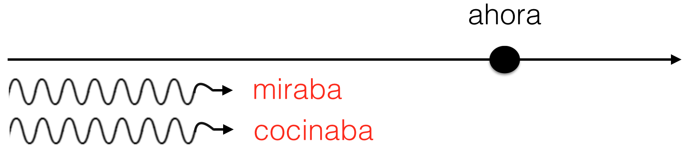

class: center, middle, inverse

# Presentaciones

---
class: center, middle 

# La tradición y la diversidad 

# ¿Hay tradiciones / costumbres importantes en tu familia?

---

class: inverse, middle

  

### Era una noche fría de invierno. Yo estaba en casa, sola y 
### aburrida. Bueno, no estaba completamente sola, porque 
### allí a mi lado, tenía mi gato. Mi gato se llamaba Tigre y 
### era un gato de esos egoístas y fríos. Normalmente, Tigre 
### pasaba la noche en el dormitorio donde dormía debajo de mi cama. Pero esa noche parecía un 
### poco nervioso y se escondía detrás de los cojines del sofá. De repente, Tigre saltó del sofá 
### y corrió a la puerta. Yo lo seguí y abrí la puerta con cuidado...

---
class: inverse, middle

  

### .RUred[Era] una noche fría de invierno. Yo .RUred[estaba] en casa, sola y 
### aburrida. Bueno, no .RUred[estaba] completamente sola, porque 
### allí a mi lado, .RUred[tenía] mi gato. Mi gato se .RUred[llamaba] Tigre y 
### .RUred[era] un gato de esos egoístas y fríos. Normalmente, Tigre 
### .RUred[pasaba] la noche en el dormitorio donde .RUred[dormía] debajo de mi cama. Pero esa noche .RUred[parecía] un 
### poco nervioso y se .RUred[escondía] detrás de los cojines del sofá. De repente, Tigre saltó del sofá 
### y corrió a la puerta. Yo lo seguí y abrí la puerta con cuidado...

---
class: inverse, middle, center

# El imperfecto

---

# El imperfecto 

## En un cuento, el imperfecto describe el trasfondo de la historia y crea una imagen. 

--

### .RUred[Era] una noche fría de invierno. Yo .RUred[estaba] en casa, sola y aburrida. Bueno, no .RUred[estaba] completamente sola, porque allí a mi lado, .RUred[tenía] mi gato. Mi gato se .RUred[llamaba] Tigre y .RUred[era] un gato de esos egoístas y fríos. Normalmente, Tigre .RUred[pasaba] la noche en el dormitorio donde .RUred[dormía] debajo de mi cama. Pero esa noche .RURed[parecía] un poco nervioso y .RUred[se escondía] detrás de los cojines del sofá.

--

.pull-left[

- la hora, la fecha, el lugar
- describir el lugar, a los personajes

]

.pull-right[

- describir las costumbres
- ¿Qué pasa en este momento?

]

Describir en el pasado, imperfecto

---

# El pretérito

## En un cuento, el pretérito narra los eventos importantes del cuento.

--

### Era una noche fría de invierno. Yo estaba en casa, sola y aburrida. Bueno, no estaba completamente sola, porque allí a mi lado, tenía mi gato. Mi gato se llamaba Tigre y era un gato de esos egoístas y fríos. Normalmente, Tigre pasaba la noche en el dormitorio donde dormía debajo de mi cama. Pero esa noche parecía un poco nervioso y se escondía detrás de los cojines del sofá.  
###<black>*De repente*, Tigre **saltó** del sofá y **corrió** a la puerta. Yo lo **seguí** y **abrí** la puerta con cuidado.

---

# En combinación...

- Describimos más con **el imperfecto**. 
- Continuamos y resumimos con <blue>el pretérito</blue>.

--

### .RUred[El imperfecto]:

- Afuera, .RUred[nevaba] un poco.
- La luna .RUred[brillaba] como el sol, pero afuera no se .RUred[veía] a nadie.

--

### **El pretérito**:

- **Cerré** la puerta y **volví** a sentarme en el sofá. 
- **Fue** una experiencia un poco inquietante.

---
class: inverse, middle

  

### .RUred[Era] una noche fría de invierno. Yo .RUred[estaba] en casa, sola y 
### aburrida. Bueno, no .RUred[estaba] completamente sola, porque 
### allí a mi lado, .RUred[tenía] mi gato. Mi gato se .RUred[llamaba] Tigre y 
### .RUred[era] un gato de esos egoístas y fríos. Normalmente, Tigre 
### .RUred[pasaba] la noche en el dormitorio donde .RUred[dormía] debajo de mi cama. Pero esa noche .RUred[parecía] un 
### poco nervioso y se .RUred[escondía] detrás de los cojines del sofá. De repente, Tigre saltó del sofá 
### y corrió a la puerta. Yo lo seguí y abrí la puerta con cuidado...

---

# El pretérito y el imperfecto: 

.pull-left[

### **¿Cómo era?**

]

.pull-right[

### .RUred[¿Qué pasó?]

]

### **Había** una vez una princesa muy hermosa. Una tarde de primavera, la princesa **cantaba** y **paseaba** por el parque del palacio cuando .black[de repente] .RUred[oyó] una voz muy bajita. .RUred[Miró] a su alrededor y .RUred[vio] un sapo que le **sonreía** desde el suelo...

---
class: center, middle, inverse

# Día 2

---
# Precalentamiento

1. Magdalena **vestirse** rápido. 

2. Esa mujer **tener** un catálogo. 

3. Pepe **sentarse** en el sofá. 

4. Mi amiga **perder** la paciencia.

5. Ud. **despertarse** a las once. 

6. Yo **tocar** la flauta. 

7. ¿Quién **entender** ese diálogo? 

8. Tú **servir** una paella rica. 

---
# Precalentamiento

1. Magdalena **se vistió** rápido. 

2. Esa mujer **tuvo** un catálogo. 

3. Pepe **se sentó** en el sofá. 

4. Mi amiga **perdió** la paciencia.

5. Ud. **se despertó** a las once. 

6. Yo **toqué** la flauta. 

7. ¿Quién **entendió** ese diálogo? 

8. Tú **serviste** una paella rica. 

---
# El pretérito y el imperfecto: 

- **Dos acciones**: el imperfecto describe las acciones continuas y simultáneas.

- **Palabras importantes**: 
  - mientras
  - mientras tanto

- Ángel .RUred[miraba] el desfile en la televisión mientras yo .RUred[cocinaba].

--

  

---

# El pretérito y el imperfecto: 

- El pretérito **narra** una serie de acciones completadas.

- Después de mirar el desfile, Ángel **llamó** a su amiga y la **invitó** 
a salir. Primero **fueron** al cine y luego **miraron** los fuegos artificiales. 

--

  

---

# El pretérito y el imperfecto: 

- .RUred[El imperfecto] expresa una acción continua. 
- **El pretérito** expresa su interrupción.

- Palabras importantes: 
  - mientras.... (el imperfecto)
  - cuando (el pretérito)

- **Empezó** a llover mientras .RUred[hacíamos] nuestro picnic.

--

  

---
background-image: url(./libs/img/imperfecto3.png),  url(./libs/img/imperfecto4.png), url(./libs/img/imperfecto5.png)
background-position: 95% 20%, 95% 50%, 95% 80%
background-size: 500px, 500px, 500px

---
background-image: url("./libs/img/resumen.png")
background-size: contain

---
# Cuenta, cuenta, cuenta

### Cuéntale a tu vecino algo que hiciste durante el fin de semana pasado

### Incluye lo siguiente:

- 2 oraciones que contengan acciones que ocurren al mismo tiempo
- 2 o más acciones que ocurran en secuencia
- 2 ejemplos de una acción que interrumpe otra

---

.pull-left[
.content-box-blue[
### **El pretérito**

- UNA acción o evento que ocurrió UNA vez.
- una SERIE de acciones completadas en el pasado.
- una acción que DURÓ un tiempo específico.
- UN EVENTO ESPECÍFICO en el pasado.
- Palabras asociadas al pretérito:  
ayer, la semana pasada, el año pasado, primero, luego
antes de/después de + infinitivo, por último

]
]

--

.pull-right[
.content-box-red[
### .RUred[El imperfecto]

- describe el trasfondo de la historia, crea una imagen
- describe la hora, la fecha, el lugar, a los personajes, las costumbres
- explica qué estaba pasando en un momento del pasado

]
]

--

### El pretérito y el imperfecto para narrar

- Describimos más con el imperfecto.
- Continuamos y resumimos con el pretérito

1. Dos acciones que ocurren al mismo tiempo
2. Una secuencia de acciones completadas 
3. Una acción que interrumpe otra acción continua

---
background-image: url("./libs/img/maya1.JPG")
background-size: 750px
background-position: 130% 50%
class: inverse

# .RUred[Chloe]

### Érase una vez una niña que  
### .RUred[se llamaba] Chloe. Chloe .RUred[era] la niña más  
### bonita y mejor portada de toda la ciudad
### de Bridgewater. .RUred[sonreía] sin parar.
### Le .RUred[gustaba] mucho perseguir a su   
### abuela y siempre .RUred[quería] jugar con  
### todo el mundo.

---
background-image: url("./libs/img/maya2.JPG")
background-size: 1220px
background-position: 50% -90%
background-color: #C0C0C0
class: middle

         
         
 

### La mejor amiga de Chloe .RUred[se llamaba] Nicole .RUred[Era] estudiante graduada y siempre .RUred[estaba] muy ocupada con sus clases. A Nicole .RUred[le encantaba] jugar con Chloe, pero a veces no .RUred[podía] porque .RUred[tenía] mucho trabajo. 

---
background-image: url("./libs/img/maya3.gif")
background-size: 750px
background-position: 140% 50%
class: inverse, middle

### A Chloe no .RUred[le importaban] las clases de Nicole.  
### Ella .RUred[creía] que Nicole .RUred[trabajaba] demasiado e  
### .RUred[intentaba] recordarle de vez en cuando que .RUred[era] 
### necesario tener tiempo para jugar también.

---
background-image: url("./libs/img/maya4.JPG")
background-size: 1300px
background-position: 60% 40%
class: bottom, inverse

### Un día Nicole y Chloe .purple[fueron] al centro comerical. .RUred[Había] muchos juguetes en la tienda de Disney. .RUred[Hacía] calor en el centro comerical. Nicole .purple[decidió] llevar su trabajo de clase para poder estudiar mientras Maya .RUred[jugaba]. 

---

# Chloe

  <video width="450" allowfullscreen controls>
    <source src="./libs/videos/maya.mp4" type="video/mp4">
    <source src="./libs/videos/maya.ogg" type="video/ogg">
  </video>

.pull-left[

### Pero a Chloe no .RUred[le importaban] las clases ni la tarea de Nicole. De repente Chloe .purple[se dio] cuenta de Nicole no le .RUred[prestaba] atención y .purple[empezó] a correr hacia ella lo más rápido que .RUred[podía].

]

--

.pull-left[

### Cuando Nicole .purple[se dio] cuenta, ya .RUred[era] demasiado tarde. Chloe .purple[chocó] con ella a toda velocidad y .purple[rompió] su teléfono. Confundida y algo dolida, Nicole .purple[decidió] que nunca más .RUred[iba] a llevar su trabajo al centro comercial. 

]

---
background-image: url("./libs/img/mayaFinal1.jpg"), url("./libs/img/mayaFinal2.jpg")
background-size: 600px, 700px
background-position: 0% 50%, 100% 50%
class: bottom, center

# ¡.RUred[Fueron felices y comieron perdices]!

---
background-image: url("./libs/img/mayaFinal3.png")
background-size: contain
class: center, middle, inverse

# Fin

---
class: center, middle, inverse

# Batalla Naval

---

---
# El imperfecto

1)     
- **Dos acciones**: el imperfecto describe las acciones continuas y simultáneas.

    

2)    
- El pretérito **narra** una serie de acciones completadas.

    

---

# El imperfecto

3)    
- El imperfecto expresa una **acción continua**.  
- El pretérito expresa su <blue>interrupción</blue>.

    

---

# Más práctica

    
    
    

- Escribe dos ejemplos de cada situación

---

# Una luna de miel

### Día 1

(1. Ser) \_\_\_\_\_\_\_\_\_\_\_\_\_\_\_\_ las diez de la noche. Nosotros (2. tener) \_\_\_\_\_\_\_\_\_\_\_\_\_\_\_\_ hambre. A las diez y media, (3. decidir) \_\_\_\_\_\_\_\_\_\_\_\_\_\_\_\_ pedir comida del restaurante del hotel. Mientras nosotros (4. esperar) \_\_\_\_\_\_\_\_\_\_\_\_\_\_\_\_ la comida, René y yo (5. dormirse) \_\_\_\_\_\_\_\_\_\_\_\_\_\_\_\_. De repente, alguien (6. tocar) \_\_\_\_\_\_\_\_\_\_\_\_\_\_\_\_ la puerta. René (7. despertarse) \_\_\_\_\_\_\_\_\_\_\_\_\_\_\_\_ y (8. abrir) \_\_\_\_\_\_\_\_\_\_\_\_\_\_\_\_ la puerta. (10. llevar) \_\_\_\_\_\_\_\_\_\_\_\_\_\_\_\_ un uniforme de prisionero. El hombre (11. entrar) \_\_\_\_\_\_\_\_\_\_\_\_\_\_\_\_ en la habitación y (12. repetir) \_\_\_\_\_\_\_\_\_\_\_\_\_\_\_\_ dos veces "¡Silencio o los mato!" Segundos después el camarero (13. anunciar) \_\_\_\_\_\_\_\_\_\_\_\_\_\_\_\_ su llegada. Después de un minuto, el prisionero (14. decir) \_\_\_\_\_\_\_\_\_\_\_\_\_\_\_\_, "¡Váyase! No queremos nada". Luego la policía (15. llegar) \_\_\_\_\_\_\_\_\_\_\_\_\_\_\_\_. En cinco minutos, todo (16. terminar) \_\_\_\_\_\_\_\_\_\_\_\_\_\_\_\_. Entonces, nosotros (17. saber) \_\_\_\_\_\_\_\_\_\_\_\_\_\_\_\_ que el prisionero (18. ser) \_\_\_\_\_\_\_\_\_\_\_\_\_\_\_\_ un asesino muy conocido. 

### Día 2

Por la mañana, René y yo (19. despertarse) \_\_\_\_\_\_\_\_\_\_\_\_\_\_\_\_ y (20. irse) \_\_\_\_\_\_\_\_\_\_\_\_\_\_\_\_ a casa. ¡Qué luna de miel!

---

# Una luna de miel

### Día 1

(1. Ser) **Eran** las diez de la noche. Nosotros (2. tener) **teníamos** hambre. A las diez y media, (3. decidir) **decidimos** pedir comida del restaurante del hotel. Mientras nosotros (4. esperar) **esperábamos** la comida, René y yo (5. dormirse) **nos dormimos**. De repente, alguien (6. tocar) **tocó** la puerta. René (7. despertarse) **se despertó** y (8. abrir) **abrió** la puerta. (10. llevar) **Llevaba** un uniforme de prisionero. El hombre (11. entrar) **entró** en la habitación y (12. repetir) **repitió** dos veces "¡Silencio o los mato!" Segundos después el camarero (13. anunciar) **anunció** su llegada. Después de un minuto, el prisionero (14. decir) **dijo**, "¡Váyase! No queremos nada". Luego la policía (15. llegar) **llegó**. En cinco minutos, todo (16. terminar) **terminó**. Entonces, nosotros (17. saber) **supimos** que el prisionero (18. ser) **era** un asesino muy conocido. 

### Día 2

Por la mañana, René y yo (19. despertarse) **nos despertamos** y (20. irse) **nos fuimos** a casa. ¡Qué luna de miel!

---
class: center, middle, inverse

# Día 3 

Funciones y formas: Las comparaciones, pretérito e imperfecto

---

# Preparar el cuento

---

# Lo que hemos visto

.pull-left[

- Sustantivos y artículos

- Pronombres personales

- Estar, ser, tener, ir 

- Posesión

- Verbos regulares 

- Verbos como “gustar”

- Cómo hacer preguntas

- El presente progresivo 

- Verbos de cambio radical

- Verbos irregulares 

- El futuro 

]

.pull-right[

- Ser y estar 

- Verbos reflexivos

- Complemento directo 

- Complemento indirecto 

- Dos complementos juntos

- Los verbos como "gustar"

- El pretérito 

- Pretérito irregular 

- Los adjetivos

- El imperfecto 

- Pretérito vs. Imperfecto 

]

