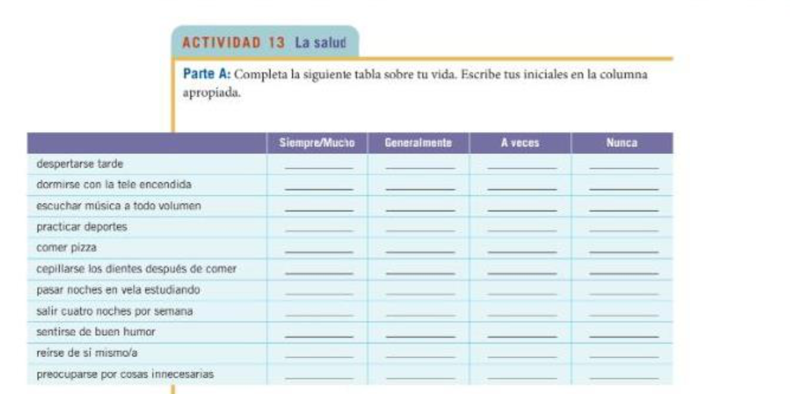
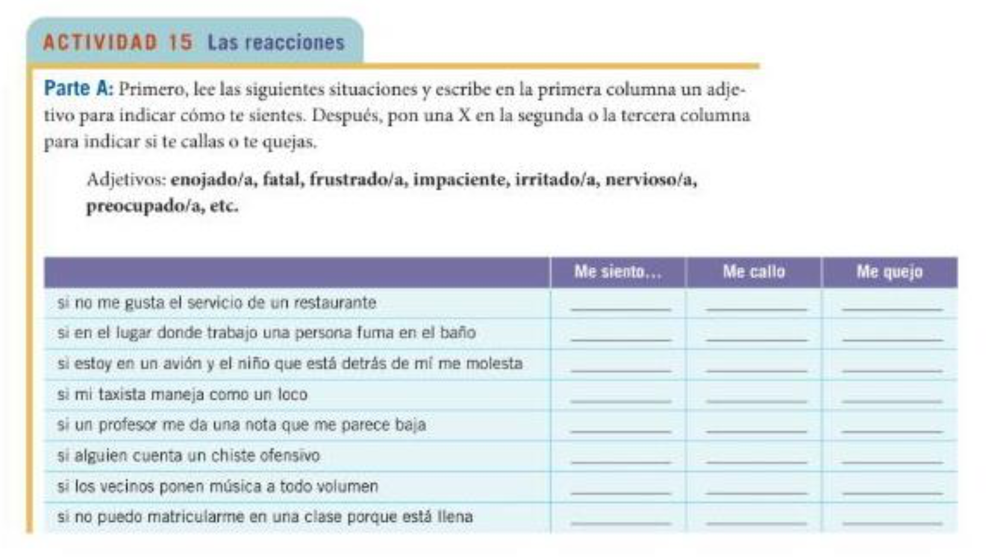
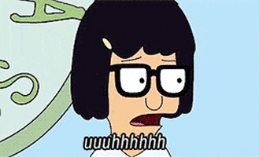

# Nuestro Plan

- Revisar tarea

- Construcciones reflexivas

- La vida nocturna

- Proyecto #1: Las entrevistas 

---
class: middle, center, inverse

# La tarea -- ¿preguntas?
---
class: middle, center, inverse

## Wordle

https://wordle.danielfrg.com 
---
background-image: url(libs/img/spiderman.jpg)
background-size: contain
class: middle

--

# .white[Spiderman (1) ve al Spiderman (2)]

--

# .white[Spiderman (2) ve al Spiderman (1)]

--

# .white[Ellos se ven]

---
background-image: url(libs/img/doghug.png)
background-size: contain
background-position: 200% 50%
class: middle

--

## Kino abraza a Maya

--

## Maya abraza a Kino

--

## Ellos se abrazan

---
background-image: url(libs/img/naruto.png)
background-size: contain
background-color: black

---
background-image: url(libs/img/globos.jpg)
background-size: contain
background-color: black

---

# Para expresar reciprocidad

### Verbos recíprocos

- Verbos que se usan para expresar acciones mútuas

- 2 o más personas participan en una acción que hacen el uno al otro

- Incluye un pronombre recíproco, siempre en plural

--

### Ejemplos

- Marta y yo **nos** .RUred[amamos]

- Ustedes **se** .RUred[conocen]

- Ben and Leslie **se** .RUred[casan]

- Vosotras **os** .RUred[ayudáis] con la tarea 

---

# Para expresar reciprocidad

### Pronombres recíprocos

| Persona   | Pronombre | Ejemplo                                             |
| :-------- | :-------- | :-------------------------------------------------- |
| Primera   | nos       | **Nos** .RUred[vemos] *el uno al otro* en el pasillo. |
|           |           | .white[.]                                             |
| Segunda   | os        | **Os** .RUred[escribís] *mutuamente* durante el verano. |
| \*Segunda | se        | Ustedes **se** .RUred[ayudan] *recíprocamente*.         |
|           |           | .white[.]                                             |
| Tercera   | se        | Los niños **se** .RUred[pelean] *entre sí*.             |

--

.pull-left[
.content-box-blue[
¡.RUred[OJO]! Si se trata de una contrucción de reciprocidad siempre se puede 
incluir una expresión tipo *el uno al otro*, *mutuamente*, *recíprocamente*, 
*entre sí*, *entre ellos*, etc. 
]
]

--

.pull-right[
.content-box-red[
\*En la mayoría de las variedades del español **se** representa 
semánticamente la segunda persona plural (ustedes), aunque su forma es 
gramaticalmente la tercera persona plural.
]
]

---

# Para expresar reciprocidad

### Verbos comunes

- abrazarse
- conocerse
- mirarse
- ayudarse
- despedirse
- pelearse
- besarse
- divorciarse
- reunirse
- casarse
- estrellarse

--

background-image: url(libs/img/crash.dms)
background-size: 450px
background-position: 85% 50%

--

background-image: url(libs/img/hug.gif)
background-size: 450px
background-position: 85% 50%

--

background-image: url(libs/img/despedirse.dms)
background-size: 450px
background-position: 85% 50%

--

background-image: url(libs/img/kisses.gif)
background-size: 450px
background-position: 85% 50%

--

background-image: url(libs/img/pulgas.gif)
background-size: 450px
background-position: 85% 50%

--

background-image: url(libs/img/scratch.gif)
background-size: 450px
background-position: 85% 50%

---

# Construcciones reflexivas

- La persona hace y recibe la acción.

.pull-left[
- **Me** despierto a las 8:00 todos los días.

- Mi padre **se** baña por la noche.

- Mis hermanas siempre **se cepillan** el pelo por la mañana.
]

.pull-right[
- Todas las mañanas despierto a mi padre a las 8:00.

- Mi padre baña a mi hermanito por la noche. 

- Mi hermana cepilla al perro una vez por semana. 
]

---

# Los pronombres reflexivos

|           |           |
| :-------- | :-------- | 
|  **me**   | **nos**   | 
| **te**    | **os**    | 
| **se**    | **se**    |  

--

Verbos reflexivos comunes:

|           |           |           |           |
| :-------- | :-------- | :-------- | :-------- |
| **acostarse**  | **maquillarse** | **afeitarse**  | **peinarse**   |
| **arreglarse** | **ponerse**     | **bañarse**    | **prepararse** |
| **cepillarse** | **vestirse**    | **despertarse**| **quitarse**   |
| **secarse**    | **dormirse**    | **ducharse**   | **lavarse**    |

---
#Actividad 12 - Tu rutina

En parejas, describan cuatro o cinco actividades de su rutina de la mañana y de su rutina de la noche. 

**Modelo**: Por la mañana yo me despierto a las 6:15, pero me levanto a las 6:45 y tomo café antes que nada. Después...

--

**Parte B** Ahora, díganse cuatro cosas que generalmente hacen los fines de semana y tres cosas que van a hacer este fin de semana. 

**Modelo** En general, los fines de semana me levanto tarde, pero este fin de semana voy a levantarme temprano porque...

---

---

---
class: center, middle, inverse

# Descanso

---
# La vida nocturna (y nuestras opiniones)

- Es preferible sacar a bailar a alguien que baliar en grupo.

- La primera fila no es la mejor para ver un concierto. 

- La gente que sale a pasear en auto no tiene nada mejor que hacer. 

- Le gente que te deja plantad@/e generalmente es gente distraída. 

---

# La vida nocturna (y nuestras opiniones)

--

- ¿Van a bailar? ¿Con qué frecuencia? ¿Sacan a bailar a otra persona o esperan a que la otra persona los saque a bailar? 

--

- ¿Les gusta ir a los bares? ¿Por qué? 

--

- ¿Qué hacen si aceptan la invitación de alguien, pero después deciden no salir? 

---
# El uso de ¿qué? y ¿cuál?

- En general se usa de manera paralela al inglés

--

- ¿**Qué** te ocurre? 

- ¿**Qué** haces mañana?

- ¿**Cuál** le gusta más?

- ¿**Cuáles** de estos cantantes prefieren?

---
# Que + ser 

Se usa **qué + ser** para pedir una definición o clasificación 

.pull-left[
- ¿**Qué es** un revendedor?

- Es una persona que le vende a otro algo que compró?

]

--

.pull-right[
- ¿**Qué somos**, amigos o novios?

- 

]
---
# Comparamos

.pull-left[

¿**Qué** es tarea?

]

.pull-right[

¿**Cuál** es la tarea?
]

---
# Actividad 19 - ¿Qué hacemos esta noche?

1. ¿_________ es el objectivo del grupo?

2. ¿_________ programa sugiere Marian: ir al cine, a un disco o dar una vuelta?

3. ¿_________ es Sol Caribe?

4. ¿_________ sugiere hacer Carola?

5. ¿_________ es posiblemente el email de Carola Medrano?

6. ¿_________ significa dejar plantada?

7. ¿_________ de los programas deciden hacer las chicas?

---

# Actividad 20 - ¿Cuánto sabes?

1. ¿A _________ hora almuerza la gente en España?

2. ¿_________ es un sinónimo de *pasarlo bien*?

3. ¿Con _________ de estas formas se despiden dos mujeres mexicanas jóvenes: un beso o un apretón de manos?

4. ¿_________ es tener un contratiempo?

5. ¿_________ películas ve más un mexicano: nacionales o extranjeras?

6. ¿_________ significa el término **hispano** en los EE.UU?

---

# Instrucciones para las entrevistas con un@ profesor@ de Middlebury
