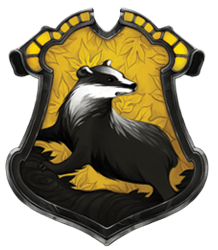

# Nuestro Plan

- Revisar tarea

- Pronombres de sujeto y objeto directo

---
class: middle, center, inverse

# La tarea -- ¿preguntas?
---

class: title-slide-section-grey, middle

# Los complementos directos

---

<iframe width="560" height="315" src="https://www.youtube.com/embed/bdOXnTbyk0g" title="YouTube video player" frameborder="0" allow="accelerometer; autoplay; clipboard-write; encrypted-media; gyroscope; picture-in-picture" allowfullscreen></iframe>

---

# ¿Qué ves?

<align="center">
  
  

---

# ¿Qué comes?

<align="center">
  
  

---

# Los complementos directos...

### Reciben la acción del verbo

<style="float: right">
  
 

--

- Voy a probar **el flan**.
- ¿Qué voy a probar? **El flan**.

--

- Veo a **nuestro camarero**.
- ¿A quién veo? A **nuestro camarero**.

---

# Los .blue[PRONOMBRES] de complementos directos...

### Sirven para evitar la repitición

 <style="float: right">
   
 

---
class: center, middle

- Voy a probar **el flan**.
- **Lo** como con frecuencia.

--

- Veo a **nuestro camarero**.
- **Lo** veo enfrente del restaurante.

---

# Los .blue[pronombres] de complementos directos

Concuerdan en cuanto al número y género. 

| Persona     |  Singular  | Plural       |
|-------------|------------| -------------|
| 1a          | **me**     | **nos**      |
| 2a          | **te**     | **os**       |
| 3a          | **lo, la** | **los, las** |
| sustantivos | **lo, la** | **los, las** |

--

- ¿Cómo quieres **el café**?
- **Lo** tomo con azúcar.

--

- ¿Tienes **las galletas**?
- Sí, **las** tengo.

--

- ¿Tú **me** ves?
- Sí, yo **te** veo. 

---

# Los complementos directos

## La posición de los complementos directos pronominales depende de la forma verbal.

--

### Con un verbo conjugado

- ¿Necesitas **el menú**?
- No, no **lo** necesito.

--

### Con un verbo conjugado y un infinitivo 

- ¿Vas a servir **la torta** ahora?
- No, **la** voy a servir un poco más tarde.
- No, voy a servir**la** un poco más tarde.

---

# A practicar

### Forma una pregunta para tu compañer@ usando los ejemplos abajo  

Ej. **ayudar económicamente**  

.grey[Pregunta]: ¿Quién .blue[te] **ayuda** económicamente?  

--

.grey[Respuesta]: Mis padres .blue[me] **ayudan** económicamente. 

--

1. querer mucho
2. escuchar en todo momento
3. llamar por teléfono con frecuencia
4. ayudar con los problemas
5. aconsejar cuando estás indeciso/a

---

# ¿Qué ves?

<align="center"&>
  
  
  

---

# ¿Qué ves?

 <align="center">
  
  
  

---

# ¿Qué ves?

 <align="center">
  

---

# ¿Qué ves?

 <align="center">
  

---

# ¿Qué ves?

 <align="center">
  

---

# ¿Qué ves?

  <align="center">
  

---

# ¿Qué ves?

 <align="center">
  

---

# Rellenad estas frases

1. Julia tiene ganas de comer paella.
Esta cocinera *[X]* prepara.

2.  Nosotros no comprendemos las reglas.
La profesora *[X]* explica.

3. Alejandro no tiene dinero.
Sus amigos *[X]* prestan.

4. Yo necesito mis gafas.
Mi hermano *[X]* trae.

5.  Yo quiero unos zapatos nuevos.
Mis abuelos *[X]* regalan.

---
class: inverse, middle, center 

# ¡Pero hay más! 

### Existe el objecto INdirecto

---
class: inverse, middle, center

# Complemento indirecto

---

# Los complementos indirectos

### Expresan ¿a quién? o ¿para quién?

Siempre **les** sirvo *vino* **a mis invitados**.

--

### ¿Qué sirvo? 

- *El vino*  
(el complemento directo)

--

### ¿A quién sirvo? 

- **A mis invitados**  
(el complemento indirecto)

---
background-image: url("https://www.wpclipart.com/signs_symbol/arrows/BW_arrows/arrow_BW_thin_left.png")
background-position: 47% 38%
background-size: 60px

# Los complementos indirectos

|  Singular         |            |  Plural               |            |
| ----------------- | ---------- | --------------------- | ---------- |
| yo                |  **me**    | nosotros              | **nos**    |
| tú                | **te**     | vosotros              | **os**     |
| usted, él, ella   | .blue[le]  | ustedes, ellos, ellas | .blue[les] |

- ¿**Me** puede traer una cuchara?

- Siempre **les** preparo las galletas.

---

# Los complementos indirectos

### La posición de los complementos indirectos pronominales depende de la forma verbal

--

#### Con un verbo conjugado

- ¿Cuánto **le** debo?

--

#### Con un verbo conjugado y un infinitivo

- ¿**Me** puede traer un tenedor?
- ¿Puede traer**me** un tenedor?

---

# Los complementos indirectos

### Muchas veces el complemento indirecto .blue[y] el pronombre de complemento indirecto aparecen en la misma oración para evitar la confusión

- Siempre **le** sirvo platos vegetarianos **a María**.

- **Les** voy a servir una sopa **a mis invitados**.

---
class: inverse-title-slide-grey, middle

# Dos complementos...

---

# Dos complementos: directo e indirecto

.pull-left[

### .blue[CD]

|        | singular | plural   |
| ------ | -------- | -------- |
| 1a     | me       | nos      |
| 2a     | te       | os       |
| 3a     | lo, la   | los, las |

]

.pull-right[

### **CI**

|        | singular | plural |
| ------ | -------- | ------ |
| 1a     | me       | nos    |
| 2a     | te       | os     |
| 3a     | le       | les    |

]

---

# Dos complementos: directo e indirecto

### Mami, ¿**me** haces .blue[unas galletas]?

--

### Sí, **te** .blue[las] hago esta tarde.

---

# Dos complementos: directo e indirecto

### Mami, ¿**me** haces .blue[unas galletas]?

- ¿Qué haces?  
  - unas galletas (el complemento directo)
- ¿A quién o para quién?  
  - a mí (me) (el complemento indirecto)

--

### Sí, **te** .blue[las] hago esta tarde.

- Te = para ti
- las = las galletas

---

# A veces "le" y "les" cambian a "se"

 <align="center">
  

--

- ¿Me puede traer un menú?
- Ahora **se** lo traigo. 

---

<iframe width="560" height="315" src="https://www.youtube.com/embed/a8Rwz6zBJSE" title="YouTube video player" frameborder="0" allow="accelerometer; autoplay; clipboard-write; encrypted-media; gyroscope; picture-in-picture" allowfullscreen></iframe>

---

# ¿Qué pasa?

 <align="center">
 

--

.pull-left[

### El perro come *las pelotas de tenis*

]

--

.pull-right[

### *Las* come. 

]

---

# ¿Qué pasa?
 <align="center">
  

--

.pull-left[

### Ari **le** da .RUred[una manzana] **a la maestra**.

]

--

.pull-right[

### **Se** .RUred[la] da.

]

---
class: title-slide-section-white, left
background-image: url(libs/img/chloe.jpeg)
background-size: contain
background-position: 100% 50%

# ¿Qué pasa?

--

.pull-left[

### Chloe **le** da .RUred[gafas] **a Nicole**.

--

### **Se** .RUred[las] da.

]

---

# ¿Qué pasa?

 <align="center">
  

--

.pull-left[

### El niño **le** va a regalar .RUred[una sorpresa] **a la niña**.

]

--

.pull-right[

### **Se** .RUred[la] va a regalar.  
### Va a regalár**se**.RUred[la].

]

---

# ¿Qué pasa?

 <align="center">
  

---

# ¿Qué pasa?

 <align="center">
  

---

class: center, middle

# Cuéntanos de tu último cumpleanos. 

usa el presente

intenta usar un OD y OI 2 veces

---
class: center, middle
Kahoot

https://play.kahoot.it/v2/?quizId=580ccd99-9cc5-4f17-a4ad-4785ae886619 

