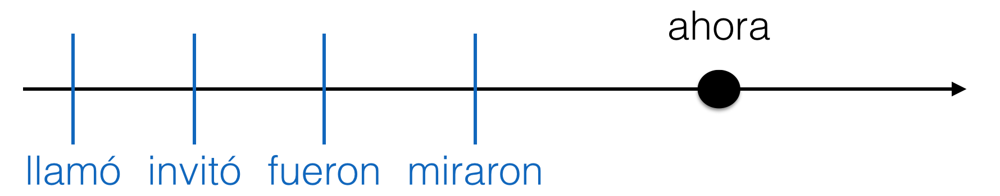

# Nuestro plan

- Revisar tarea

- “El cine” pp. 60-61 act. 18-22

- Pretérito vs. imperfecto 1 p.76 Act. 3-5

---
class: middle, center, inverse,

# Tarea -- ¿preguntas?

---
background-image: url(./libs/img/cine.png),  url(./libs/img/imperfecto4.png), url(./libs/img/imperfecto5.png)
background-position: 95% 95% 50%, 95% 80%
background-size: 500px, 500px, 500px

---

# Actividad 18

1. ¿Quién dirigió la película?

2. ¿Quiénes son los dos personajes históricos?

3. ¿Quién ganó un premio Goya y por qué?

4. ¿Cuándo se estrenó la película?

5. ¿De qué género es?

6. ¿Qué clasificación moral tiene?

7. Lee la critica. ¿Te gustaría ver esta película? ¿Por qué sí o no?

---

# Actividad 20

Piensen en las películas que están dando en el cine y hablen sobre las siguientes ideas:

1. Clasifiquenlas por género.

2. Comenten si las bandas sonoras son buenas, malas o no son de importancia. 

3. Comenten sobre la reacción de los críticos. 

4. Nombren una película que vieron últimamente que no es taquillera pero que vale la pena ver. 

5. Comenten si todas la películas taquilleras son muy hollywoodenses o no. 

---

# El pretérito

## En un cuento, el pretérito narra los eventos importantes del cuento.

--

### Era una noche fría de invierno. Yo estaba en casa, sola y aburrida. Bueno, no estaba completamente sola, porque allí a mi lado, tenía mi gato. Mi gato se llamaba Tigre y era un gato de esos egoístas y fríos. Normalmente, Tigre pasaba la noche en el dormitorio donde dormía debajo de mi cama. Pero esa noche parecía un poco nervioso y se escondía detrás de los cojines del sofá.  
###<black>*De repente*, Tigre **saltó** del sofá y **corrió** a la puerta. Yo lo **seguí** y **abrí** la puerta con cuidado.

---

# En combinación...

- Describimos más con **el imperfecto**. 
- Continuamos y resumimos con <blue>el pretérito</blue>.

--

### .RUred[El imperfecto]:

- Afuera, .RUred[nevaba] un poco.
- La luna .RUred[brillaba] como el sol, pero afuera no se .RUred[veía] a nadie.

--

### **El pretérito**:

- **Cerré** la puerta y **volví** a sentarme en el sofá. 
- **Fue** una experiencia un poco inquietante.

---
class: inverse, middle

  

### .RUred[Era] una noche fría de invierno. Yo .RUred[estaba] en casa, sola y 
### aburrida. Bueno, no .RUred[estaba] completamente sola, porque 
### allí a mi lado, .RUred[tenía] mi gato. Mi gato se .RUred[llamaba] Tigre y 
### .RUred[era] un gato de esos egoístas y fríos. Normalmente, Tigre 
### .RUred[pasaba] la noche en el dormitorio donde .RUred[dormía] debajo de mi cama. Pero esa noche .RUred[parecía] un 
### poco nervioso y se .RUred[escondía] detrás de los cojines del sofá. De repente, Tigre saltó del sofá 
### y corrió a la puerta. Yo lo seguí y abrí la puerta con cuidado...

---

# El pretérito y el imperfecto: 

.pull-left[

### **¿Cómo era?**

]

.pull-right[

### .RUred[¿Qué pasó?]

]

### **Había** una vez una princesa muy hermosa. Una tarde de primavera, la princesa **cantaba** y **paseaba** por el parque del palacio cuando .black[de repente] .RUred[oyó] una voz muy bajita. .RUred[Miró] a su alrededor y .RUred[vio] un sapo que le **sonreía** desde el suelo...

---
# El pretérito y el imperfecto: 

- **Dos acciones**: el imperfecto describe las acciones continuas y simultáneas.

- **Palabras importantes**: 
  - mientras
  - mientras tanto

- Ángel .RUred[miraba] el desfile en la televisión mientras yo .RUred[cocinaba].

--

  

---

# El pretérito y el imperfecto: 

- El pretérito **narra** una serie de acciones completadas.

- Después de mirar el desfile, Ángel **llamó** a su amiga y la **invitó** 
a salir. Primero **fueron** al cine y luego **miraron** los fuegos artificiales. 

--

  

---

# El pretérito y el imperfecto: 

- .RUred[El imperfecto] expresa una acción continua. 
- **El pretérito** expresa su interrupción.

- Palabras importantes: 
  - mientras.... (el imperfecto)
  - cuando (el pretérito)

- **Empezó** a llover mientras .RUred[hacíamos] nuestro picnic.

--

  

---
background-image: url(./libs/img/imperfecto3.png),  url(./libs/img/imperfecto4.png), url(./libs/img/imperfecto5.png)
background-position: 95% 20%, 95% 50%, 95% 80%
background-size: 500px, 500px, 500px

---
background-image: url("./libs/img/resumen.png")
background-size: contain

---
# Cuenta, cuenta, cuenta

### Cuéntale a tu vecino algo que hiciste durante el fin de semana pasado

### Incluye lo siguiente:

- 2 oraciones que contengan acciones que ocurren al mismo tiempo
- 2 o más acciones que ocurran en secuencia
- 2 ejemplos de una acción que interrumpe otra

---

.pull-left[
.content-box-blue[
### **El pretérito**

- UNA acción o evento que ocurrió UNA vez.
- una SERIE de acciones completadas en el pasado.
- una acción que DURÓ un tiempo específico.
- UN EVENTO ESPECÍFICO en el pasado.
- Palabras asociadas al pretérito:  
ayer, la semana pasada, el año pasado, primero, luego
antes de/después de + infinitivo, por último

]
]

--

.pull-right[
.content-box-red[
### .RUred[El imperfecto]

- describe el trasfondo de la historia, crea una imagen
- describe la hora, la fecha, el lugar, a los personajes, las costumbres
- explica qué estaba pasando en un momento del pasado

]
]

--

### El pretérito y el imperfecto para narrar

- Describimos más con el imperfecto.
- Continuamos y resumimos con el pretérito

1. Dos acciones que ocurren al mismo tiempo
2. Una secuencia de acciones completadas 
3. Una acción que interrumpe otra acción continua

---
# Una luna de miel

### Día 1

(1. Ser) \_\_\_\_\_\_\_\_\_\_\_\_\_\_\_\_ las diez de la noche. Nosotros (2. tener) \_\_\_\_\_\_\_\_\_\_\_\_\_\_\_\_ hambre. A las diez y media, (3. decidir) \_\_\_\_\_\_\_\_\_\_\_\_\_\_\_\_ pedir comida del restaurante del hotel. Mientras nosotros (4. esperar) \_\_\_\_\_\_\_\_\_\_\_\_\_\_\_\_ la comida, René y yo (5. dormirse) \_\_\_\_\_\_\_\_\_\_\_\_\_\_\_\_. De repente, alguien (6. tocar) \_\_\_\_\_\_\_\_\_\_\_\_\_\_\_\_ la puerta. René (7. despertarse) \_\_\_\_\_\_\_\_\_\_\_\_\_\_\_\_ y (8. abrir) \_\_\_\_\_\_\_\_\_\_\_\_\_\_\_\_ la puerta. (10. llevar) \_\_\_\_\_\_\_\_\_\_\_\_\_\_\_\_ un uniforme de prisionero. El hombre (11. entrar) \_\_\_\_\_\_\_\_\_\_\_\_\_\_\_\_ en la habitación y (12. repetir) \_\_\_\_\_\_\_\_\_\_\_\_\_\_\_\_ dos veces "¡Silencio o los mato!" Segundos después el camarero (13. anunciar) \_\_\_\_\_\_\_\_\_\_\_\_\_\_\_\_ su llegada. Después de un minuto, el prisionero (14. decir) \_\_\_\_\_\_\_\_\_\_\_\_\_\_\_\_, "¡Váyase! No queremos nada". Luego la policía (15. llegar) \_\_\_\_\_\_\_\_\_\_\_\_\_\_\_\_. En cinco minutos, todo (16. terminar) \_\_\_\_\_\_\_\_\_\_\_\_\_\_\_\_. Entonces, nosotros (17. saber) \_\_\_\_\_\_\_\_\_\_\_\_\_\_\_\_ que el prisionero (18. ser) \_\_\_\_\_\_\_\_\_\_\_\_\_\_\_\_ un asesino muy conocido. 

### Día 2

Por la mañana, René y yo (19. despertarse) \_\_\_\_\_\_\_\_\_\_\_\_\_\_\_\_ y (20. irse) \_\_\_\_\_\_\_\_\_\_\_\_\_\_\_\_ a casa. ¡Qué luna de miel!

---

# Una luna de miel

### Día 1

(1. Ser) **Eran** las diez de la noche. Nosotros (2. tener) **teníamos** hambre. A las diez y media, (3. decidir) **decidimos** pedir comida del restaurante del hotel. Mientras nosotros (4. esperar) **esperábamos** la comida, René y yo (5. dormirse) **nos dormimos**. De repente, alguien (6. tocar) **tocó** la puerta. René (7. despertarse) **se despertó** y (8. abrir) **abrió** la puerta. (10. llevar) **Llevaba** un uniforme de prisionero. El hombre (11. entrar) **entró** en la habitación y (12. repetir) **repitió** dos veces "¡Silencio o los mato!" Segundos después el camarero (13. anunciar) **anunció** su llegada. Después de un minuto, el prisionero (14. decir) **dijo**, "¡Váyase! No queremos nada". Luego la policía (15. llegar) **llegó**. En cinco minutos, todo (16. terminar) **terminó**. Entonces, nosotros (17. saber) **supimos** que el prisionero (18. ser) **era** un asesino muy conocido. 

### Día 2

Por la mañana, René y yo (19. despertarse) **nos despertamos** y (20. irse) **nos fuimos** a casa. ¡Qué luna de miel!

---
# Para practicar un poco más 

https://personal.colby.edu/~bknelson/SLC/ricitos1.html

https://personal.colby.edu/~bknelson/SLC/superhombre.html 

---
# El imperfecto

1)     
- **Dos acciones**: el imperfecto describe las acciones continuas y simultáneas.

    

2)    
- El pretérito **narra** una serie de acciones completadas.

    

---

# El imperfecto

3)    
- El imperfecto expresa una **acción continua**.  
- El pretérito expresa su <blue>interrupción</blue>.

    

---

# Más práctica

    
    
    

- Escribe dos ejemplos de cada situación

---
class: center, middle, inverse 

# Kahoot

https://create.kahoot.it/share/preterite-vs-imperfect/99181cd8-35de-4356-ac71-b564c5a62579 
