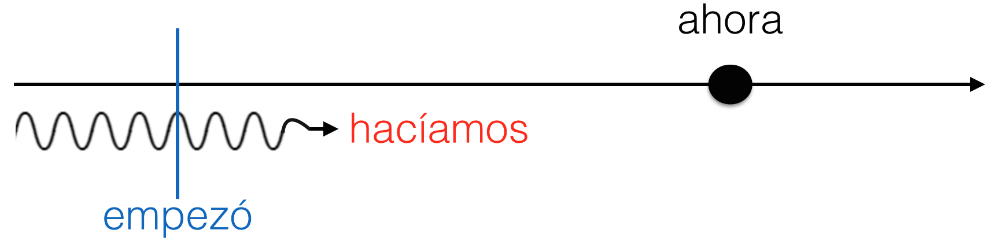

# Nuestro Plan

- Revisar tarea

- La leyenda de maíz

- Pretérito vs imperfecto

---
background-image: url(./libs/img/actividad1.png)
background-position: 95% 95% 50%, 95% 80%
background-size: 500px, 500px, 500px

---
class: center, middle, inverse 

<audio controls>
  <source src="./libs/assets/txt_audio_cd1_track_03.wav" type="audio/wav">
Your browser does not support the audio element.
</audio>

---
# Parte B

Después de escuchar el audio, discutan en su grupo si su interpretación era correcta. De no ser así, resuman qué ocurrió. 

---
# Actividad 8 - La vida antes de la tecnología

En grupos, digan por lo menos una o dos cosas que hacía la gente cuando no existían los siguientes inventos. Luego, discutan cuáles son las ventajas y desventajas de cada uno. 

**modelo**: Cuando no existía el plástico, la gente compraba refrescos en botellas de vidrio. Tampoco había recipentes de Tupperware para la comida. 

Los televisores, los aviones, los teléfonos celulares, la electricidad, las computadoras, Facebook, Twitter, Tumblr

---

# Actividad 9 - El barrio de tu infancia

Con un compañero, describan cómo era su vida y el barrio donde vivían cuando eran niños. Mientras escuchan a su compañero, háganle preguntas para obtener más información. 

**Modelo**

- Mi barrio era muy bonito porque tenía muchos árboles y era tranquilo. 
- El mío también era tranquilo. ¿Había muchos edificios en tu barrio? 

---
# Una luna de miel

### Día 1

(1. Ser) \_\_\_\_\_\_\_\_\_\_\_\_\_\_\_\_ las diez de la noche. Nosotros (2. tener) \_\_\_\_\_\_\_\_\_\_\_\_\_\_\_\_ hambre. A las diez y media, (3. decidir) \_\_\_\_\_\_\_\_\_\_\_\_\_\_\_\_ pedir comida del restaurante del hotel. Mientras nosotros (4. esperar) \_\_\_\_\_\_\_\_\_\_\_\_\_\_\_\_ la comida, René y yo (5. dormirse) \_\_\_\_\_\_\_\_\_\_\_\_\_\_\_\_. De repente, alguien (6. tocar) \_\_\_\_\_\_\_\_\_\_\_\_\_\_\_\_ la puerta. René (7. despertarse) \_\_\_\_\_\_\_\_\_\_\_\_\_\_\_\_ y (8. abrir) \_\_\_\_\_\_\_\_\_\_\_\_\_\_\_\_ la puerta. (10. llevar) \_\_\_\_\_\_\_\_\_\_\_\_\_\_\_\_ un uniforme de prisionero. El hombre (11. entrar) \_\_\_\_\_\_\_\_\_\_\_\_\_\_\_\_ en la habitación y (12. repetir) \_\_\_\_\_\_\_\_\_\_\_\_\_\_\_\_ dos veces "¡Silencio o los mato!" Segundos después el camarero (13. anunciar) \_\_\_\_\_\_\_\_\_\_\_\_\_\_\_\_ su llegada. Después de un minuto, el prisionero (14. decir) \_\_\_\_\_\_\_\_\_\_\_\_\_\_\_\_, "¡Váyase! No queremos nada". Luego la policía (15. llegar) \_\_\_\_\_\_\_\_\_\_\_\_\_\_\_\_. En cinco minutos, todo (16. terminar) \_\_\_\_\_\_\_\_\_\_\_\_\_\_\_\_. Entonces, nosotros (17. saber) \_\_\_\_\_\_\_\_\_\_\_\_\_\_\_\_ que el prisionero (18. ser) \_\_\_\_\_\_\_\_\_\_\_\_\_\_\_\_ un asesino muy conocido. 

### Día 2

Por la mañana, René y yo (19. despertarse) \_\_\_\_\_\_\_\_\_\_\_\_\_\_\_\_ y (20. irse) \_\_\_\_\_\_\_\_\_\_\_\_\_\_\_\_ a casa. ¡Qué luna de miel!

---

# Una luna de miel

### Día 1

(1. Ser) **Eran** las diez de la noche. Nosotros (2. tener) **teníamos** hambre. A las diez y media, (3. decidir) **decidimos** pedir comida del restaurante del hotel. Mientras nosotros (4. esperar) **esperábamos** la comida, René y yo (5. dormirse) **nos dormimos**. De repente, alguien (6. tocar) **tocó** la puerta. René (7. despertarse) **se despertó** y (8. abrir) **abrió** la puerta. (10. llevar) **Llevaba** un uniforme de prisionero. El hombre (11. entrar) **entró** en la habitación y (12. repetir) **repitió** dos veces "¡Silencio o los mato!" Segundos después el camarero (13. anunciar) **anunció** su llegada. Después de un minuto, el prisionero (14. decir) **dijo**, "¡Váyase! No queremos nada". Luego la policía (15. llegar) **llegó**. En cinco minutos, todo (16. terminar) **terminó**. Entonces, nosotros (17. saber) **supimos** que el prisionero (18. ser) **era** un asesino muy conocido. 

### Día 2

Por la mañana, René y yo (19. despertarse) **nos despertamos** y (20. irse) **nos fuimos** a casa. ¡Qué luna de miel!

---
# Para practicar un poco más 

https://personal.colby.edu/~bknelson/SLC/ricitos1.html

https://personal.colby.edu/~bknelson/SLC/superhombre.html 

---
# El imperfecto

1)     
- **Dos acciones**: el imperfecto describe las acciones continuas y simultáneas.

    

2)    
- El pretérito **narra** una serie de acciones completadas.

    

---

# El imperfecto

3)    
- El imperfecto expresa una **acción continua**.  
- El pretérito expresa su <blue>interrupción</blue>.

    

---

# Más práctica

    
    
    

- Escribe dos ejemplos de cada situación

---
class: center, middle, inverse 

# Kahoot

https://create.kahoot.it/share/preterite-vs-imperfect/99181cd8-35de-4356-ac71-b564c5a62579 
