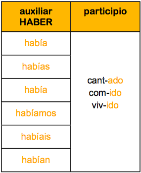
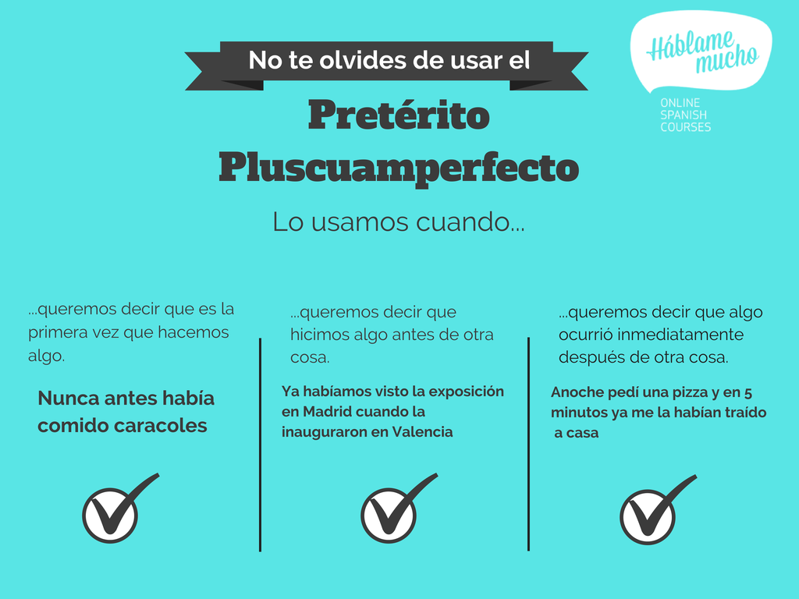
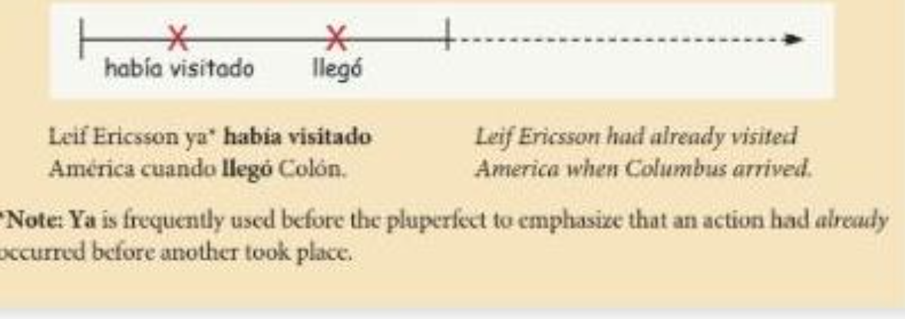

# Nuestro Plan

- Tarea

- Pluscuamperfecto 

---

# Wordle

https://wordle.danielfrg.com

---

# Errores comunes en la prueba 

- Verbos tipo gustar: https://conjuguemos.com/grammar/homework/202 

---
class: middle, center, inverse

# Tarea -- ¿preguntas?

---

# Repaso pretérito vs imperfecto 

https://conjuguemos.com/activities/spanish/grammar/1 

---

# Pluscuamperfecto

- Usamos el pluscuamperfecto para expresar una acción que ocurrió antes de otra acción. 

- Para formar el pluscuamperfecto usamos una forma del verb haber en el imperfecto + el participio pasivo. 

---
class: center, middle

---
class: center, middle 

---
class: center, middle 

<iframe width="560" height="315" src="https://www.youtube.com/embed/Y-MysTEBNyA" title="YouTube video player" frameborder="0" allow="accelerometer; autoplay; clipboard-write; encrypted-media; gyroscope; picture-in-picture" allowfullscreen></iframe>

https://www.profedeele.es/actividad/preterito-pluscuamperfecto/ 

---
# Actividad 17

Parte A: En una línea, marca un mínimo de cinco años importantes de tu vida. Algunas posibilidades son el año en que naciste, el año en que recibiste un premio o que tu equipo ganó una competencia, el año en que trabajaste por primera vez. Marca los años pero no escribas qué hiciste en esos años. 

--

Parte B: En parejas, muéstrense su línea y pregúntense sobre las fechas importantes de su vida. Hagan preguntas como: ¿Qué pasó en...? ¿En qué año (terminaste la escuela secundaria)? ¿Ya habías... cuando...?

--

Parte C: Ahora hablen de la vida de su compañero/a/e diciendo oraciones como la siguiente: 

Elisa ya **había estudiado** un pcco de español cuando **fue** a México por primera vez. 

---
class: center, middle

# ¿Cuántos cuentos cuenta el "cuentacuentos"?

---

# Rúbrica - reflexión 

---

# Entrevista 
