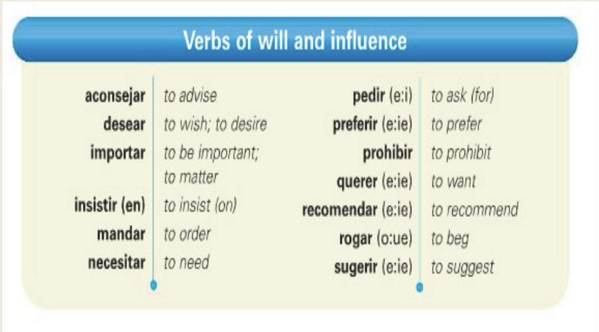

class: center, middle, inverse

# Los Estados Unidos: sabrosa fusión de culturas 

---

#Día 1 - Plan

- Revisar tarea

- Narrar y describir en el pasado

- Present perfecto 

---
class: middle, center, inverse

# Wordle

---
class: middle, center, inverse

# Tarea - ¿preguntas?

---
class: middle, center, inverse
# Narramos y describimos en el pasado 

---
# Una historia interesante

Pensamos en una de las siguientes situaciones y completa la tabla para prepararte a contar la historia. 

- una vez que hiciste algo malo y tus padres te pillaron

- la ocasión en que conociste a tu primer/a novio/a/e

- una fiesta sorpresa a la cual asististe

- tu primer día de universidad

- la peor salida con alguien

|Edad | Lugar | Mes/día de la semana | Emociones |
|:----|:------|:---------------------|:----------|
|     |       |                      |           |

--

**Parte B** Ahora, en parejas, cuéntense sus historias y háganse preguntas para averiguar más información. Tomen apuntes sobre la historia de su compañero/a para luego contarle la histora a otra persona.

---
class: middle, center, inverse
# ¿Cuántos cuentos cuenta el "cuentacuentos"?

---
class: middle, center, inverse

# Presente perfecto (pretérito perfecto)

---
# Presente perfecto (pretérito perfecto)

Tenemos ya tres opciones para hablar del pasado, pero también podemos usar el presente perfecto (pretérito perfecto). Se usa para hablar de eventos que tomaron lugar en el pasado pero son relevantes para el presente, o eventos que empezaron en el pasado y que tal vez continuan en el presente. 

--

**Para formar**: 

|Haber |        |
|:-----|:-------|
| he   | hemos  |
| has  | habéis |
| ha   | han    | 

+ participio pasado

---
# Ejemplos:

- ¿**Has visto** la película El Norte de Gregory Nava?

- Sí, la **he visto** varias veces. La **han mostrado** en escuelas, universidades y cines por más de 30 años. 

---
# Alguna vez y ya

.pull-left[
- Usamos el present perfecto con la expresión **alguna vez**

- ¿Alguna vez **has visitado** el pueblo donde nació tu bisabuelo?
]

.pull-right[
- **Ya** se usa más en España con el presente perfecto 

- **Todavía** se usa en casi todas partes antes de **no** o al final de una oración 

- ¿**Ya** has terminado? 

- ¿Sí, **ya** he terminado.

- ¿**Todavía** no has comido? 

- No, **todavía** no he comido nada. (No, no he comido nada **todavía**)
]
---
# Y este verano, ¿qué?

Pregúntenle a la otra persona si ha hecho las siguientes actividades este verano. La persona que responde debe explicar su respuesta. 

**Modelo**: ¿Ya has tomado un examen? Sí, ya he tomado un examen. Tuve uno... | No, todavía no he tomado ningún examen. Tengo uno...

1. hablar con un consejero/a/e académico/a/e

2. ir a la oficina de su profesor/a de español 

3. elegir las materias para el próximo semestre

4. planear dónde pasar las próximas vacaciones

5. solicitar un trabajo

---
class: middle, center, inverse
# Estudiamos

---
# Repaso parte 1

Pretérito y el pluscuamperfecto 

1. Yo ya __________ (comer) con mi mamá cuando _______ (llegar) mi hermano con hambre. 

2. Cuando yo _________ (decidir) ir a Middlebury, ya ________ (ver) fotos del pueblo. 

3. Mis amigos ya ___________ (comprar) los boletos de avión para ir de vacaciones cuando yo les _______ (decir) que no. 

---
# Un cuento de hadas (pretérito vs imperfecto)

https://personal.colby.edu/~bknelson/SLC/ricitos2.html 

---
# Ser y estar

https://personal.colby.edu/~bknelson/SLC/ser_estar.html 

---
# DO/IO pronoun

https://personal.colby.edu/~bknelson/SLC/DO_or_IO.html

---
# Lo + adjetivo o lo que + verbo

Escribimos oraciones utilizando lo + adjetivo o lo que + verbo

modelo: Lo que me gustaba de mis vecines era que me dieron galletas. 

Lo increíble de tu viaje a Costa Rica fue que comiste lengua. 

- usamos: bueno/encantar/interesante/molestar/trágico

1. Zoom

2. Mi universidad/trabajo

3. Apredender español

4. Los EE.UU

5. Covid

---
# Tarea

- Estudiar: presente del subjuntivo 136 y 137 (verbos de influencia)

- SAM: pg. 65, act. 11, pg. 68 act 14 y 15 p. 69 act. 16

- Estudiar para la prueba 2

---
class: middle, inverse
# Día 2

- Prueba 2

- Revisar la tarea

- Presente del subjuntivo (influencia)

---
class: middle, center, inverse

# Wordle

---
class: middle, center, inverse

# Tarea - ¿preguntas?

---
class: middle, center, inverse

# Presente del subjuntivo (influencia) 

---
# Modo

**Modo** es una manera de expresar la actitud del que habla acerca de lo que se dice

**El sentimiento del hablante cuando expresa una idea.**

.pull-left[
**Indicativo**

- *Indicativo* significa "afirmar un hecho"

- José juega afuera. 

- **Realidad objetiva**
]

.pull-right[
**Subjuntivo**

- Lo usamos para expresar cosas que no son hechos sino deseos, posibilidades, dudas, sugerencias, condiciones, etc. 

- "Es importante **que** Sandra salga a tiempo.

- (No es un hecho. Es lo que se debe hacer.)

- **Realidad subjetiva**
]

---
# El verbo estudiar (-ar)

| Indicativo | Subjuntivo |
|:-----------|:-----------|
| Estudio    | Estudie    |
| Estudias   | Estudies   |
| Estudia    | Estudie    | 
| Estudiamos | Estudiemos |
| Estudiáis  | Estudiéis  |
| Estudian   | Estudien   |

¿Cómo son diferentes? 

---
# El verbo querer (e->ie) (-er)

| Indicativo | Subjuntivo |
|:-----------|:-----------|
| Quiero     | Quiera     |
| Quieres    | Quieras    |
| Quiere     | Quiera     | 
| Queremos   | Queramos   |
| Queréis    | Queráis    |
| Quieren    | Quieran    |

¿Cómo son diferentes? 

---
# El verbo decir (-ir)

| Indicativo | Subjuntivo |
|:-----------|:-----------|
| Digo       | Diga       |
| Dices      | Digas      |
| Dice       | Diga       | 
| Decimos    | Digamos    |
| Decís      | Digáis     |
| Dicen      | Digan      |

¿Cómo son diferentes? 

---
class: center

# La profesora quiere...

  - ... *que* los estudiantes **trabajen** mucho. 
  
  - ... *que* **no se duerman** en clase.

  - ... *que* **no usen los celulares** en la clase.
  
  - ... *que* **sean** buenos estudiantes de español.
  

---

# El subjuntivo se usa con **verbos de voluntad e influencia**

.pull-left[
**oración principal**

- El profesor *quiere*

- Yo *deseo*

- Mis padres *mandan*

- Ella *aconseja*

- Nosotros *rogamos*
]

.pull-right[
**oración subordinada**

- **estudien** el subjuntivo

- tú **leas** más

- yo **estudie** mucho

- sus amigos **limpien el dormitorio**

- **haya** tarea
]

--

**que**

--

*verbo de voluntad o influencia* + que + **acción deseada/requerida**

*indicativo* que **subjuntivo**

---
# El subjuntivo se usa con verbos de voluntad e influencia

---
# La fórmula mágica

| **oración principal** | "que" | **oracieon subordinada**   |
|:----------------------|:------|:---------------------------|
| **indicativo**        | + que | **subjuntivo**             |
| Yo quiero             | que   | ustedes **estudien** mucho |

---
# Aconsejar...

---
# Mandar...

---
# Necesitar 

---
# Ahora con estos verbos

- Prohibir

- Recomendar

- Rogar/suplicar

- Insistir (en)

- Sugerir

- Pedir

---
# A dios le pido

<iframe width="560" height="315" src="https://www.youtube.com/embed/kMIaYXxLnUA" title="YouTube video player" frameborder="0" allow="accelerometer; autoplay; clipboard-write; encrypted-media; gyroscope; picture-in-picture" allowfullscreen></iframe>

---
# Actividad 5 - Un deseo

Mi deseo es muy simple: Espero que la gente (aprender) un poco más sobre quiénes somos los hispanos. Estoy un poco cansada de escuchar decir cosas como que a los hispanos no les gusta (trabajar), que prefieren dormir la siesta y que nunca son puntuales. Es necesario que la gente (darse) cuenta de que no es verdad y que no es bueno (generalizar) de esa manera por el comportamiento de unos pocos. Prefiero que nadie (hacer) comentarios ni positivos ni negativos. Es importante (entender) que los hispanos somos muy variados ya que no todos hablamos español y, si lo hablamos, no todos somos de España. También es importante que los americanos (saber) que no todos somos católicos y que no todos comemos arroz con frijoles. Les recomiendo que (buscar) en Internet información sobre quiénes somos los hispanos, pues es importante (saber) con quién compartimos nuestro día a día. Un guatemalteco y un chileno tienen tantas diferencias como un estadounidense y un inglés. Pero lo más importante es que quiero que (entender) que somos tan americanos como el resto del país. Ese es mi deseo para el próximo año.

---
# Actividad 6 - El compañero de cuarto

En parejas, diganle a la otra persona qué cualidades son importantes y qué cualidades no son importantes en un/a/e compañero/a/e de cuarto o apartamento. 

**Modelo**: Para mí, es importante que mi compañero/a no ponga música a todo volumen

.pull-left[
- ser ordenado/a/e

- saber cocinar

- no fumar

- no hacer mucho ruido

- identifica como hombre/mujer/non-binario

-no jugar videojuegos a toda hora
]

.pull-right[
- no usar mis cosas sin permiso

- tener mucho dinero

- pagar las cuentas a tiempo

- no llevar muchos amigos a casa

- no hablar mal de otros

- ¿?
]
---
# Tarea

- Leer: mandatos afirmativos y negativos p. 143

- SAM: p. 71 act 1 y 2, p. 73 act 6A

---
class: middle, inverse
# Día 3

- Mandatos afirmativos y negativos (Ud. y Uds) 

---

p. 143 act 12

---

Tarea

- Contestar: p. 144 act. 13 y 14A

- Estudiar Mandatos afirmativos y negativos (tú) p. 146

- Contestar p. 147 act. 16

- Estudiar se impersonal y pasivo p. 154

- Estudiar: vocabulario pg. 163

- SAM: p. 76 act 11, p. 77 act 12

