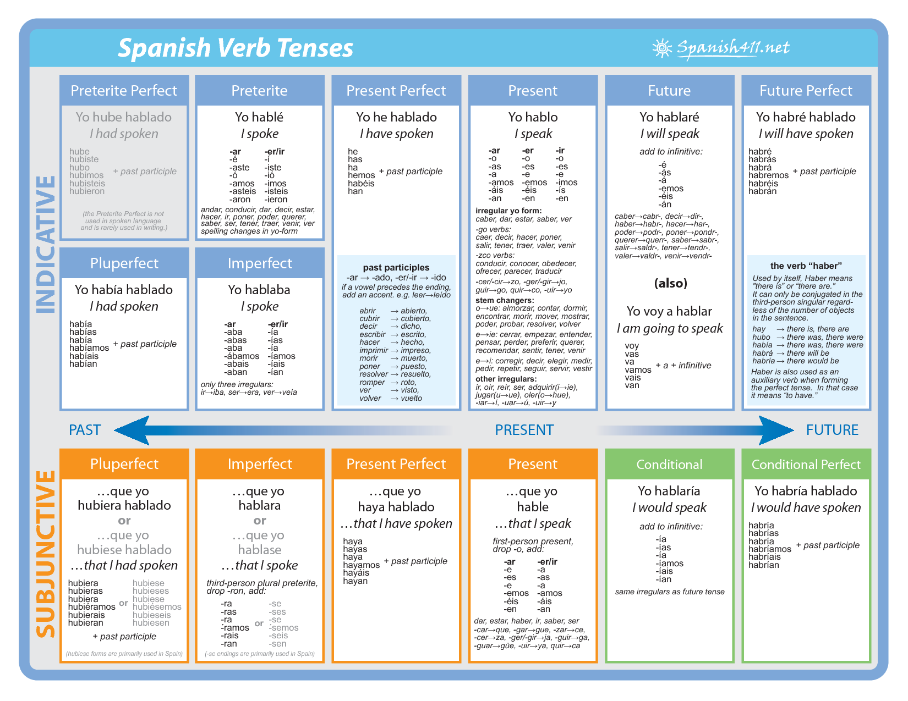

class: middle, center, inverse

# ¡Capítulo 6! "Nuevas democracias" 

---
# Nuestro plan

- Wordle

- Revisar la tarea

- Mandatos afirmativos y negativos (tú y vosotros)

- La comida

- Se impersonal y pasivo 

---
class: center, middle

# Wordle

---
class: center, middle, inverse

# Tareas - ¿Pregunas?

---
class: center, middle, inverse

# Repaso: cruzigrama

---
class: center, middle

| Mandatos | Afirmativos            | Negativos                    |
|:---------|:-----------------------|:-----------------------------|
| tú       | tomar -> toma          | tomar -> no tomes            |
|          | comer -> come          | comer -> no comas            |
|          | compartir -> comparte  | compartir -> no compartas    |
| vosotros | hablar -> hablad       | hablar -> no habléis         | 
|          | comer -> comed         | comer -> no comáis           |
|          | compartir -> compartid | compartir -> no compartáis   |
| reflexive| levantarse -> levantaos| levantarse -> no os levantéis|
                         

---
# Actividad 18 - La asistente social y su caso 

Una asistente social les da órdenes a miembres de una familia porque no escuchan sus consejos. Cambia las siguienes sugerencias a órdenes con la forma de tú, Ud. o Uds., según a quién le esté hablando ella. 

**Modelo**: Felipe, debes limpiar tu habitación | Felipe, limpia tu habitación.

1. Uds. deben escuchar a su hijo. 

2. Juan, es importante que te comuniques con tus padres. 

3. Uds. no deben pelearse delante de sus hijos. 

4. Muchachos, Uds. tiene que ir a la escuela todos los días. 

5. Señor, tiene que darles consejos a sus hijos.

6. Muchachos, no deben acostarse tarde. 

7. Lucia, debes gritar menos y escuchar más. 

8. Ignacio, debes venir a verme el mes que viene. 

---
# Los cuatro mandamientos para un amigo en Middlebury

- En parejas, escribid una lista de **cuatro mandamientos** para ayudar a futuros alumnos/as/es de la escuela de español de Middlebury College  

**Modelo** Id a clase todos los días. Estudiad en BiHall porque hay aire acondicionado. Salid a la noche de salsa. No comáis en Ross. 

---
class: center, middle, inverse

# Se pasivo y impersonal

--

## (lo siento)

---
# Se impersonal y pasivo

Se utilizan cuando no existe un sujeto o no es relevane para nuestro enunciado: 

**ejemplo**: Para usar este desoderante, primero se agita y después se presiona el botón.

--

Lo importante aquí es la acción, no la persona que la realiza. 

---
class: middle, center

<iframe width="560" height="315" src="https://www.youtube.com/embed/ecmgC9IubW0" title="YouTube video player" frameborder="0" allow="accelerometer; autoplay; clipboard-write; encrypted-media; gyroscope; picture-in-picture" allowfullscreen></iframe>

---
# Los usos del se impersonal que aparecen en el vídeo: 

--

- Primero **se seleccionan** los granos.

- Luego **se descartan** uno por uno. 

- Más tarde **se tuesta** en esta máquina. 

- Después **se pesa** y **se empaqueta**.

- Para terminar, **se introduce** el café en la cafetera y se sirve. 

--

**Recordad** al usar el *se impersonal* conjugamos los verbos tercera persona. El número cambia dependiendo de la oración
---
# ¿Cómo se forma?

Se + 3ra persona singular del verbo

Se + 3ra persona singular del verbo + nombre singular 

Se + 3ra persona plural del verbo + nombre plural o lista de nombres

--

**Se come** bien en esta casa.

**Se estudia** mucho en esta universidad. 

En España, **se usa aceite** de oliva para cocinar. 

**Se añaden sal y pimienta**.

---
# Los cuatro mandamientos para un amigo en Middlebury

- En parejas, escribid una lista de **cuatro mandamientos** para ayudar a futuros alumnos/as/es de la escuela de español de Middlebury College  

**Modelo** Se va a clase todos los días. Se estudia en BiHall porque hay aire acondicionado. Se sale a la noche de salsa. Se come en Proctor. 

---

---
class: center, middle, inverse

.pull-left[
# De niño/a/e
]

.pull-right[
# Hoy día
]

---
class: center, middle, inverse
# PPT de la cocina

---
class: center, middle 

<iframe width="560" height="315" src="https://www.youtube.com/embed/Gvyl_zdji2k" title="YouTube video player" frameborder="0" allow="accelerometer; autoplay; clipboard-write; encrypted-media; gyroscope; picture-in-picture" allowfullscreen></iframe>

---
class: center, middle

<iframe width="560" height="315" src="https://www.youtube.com/embed/Y-2rJxg97n8" title="YouTube video player" frameborder="0" allow="accelerometer; autoplay; clipboard-write; encrypted-media; gyroscope; picture-in-picture" allowfullscreen></iframe>

---

# Tarea

- **F**

- Estudiar vocabulario: p. 196 

- Estudiar: Presente del subjuntivo 168-169 (Verbos de emoción)

- Estudiar: Presente perfecto del subjuntivo p. 173 (verbos de emoción)

- **SAM**
  
- P. 78 act.14, p. 79 act. 16, p. 84 act. 22

---
class: middle, center, inverse

# Día 2

---
# Nuestro plan

- Wordle

- Revisar la tarea

- Presente subjuntivo (verbos de emoción) 

- Presente perfecto del subjuntivo

---
class: center, middle, inverse

# Wordle

https://wordle.danielfrg.com/

---
class: center, middle, inverse

# Tarea - ¿Preguntas?

---
class: center, middle, inverse
# PPT de la cocina

---
class: center, middle, inverse

# Presente del subjuntivo (verbos de emoción)

---
# Verbos de emoción, influencia y duda

Usamos el subjuntivo para expresar influencia, emoción, duda, y la inexistencia 

Si hay un verbo de emoción/duda/influencia en la cláusula principal (independiente), el segundo verbo en la cláusula subordinada **requiere** el subjuntivo.

**ejemplo:** Mi hermana *espera* que su novio *coma* con ella. 

---
class: center, middle

---
# Subjuntivo con verbos de emoción

Si la cláusula independiente expresa emoción, el verbo en la cláusula dependiente requiere el subjuntivo. 

**Ejemplos:**

1. Me gusta la idea de que **vayas** a Madrid a estudiar. 

2. Es triste que él **esté** enfermo y no **haga** el examen. 

3. Siento mucho no ir a tu fiesta de cumpleaños. 

4. Siento mucho que no vaya a tu fiesta de cumpleaños.

---
class: center, middle

---
class: center, middle

---
# Ojalá

**Ojalá** significa "Espero que" que sugiere una emoción 

**SIEMPRE** requiere el subjuntivo.

- Ojalá (que) **tengas** suerte. 
---

# Verbos de influencia

Si la cláusula independiente tiene un verbo de influencia, el verbo en la cláusula dependiente requiere el subjuntivo. 

**Ejemplos:**

1. Ella quiere que yo **hable** español. 

2. Mi padre me prohíbe que (yo) **use** su coche. 

3. Es necesario que usted **llegue** a tiempo.

---
class: center, middle

---
class: center, middle

---
class: center, middle

---
class: center, middle

---
# Expresamos nuestras emociones

Con otra persona, usad la lista para decir cuatro o cinco cosas que les molesta, disgusta, entristece, sorprende, gustar, etc. y expliquen por qué

.pull-left[
- ser inmadura

- fumar cerca de ti

- quejarse constantemente

- masticar chicle y hacer ruido

- hablar mal de otros

- mentir mucho
]

.pull-right[
- hablar con la boca llena

- no compartir sus cosas

- pedir dinero prestado

- ¿?
]

---
# La universidad y sus prioridades 

La situación actual de nuestra universidad nos afecta como estudiantes y por eso creemos que se necesitan cambios. Miramos la siguiente lista y elijimos dos cambios de cada categoria. Luego escribimos nuestras opiniones sobre la situación actual para indicar los cambios necesarios. 

**Ejemplo**: Es lamentable que no hayan contratado a Nicole como profesora del año entero. Es necesario que Uds. la den un contrato lo antes posible. 

.pull-left[
**Facultades**

- abrir una nueva facultad de...

- contratar a más profesores para la facultad de.. 

- prestar más atención a las evaluaciones de los profesores que hacen los estudiantes

- ¿?
]

.pull-left[
**Vivienda y transporte**

- construir más residencias estudiantiles

- ofrecer más lugares para estacionar carros y bicicletas 

- bajar el precio de las residencias y las comidas

- ¿?
]

---
class: center, middle, inverse

# Presente perfecto del subjuntivo

---

---

# Comparamos 

Espero que las elecciones sean limpias y transparentes. 

Espero que la gente ya sepa por quién votar. 

--

Espero que la gente no se haya olivdado de escuchar los debates. 

¡Qué sorpresa que los candidatos hayan hecho una campaña honesta!

Me alegra que el candidato del Partido Verde haya participado en los debates.

---

# ¿Cómo se forma?

Haber + participio pasado 

| haber  |             |
|:-------|:------------|
| haya   | hayamos     |
| hayas  | hayáis      |
| haya   | hayan       |

---
# Acontecimientos importantes

Expresa tu opinión sobre los siguientes acontecimientos del pasado con frases como **Es lamentable que...**, **Me alegra que...**, **Es interesante que...**

**Modelo:** en 1999 la administración del canal de Panamá / pasar a manos panameñas | Me alegra que en 1999 la adminstración del canal de Panamá haya pasado a manos panameñas porque el canal está en ese país y ellos están capacitados para adminstrarlo.

1. en 1848 México / venderles California a EE.UU

2. en Argentina / desaparecer 30.000 personas durante la guerra sucia entre 1976 y 1983

3. Michelle Bachelet / ser la primera mujer presidenta de Chile entre 2006 y 2010

4. en 1987 Óscar Arias (expresident costarricense) / ganar el premio Nobel de la Paz

5. el Che Guevara / escribir su famoso diario entre 1966 y 1967

6. en 1955 / Perón (expresidente argentino) / quemar iglesias 

---
class: center, middle

# El año pasado

--

## ¿Cómo sentimos de lo que ha pasado?

--

Es una lástima que no haya ido a más fiestas en Middlebury. 

---
class: center, middle

# encuesta 

--
(lo siento)

https://forms.gle/982Z9ZsW6DXTw8HE9

---
# Tarea 

- **F**

- Contestar: p. 174 act. 9

- Estudiar vocabulario: pp. 177 y 178

- Estudiar: Presente de Subjuntivo pp. 181 y 182 (Verbos de duda)

- Contestar: p. 182 act. 18 A y act. 19

- **SAM**

- P. 87 act. 1 y 2, p. 88 act. 3, p. 89 act. 5, p. 90 act. 6

- **EMPEZAR LA REFLEXION DE ESTA SEMANA**

---
class: center, middle, inverse

# Día 3

---
# Nuestro plan 

- Wordle 

- Revisar tarea

- Presente del subjuntivo (verbos de duda)

- La política

---

class: center, middle, inverse

# Wordle

https://wordle.danielfrg.com/

---
class: center, middle, inverse

# Tarea - ¿Preguntas?
---

class: center, middle, inverse

# Presente del subjuntivo (verbos de duda)

---

# Verbos que expresan duda

Si la cláusula independiente tiene un verbo que expresa duda, el verbo en la cláusula dependiente requiere el subjuntivo. 

**Ejemplos:**

1. Ud. no cree que ella **esté** enferma. 

2. Es posible que **llueva** mañana. 

3. Es probable que **lleguemos** a tiempo.

---
class: center, middle

---
class: center, middle

---
# Opiniones sobre los famosos

Con un/a/e compañero/a/e, den su opinión sobre los siguientos sucesos usando expresiones como **(No) Creo que... porque..., Dudo que... porque..., No cabe duda que... porque...**

1. Los Mets ganarán la serie mundial este año. 

2. Avril Lavigne murió y la chica que vemos ahora se llama Melissa.

3. El Sr. Rogers mató a 150 personas cuando trabajó de militar. 

4. Armie Hammer comió otra persona (o más de una).

5. Elvis y Tupac no murieron y viven en Las Islas Canarias. 

 
---
# Actividad 16 - Situación política en Hispanoamérica

Da tu opinión y expresa emociones sobre los siguientes ejemplos de la situación política y social pasada y actual de Hispanoamérica, y explica por qué piensas así. Usa expresiones como **(No) Me sorprende..., Es una lástima..., Es bueno/malo...**

**Modelo**: Un juez español pidió la extradición de un militar argentino por violación de derechos humanos para juzgarlo en España.  | Me alegra que un juez español haya pedido la extradición de un militar argentino para juzgarlo en España porque...

1. Rigoberta Menchú, indígena guatemalteca, ganó el premio Nobel de la Paz. 

2. Existe discriminación racial en Hispanoamérica. 

3. La CIA ayudó al general Pinochet a subir al poder en Chile con un golpe de estado. 

4. Hay mucha desigualdad económica en Hispanoamérica. 

5. Han muerto muchos policías en México por hacerles frente a los narcotraficantes.

6. Los militares tiene mucha influencia en algunos gobiernos hispanoamericanos. 

---
class: center, middle, inverse

# ¡Repaso! ¡A estudiar!
---
# Tarea

- **F**

- ESTUDIAR PARA EL EXAMEN PARCIAL

- Estudiar: Los pronombres relativos p. 185
 
- **SAM**

- p. 91 act. 8 y 9, p.95 act. 14 y 15

---
class: center, middle, inverse

# Día 4

---
# Nuestro plan

- EXAMEN PARCIAL

- Revisar tarea

- Los pronombres de relativo que y quien

---
class: center, middle, inverse
# Wordle

https://wordle.danielfrg.com/

---
class: center, middle, inverse

# Tarea - ¿Preguntas?

---
class: center, middle, inverse 

# Los pronombres de relativo que y quien 

---
class: center, middle, inverse

# Que vs Quien

---

# Que

Que es el relativo más habitual en español pues admite cualquier antecedente: una persona, un animal, una cosa, un concepto o un acontecimiento. Puede usarse tanto en oraciones relativas explicativas (non-defining clauses), como en oraciones especficativas (defining clauses).

En las oraciones especificativas la frase introducidada por "que" no se escribe entre comas, pero la frase explicativa sí se separa usando comas. 

**Ejemplo**: 

- Conduce un coche que es de su madre.

- Juan, que tuvo un accidente la semana pasada, ya se ha recuperado.

---
# Quien/Quienes

El relativo quien siempre tiene como antecedente una persona y suele reservarse para el lenguaje escrito. Si no va precedido de una preposición, puede usarse como alternativa a que en oraciones explicativas (entre comas).

**Ejemplo**: 

- Juan, quien/que ha tenido un accidente, está sano y salvo.

--

El relativo quien no necista tener antecedente expreso. En este caso, debe concordar en número con el resto de los elementos de la oración (singular/plural)

**Ejemplo**: 

- Quien avisa no es traidor. 

- Quienes presenciaron el accidente paraon a ayudar a Juan. 

---
# Actividad 22 - Comentarios - que o quien(es)

1. Los politicos ____ entienden los problemas económicos votaron en contra de un aumento de sus propios sueldos. Al final perdieron porque muchos congresistas egocéntricos, ____ se preocupan de sis mismos, no piensan en el bienestar del pueblo. 

2. El presidente, _____ se divorció tres veces, cree que el matrimonio como institución es fundamental. 

3. Los senadores ______ ganaron las elecciones este año recibieron una invitación de la primera dama a una cena de gala. Van a comer como reyes mientras el pueblo se muere de hambre. 

4. Todos los políticos del Partido Populista, _______ votaron en bloque contra la protección del medio ambiente son unos sinvergüenzas. 

5. Josefina Montoya, _______ nunca cumple su palabra, dice una cosa durante la campaña y luego hace otra. 

---
# Actividad 23 - Indentifica a hispanos famosos 

Con un/a/e compañero/a/e identifiquen al mayor número posible de hispanos famosos usando pronombres relativos. 

**Modelo**: La Malinche fue la mujer que ayudó a Cortés a entenderse con los indígenas.

.pull-left[
- Carlos Santana

- Isabel Allende

- Pao Gasol

- Marco Rubio

- Celia Cruz
]

.pull-right[
- Hernán Cortés

- Francisco Franco

- Sor Juana

- Gabriel Garcia Márquez

- Isabel la Católica
]

---
# Tarea 

- **F**

- Estudiar por y para p. 188-189 

- Contestar: p. 190 act. 25

- **SAM**

- P. 93 act. 11, p.96 act.16
