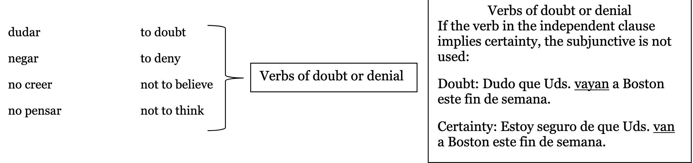
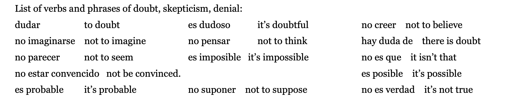
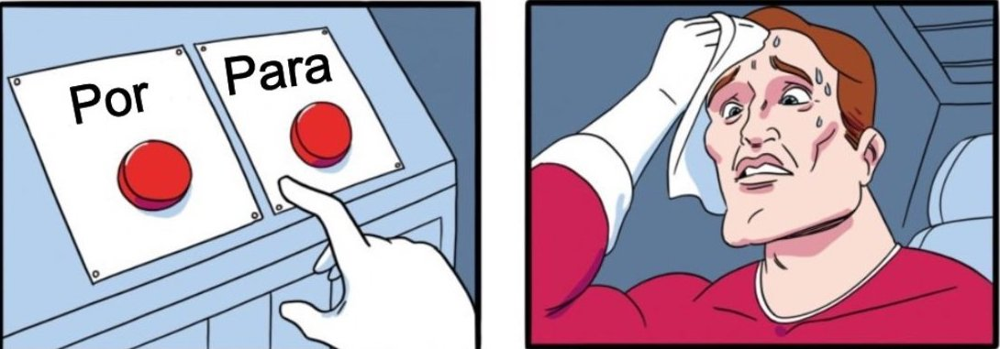
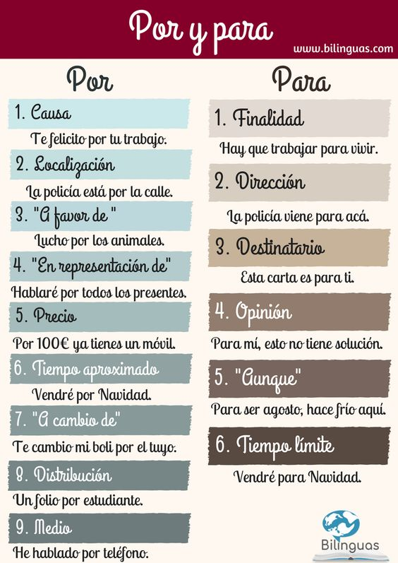
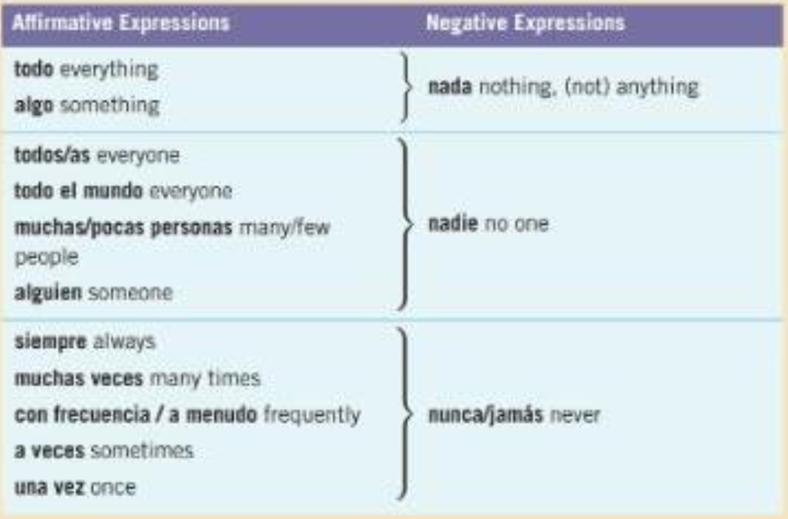

class: center, inverse, middle

# Unidad 7

---
# Nuestro Plan

- Wordle

- tarea

- lo que no hicimos la semana pasada

- por y para

---

class: center, middle, inverse
# Wordle

https://wordle.danielfrg.com/

---
class: center, middle, inverse

# Tarea - ¿Preguntas?

---

class: center, middle, inverse

# Presente del subjuntivo (verbos de duda)

---

# Verbos que expresan duda

Si la cláusula independiente tiene un verbo que expresa duda, el verbo en la cláusula dependiente requiere el subjuntivo. 

**Ejemplos:**

1. Ud. no cree que ella **esté** enferma. 

2. Es posible que **llueva** mañana. 

3. Es probable que **lleguemos** a tiempo.

---
class: center, middle

---
class: center, middle

---
class: center, middle

---
class: center, middle

---
class: center, middle

---
class: center, middle

---
class: center, middle, inverse

# Que vs Quien

---

# Que

Que es el relativo más habitual en español pues admite cualquier antecedente: una persona, un animal, una cosa, un concepto o un acontecimiento. Puede usarse tanto en oraciones relativas explicativas (non-defining clauses), como en oraciones especficativas (defining clauses).

En las oraciones especificativas la frase introducidada por "que" no se escribe entre comas, pero la frase explicativa sí se separa usando comas. 

**Ejemplo**: 

- Conduce un coche que es de su madre.

- Juan, que tuvo un accidente la semana pasada, ya se ha recuperado.

---
# Quien/Quienes

El relativo quien siempre tiene como antecedente una persona y suele reservarse para el lenguaje escrito. Si no va precedido de una preposición, puede usarse como alternativa a que en oraciones explicativas (entre comas).

**Ejemplo**: 

- Juan, quien/que ha tenido un accidente, está sano y salvo.

--

El relativo quien no necista tener antecedente expreso. En este caso, debe concordar en número con el resto de los elementos de la oración (singular/plural)

**Ejemplo**: 

- Quien avisa no es traidor. 

- Quienes presenciaron el accidente paraon a ayudar a Juan. 

---
class: center, middle

# Nuestros amigos @ Colby

https://personal.colby.edu/~bknelson/SLC/relative_pronouns.html

---

class: inverse, middle, center
# Por y Para 

#### Significan lo mismo, ¿qué hago?

---
# Por

.pull-left[

- El viaje y la comunicación
  - ejemplo: Viajo **por** Francia y España
  
  - La contacto **por** teléfono. 
  
- Los intercambios
  - ejemplo: Te doy mi galleta **por** tu manzana. 
  
]

.pull-right[

- La Duración
  - ejemplo: Tengo que trabajar **por** ocho horas hoy. 
  
  - ¿Duermes **por** 12 horas?
  
- La Motivación
  - ejemplo: Trabajo **por** ti, porque te quiero mucho. 
  
  - **Por** su amor a los niños, quiere ser maestra. 
]

---
# Para

.pull-left[

- Los destinos
  - ejemplo: Salgo **para** Chile mañana.
  
  - ¿**Para** dónde vas con tanta prisa?
  
- Los recipentes
  - ejemplo: Este regalo es **para** Anita. 
  
  - Estos chocolates no son **para** los perros. 
]

.pull-right[

- Las fechas
  - ejemplo: Necesito la presentación para el viernes.
  
  - Tengo que terminar esto **para** las ocho.
  
- Las metas
  - ejemplo: Trabaja mucho **para** ganar más dinero. 
  
  - Corro **para** mantenerme en forma. 
]

---

---

# Practicamos en parejas

1. Voy a casarme [ por, para ] amor.

2. Roberto tiene que hacerlo [ por, para ] mañana.

3. Luis estudia [ por, para ] médico. 

4. Ayer yo trabajé [ por, para ] Luisa porque ella se enfermó. 

5. Yo pagué veinte dólares [ por, para ] el libro de texto. 

6. Viajamos a Cuba [ por, para ] barco. 

7. Mi familia vivió en Puerto Rico [ por, para ] cinco años. 

8. Este traje de baño es demasiado pequeño [ por, para ] mí. 

---

1. Voy a casarme **por** amor.
  - La motivación

2. Roberto tiene que hacerlo **para** mañana.
  - Fecha límite

3. Luis estudia **para** médico. 
  - El destino

4. Ayer yo trabajé **por** Luisa porque ella se enfermó. 
  - En lugar de
  
5. Yo pagué veinte dólares **por** el libro de texto. 
  - intercambio

6. Viajamos a Cuba **por** barco. 
  - Método de transporte

7. Mi familia vivió en Puerto Rico **por*** cinco años. 
  - Duración de tiempo

8. Este traje de baño es demasiado pequeño **para** mí. 
  - Es una comparación 
  
---
class: center, middle

# Nuestros amigos @ Colby X2

https://personal.colby.edu/~bknelson/SLC/por_para.html

---

# Algunos regalitos de sorpresa 

---

# Reglas

--

### NO podemos gastar más de $5

--

### Esto es algo divertido para practicar la diferencia entre por y para. 

--

### NO es para causar estrés.

---

# ¿Cómo lo haremos?

- Tod@s vamos a escoger un nombre 

- **NO** enseñéis el nombre a **NADIE**, es un secreto. 

- Hablamos ahora: haciendo preguntas como: ¿**Conoces** a Maya? ¿Sabes si a ella le gusta leer?

--

- Mañana - tenemos que presentar el regalo. 

- Ejemplo: Este regalo es para alguien super divertido en la clase. Es una persona muy amable. 
Me cae super bien. A ella le gusta mucho masticar chicle, por eso este chicle es para ti Alicia.

---
class: center, middle, inverse

# Día 2

---
# Nuestro Plan

- Wordle

- Tarea

- Por/Para

- Ecoturismo

- Afirmaciones y negaciones

---
class: center, middle, inverse

# Wordle

https://wordle.danielfrg.com/

---
class: center, middle, inverse

# Tarea - ¿Preguntas?

---
class: center, middle, inverse

# Repaso: Por vs. Para 

---
# Repaso por vs para 

https://conjuguemos.com/grammar/213 

---
class: center, middle, inverse

# Kahoot

https://create.kahoot.it/details/1619ca45-eb5a-4efe-bc4d-7ae383178816

---
class: middle, center 

# Regalitos

---
class: center, middle, inverse

# Unas vacaciones diferentes / Ecoturismo

---
class: center, middle

# Infográficos

---
# Actividad 9 - Ecoturismo, ¿peligro o no?

Lee las siguientes oraciones relacionadas al ecoturismo y marca tu opinión usando esta escala: a = estoy seguro/a/e, b = es posible, c = no lo creo

.pull-left[
1. La sola presencia del ser humano destruye el medio ambiente.

2. Para llegar a lugares remotos, hay que usar medios de transporte que contaminan el medio ambiente.

3. Para tomar conciencia del valor de la naturaleza, hay que ver las zonas remotas y virgenes con los propios ojos. 

4. Los ecoturistas contribuyen a la economía de las comunidades locales.
]

.pull-right[
5. Después de hacer un viaje de ecoturismo, los participantes tienen un papel más activo en el movimiento verde.

6. Los controles de un gobierno nunca van a ser suficientemente estrictors para controlar los problemas que puede traer el ecoturismo. 

7. Los ecoturistas nunca tiran basura ni hacen nada para destruir el lugar que visitan. 

8. La presencia constante de grupos de ecoturistas no es natural y por eso, crea un desequilibrio en el área. 
]

---
class: center, middle

# ¿Qué opinamos sobre el ecoturismo?

---
class: middle, center, inverse

# Afirmaciones y Negaciones 

---
# ¿Cómo formamos oraciones negativas?

NO + verb + palabra negativa 

.pull-left[

- ¿Te ayudó la Sra. López? 

- ¿Ayudarme? Esa mujer no me ayuda jamás. 
(Esa mujer jamás me ayuda.)

]

.pull-right[

- ¿Comiste?

- No, no comí nada. 
]

---
# Nadie y alguien como objetos directos

Cuando **nadie** y **alguien** son objetos directos, tenemos que usar la *a personal.*

--

- Comparamos:

--

.pull-left[
- ¿Viste a alguien?

- No, no vi a nadie. 
]

.pull-right[
- ¿Alguien te vio?

- No, nadie me vio. / No, no me vio nadie. 
]

---

---
# Actividad 13 p. 209 - ¿Hay algún piloto en tu familia?

En parejas, usen la siguiente lista de ocupaciones para averiguar sobre la familia de su compañero/a/e. Sigan el model. 

A: ¿Hay algún piloto en tu familia?

B: Sí, hay una mujero piloto. (¿Quién es?....) | No, no hya ningún piloto. No, no hay ninguno. 

.pull-left[
- vendedor

- enfermero

- plomero

- artista

- político
]

.pull-left[
- arquitecto

- cartero

- ecologista

- carpintero

- camarero
]

---
# Tarea

**F**

- Estudiar: Subjuntivo en cláusulas adj. pp. 210 y 211

- Contestar: p. 211 act. 14 A

- Estudiar: Subjuntivo en cláusulas adv.1 pp. 216-217 

- Contestar: p. 217 act. 20 A

**SAM**

- P. 101 act. 1, pp. 103-104 act. 5 y 6      
 
---
class: center, middle, inverse

# Día 3

---
# Nuestro Plan

- Wordle

- Tarea

- Afirmaciones y negaciones

- Subjuntivo en cláusulas adjetivales

- Subjuntivo en cláusulas adv. 1

---
class: center, middle, inverse

# Wordle

https://wordle.danielfrg.com/

---
class: center, middle, inverse

# Tarea - ¿Preguntas?

---
class: middle, center, inverse

# Afirmaciones y Negaciones 

---
# ¿Cómo formamos oraciones negativas?

NO + verb + palabra negativa 

.pull-left[

- ¿Te ayudó la Sra. López? 

- ¿Ayudarme? Esa mujer no me ayuda jamás. 
(Esa mujer jamás me ayuda.)

]

.pull-right[

- ¿Comiste?

- No, no comí nada. 
]

---
# Nadie y alguien como objetos directos

Cuando **nadie** y **alguien** son objetos directos, tenemos que usar la *a personal.*

--

- Comparamos:

--

.pull-left[
- ¿Viste a alguien?

- No, no vi a nadie. 
]

.pull-right[
- ¿Alguien te vio?

- No, nadie me vio. / No, no me vio nadie. 
]

---

---
# Actividad 13 p. 209 - ¿Hay algún piloto en tu familia?

En parejas, usen la siguiente lista de ocupaciones para averiguar sobre la familia de su compañero/a/e. Sigan el model. 

A: ¿Hay algún piloto en tu familia?

B: Sí, hay una mujero piloto. (¿Quién es?....) | No, no hya ningún piloto. No, no hay ninguno. 

.pull-left[
- vendedor

- enfermero

- plomero

- artista

- político
]

.pull-left[
- arquitecto

- cartero

- ecologista

- carpintero

- camarero
]

---
class: center, middle

# Subjuntivo en cláusulas adjetivales

---
# La cláusula adjetiva

Una cláusula adjetiva es un tipo de oración subordinada (con un verbo conjugado) que tiene la misma función que un adjetivo: describir un sustantivo. 

**Ejemplo:** Tengo una amiga cubana

- adjetivo = cubana 
- sustantivo = amiga

--

Tengo una amiga que vive en Cuba

--

*vive en Cuba* = una cláusula adjetiva (describe al sustantivo amiga)

---
# La cláusula adjetiva con subjuntivo

El subjuntivo se usa en cláusulas adjetivas cuando la existencia del antecedente es *desconocida*, *irreal* o *incierta* para quien habla:

--

- Necesito un libro que **tenga** ilustraciones (no sé si el libro existe)

- Escoge la camisa que más te **guste** (no sé qué camisa)

- ¿Hay alguien que **viva** cerca? (no sé si hay alguien)

- No conozco a nadie que **hable** chino (persona desconocida)

- Busco una persona que me **ayude** (no sé si la persona existe)

---
# Comparamos

.pull-left[
**Subjuntivo**

- Necesito un libro que **tenga** ilustraciones

- ¿Hay alguien que **viva** cerca?

- No conozco a nadie que **hable chino**

- Busco una persona que me **ayude** por las tardes
]

.pull-right[
**Indicativo**

- Tengo un libro que tiene ilustraciones

- ¿Esa persona vive cerca?

- Conozco a alguien que habla chino

- Encontré a una persona que me ayuda por las tardes
]
---
# A practicar

1. Tengo éxito gracias a la gente que me (apoya / apoye).

2. Voy a tener éxito si encuentro gente que me (apoya / apoye).

3. Necesitamos empleados que (conocen / conozcan) la tecnología.

4. Tenemos empleados que (conocen / conozcan) la tecnología.

5. Busca una persona que te (puede / pueda) ayudar.

6. Conozco a una persona que te (puede / pueda) ayudar.

7. ¿Hay algún restaurante que (sirve / sirva) comida hispana?

8. Queremos un restaurante que (sirve / sirva) comida hispana.

9. Queremos la casa que (tiene / tenga) vista al mar.

10. Vivimos en una casa que (tiene / tenga) vista al mar.

---
# Actividad 15 - el lugar ideal 

Mira la siguiente lista y decide las tres características más importantes para ti.

.pull-left[

- nevar mucho/poco

- tener temperatura moderadas

- estar cerca de las montañas

- estar cerca del agua

- ser posible comprar comida de huertas con agricultura sostenible

- ser un centro urbano con buen sistema de transporte público
]

.pull-right[

- haber muchas/pocas actividades culturales

- no haber fábricas que contaminen

- estar en el campo 

- tener buenas escuelas 

- convivir gente de diferentes razas y culturas 

- existir programas para reducir, reutilizar y reciclar 

- ser un lugar tranquilo

- haber poca delincuencia 
]

--

Busco un lugar que/donde...| Quiere vivir en un lugar que/donde...
---
# Actividad 18 - ¿Conoces a alguien que...?

Sigan el modelo: 

- ¿Conoces a alguien que haya nadado en el río Amazonas?

- No, no  conozco a nadie que haya nadado en el Amazonas. | Sí, conozco a alguien....

.pull-left[

- ver pingüinos en la Patagonia

- escalar los Andes

- hacer rafting

- ver una película sobre algún deporte extremo
]

.pull-right[

- cruzar el Atlántico en barco

- hacer alas delta

- saltar con una cuerda bungee

- hacer una caminata de ocho horas
]

---
class: middle, center

# Subjuntivo en cláusulas adverbiales

---
# Cláusulas adverbiales de tiempo

**Las cláusulas adverbiales cumplen la misma función que cumpliría un adverbio en una oración simple.** Estas cláusulas nos dan información, por ejemplo, sobre el tiempo, el propósito o la condición de la realización de la acción comunicada por el verbo en la oración principal.

--

**Veamos**...

Juan comprará su billete de avión mañana. 

¿Dónde está el adverbio? ¿A qué verbo modifica?

--

Mañana nos dice cuándo ocurre la acción de comprar

---
# Cláusulas adverbiales de tiempo

En ocasiones, el tiempo (o el propósito, la condición, etc.) de la acción del verbo de la cláusula principal se nos da en base a otra acción. Es decir, una acción tiene lugar antes, después o al mismo tiempo que otra acción. En este caso, la información se comunicaría en una cláusula adverbial (de tiempo, condición o propósito) en lugar de en una sola palabra. **Recuerda** la cláusula requiere un verbo.

--

Juan comprará su billete de avión mañana. (tenemos solo el adverbio mañana para saber cuando)

Vs. 

Juan comprará su billete de avión *cuando tenga dinero*. (tenemos una cláusula adverbial de tiempo - tiene un verbo - para sabero cuándo ocurre algo)

---
class: center, middle

**Recuerden**: Usaremos el subjuntivo en cláusulas adverbiales sólo cuando la información contenida en la cláusula no se puede afirmar como real. 

---
# Cláusulas adverbiales - conjunciones adverbiales de tiempo

Para hablar de acciones o estados pendientes (que sugiere una acción en el futuro de la cual no hay certeza)

| Cláusula principal | + expresión adverbial | + verbo en el subjuntivo |
|:-------------------|:----------------------|:-------------------------|
| Haremos ejercicio  | hasta que             | me canse.                |
| Tomaré la clase de yoga | tan pronto como  | el estudio ofrezca clases en la noche. |
| Quiero llevarte a mi gimnasio | en cuanto  | me dén más invitaciones. |
| Llámame            | cuando                | vayas a correr por la playa. |
| Puedes seguir tomando clases de karate | mientras | no te lastimes.   |
| Vamos a comer un bocadillo | después de que | termines de correr, ¿vale? |

---
# Para acciones y estados habituales... usamos el indicativo 

Normalmente, **cuando** uno *hace* ejercicio físico, la pérdida de peso *es* inmediata y natural. 

*Hacemos* ejercicio **hasta que** nos *cansamos.* 

---
### Actividad 21 - En una reuníon de Mundo Verde

Combinamos ideas de las dos columnas para decir algunas de las cosas que escuchamos en una fiesta con miembros de Mundo Verde.

.pull-left[

1. Los bosques van a estar en mejores condiciones después de que

2. Vamos a utilizar más fuentes de energía renovable cuando 

3. Los cambios climáticos van a empeorar hasta que

4. La gente del primer mundo no va a reducir su huella ecológica hasta que

5. La contaminación causada por las fábricas va a reducirse en cuanto

6. Los cuidadanos van a poner paneles solares en su casa cuando
]

.pull-right[
a. acabarse/el petróleo

b. dejar/de cortar árboles de forma exagerada

c. el gobierno/darles/incentivos económicos a sus dueños

d. la compañía eléctrica/comprarles/el exceso de energía que producen

e. todos los países/ponerse/de acuerdo y/tomar/medidas conjuntas

f. tomar/conciencia de la cantidad de basura innecesaria que genera
]
---
# Actividad 22 - tu vida actual y tus planes futuros

En parejas túrnense para hacerse las siguientes preguntas sobre el presente y sobre el futuro. Al contestar, usen las expresiones que están entre paréntesis en oraciones completas. 

- ¿Cuándo vas a ir a visitar a tu familia? (en cuanto) | La voy a ir a visitar en cuanto termine el semestre. 

1. ¿Cuándo vas a comprar un carro verdo? (en cuanto)

2. ¿Cuándo sales con tus amigos? (después de)

3. Generalmente, ¿cuándo haces la tarea para esta clase? (después de que)

4. ¿Cuándo miras tu página de red social? (cuando)

5. ¿Hasta cuándo vas a vivir en el lugar donde vives ahora? (hasta que)

6. ¿Cuándo vas al cine? (cuando)

7. ¿Cuándo te levantas por la mañana? (tan pronto como)

---
# Tarea

**F**

- Estudiar: Pronombres (doble objeto) p. 220

- Contestar: p. 221 act. 24

**SAM**

- P. 105 act. 7, p. 106 act. 9, p. 107 act. 10, p. 109 act. 15, p. 110 act. 16 

- Repasar para la prueba

- REFLEXION 5
